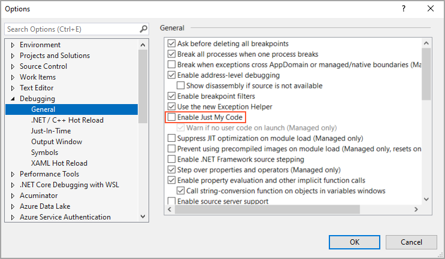
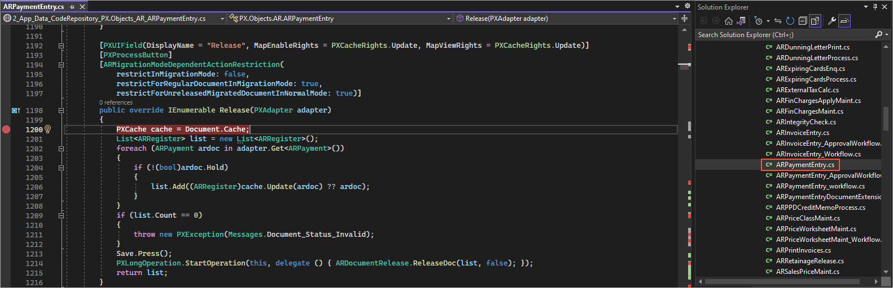

# Step 2: Preparing the Project for Debugging {#_d2480b9a-e8d8-4328-b090-1af75e63024b .task}

To find the workflow event that you can use in a customization project, you can debug the Acumatica ERP source code with breakpoints and see which breakpoint is hit in which scenario. In this step, you will prepare the `PhoneRepairShop_Code` for debugging in Visual Studio.

To prepare the `PhoneRepairShop_Code` project for the debugging of the Acumatica ERP code, you should do the following:

1.  Make sure the Acumatica program database \(PDB\) files are located in the `Bin` folder of the Acumatica ERP instance folder that you are using for this activity.

    The PDB files were copied to the `Files\Bin` folder of the Acumatica ERP installation folder \(such as `C:\Program Files\Acumatica ERP\Files\Bin`\) during the installation process if the **Install Debugger Tools** check box was selected in the Acumatica ERP Installation wizard. When you create a new instance or update an existing one, these PDB files are copied to the `Bin` folder of the instance. If you did not select the **Install Debugger Tools** check box during installation, you should remove Acumatica ERP and install it again with the **Install Debugger Tools** check box selected. For details, see [Acumatica ERP Installation On-Premises: To Install the Acumatica ERP Tools \(Optional\)](../Shared/../UserGuide/INST_Installing_Configuration_Wizard_Install_Tools_Activity.md).

    **Tip:** A PDB file holds debugging and project state information that is used for incremental linking of a debug configuration of your program. In general, a PDB file contains the link between compiler instructions and lines in source code.

2.  Configure the `Web.config` file of the instance by doing the following:
    1.  In the file system, open in the text editor the `Web.config` file, which is located in the root folder of the *PhoneRepairShop* instance.
    2.  In the `<system.web>` tag of the file, locate the `<compilation>` element.
    3.  Set the debug attribute of the element to *True*, as shown in the following code.

        ```language-xml
        <system.web>
         <compilation debug="True" ...>
        ```

    4.  Save your changes.
3.  Configure the `PhoneRepairShop_Code` project for debugging by doing the following:
    1.  In Visual Studio, open the `PhoneRepairShop_Code` solution, which includes both the `PhoneRepairShop_Code` project and the website.
    2.  On the main menu, select **Tools** &gt; **Options**.
    3.  In the **Debugging** &gt; **General** section, clear the **Enable Just My Code** check box, as shown in the following screenshot.

        

    4.  In the **Debugging** &gt; **Symbols** section, in the **Symbols file \(.pdb\) locations** list, add the path to the location of the PDB files in your Acumatica ERP instance.
    5.  Click **OK**.
4.  To view the source code of the `Release` action of the [Payments and Applications](../Shared/../UserGuide/AR_30_20_00.md) \(AR302000\) form, open the `PX.Objects.AR.ARPaymentEntry` graph: In the website folder in the Solution Explorer, select **App\_Data** &gt; **CodeRepository** &gt; **PX.Objects** &gt; **AR** &gt; **ARPaymentEntry.cs**, and go to the definition of the **Release** action—that is, the `IEnumerable Release(PXAdapter adapter)` method.
5.  Add a breakpoint inside the `Release` method, as shown in the following screenshot.

    

6.  Attach the Visual Studio debugger to the `w3wp.exe` running process.

    **Tip:** For details about attaching to the process, see [To Debug the Customization Code](../Shared/../CustomizationPlatform/CG_Troubleshooting_ToDebug.md).

7.  Start debugging by doing the following:
    1.  In Acumatica ERP, open the [Payments and Applications](../Shared/../UserGuide/AR_30_20_00.md) \(AR302000\) form.
    2.  Create a payment.
    3.  On the form toolbar, click the **Release** button.

        Wait until the breakpoint is hit.

    4.  In Visual Studio, view the debug information for the `Release` method.

**Tip:** If an invoice was created for a repair work order with only non-stock items, by default, an AR invoice would be created instead of the SO invoice. There is no difference for the release of a payment for AR and SO invoices, so you do not need to customize the closing of AR invoices as well.

**Parent topic:**[Workflow Events: To Use an Existing Event](../DeveloperGuide/WorkflowAPI_Events_Activity_UseExisting.md)

