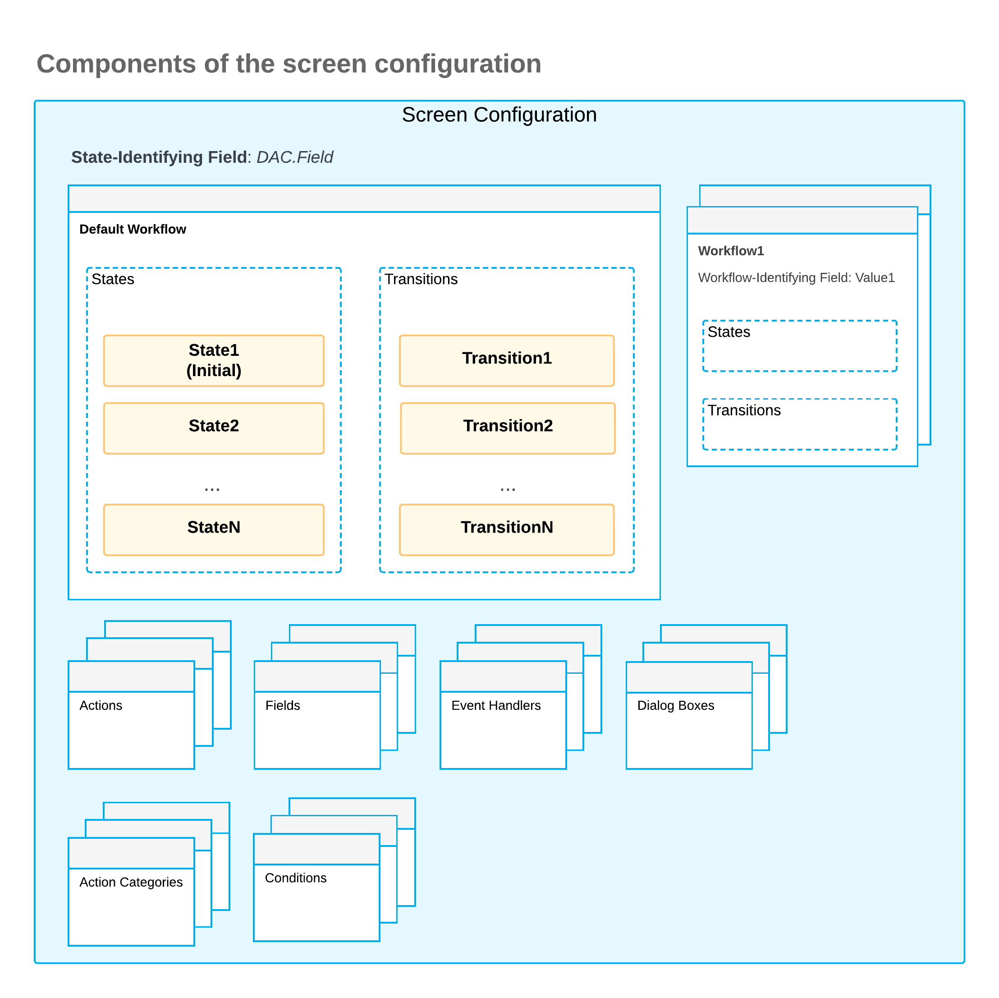

# Screen Configuration: General Information {#_7cc605de-56b5-47c1-84cd-85e8c9264098 .concept}

Each form of Acumatica ERP \(including existing and custom forms\) includes a screen configuration—that is, the configuration of the screen that corresponds to the form. The screen configuration contains the configuration of the components of the particular screen, such as actions and fields, and the definitions of workflows.

When a form is created, a screen configuration of this form is empty. To define a workflow or to add configuration of components of a screen, you need to edit the screen configuration of the corresponding form. Some of the existing forms of Acumatica ERP have predefined workflows, so their screen configuration is not empty.

In this chapter, you will edit a screen configuration and start defining a workflow.

## Learning Objectives { .section}

In this chapter, you will learn how to do the following:

-   Create a graph extension where a workflow can be implemented
-   Determine the workflow's set of states
-   Define the set of states for the workflow
-   Override the Configure method that contains the screen configuration
-   Locate the class where the predefined workflow is implemented

## Applicable Scenarios { .section}

You will work with a screen configuration in the following cases:

-   You want to create a new workflow. You create a workflow when the form you want to customize does not have one, or when the existing workflow does not fit your business processes.
-   Update \(that is, create an extension of\) a predefined workflow. Customizing a predefined workflow can save you time over creating a custom workflow from scratch, especially if you want to make only minor changes to the functionality of the predefined workflow.
-   You want to add or update components of a screen configuration, such as actions or fields. You can configure actions and states of fields in a screen configuration even if they are not used in a workflow.

## Workflow Implementation { .section}

A workflow class is a class where the workflow is implemented. A workflow class is an extension of the graph for which the workflow should be applied. For example, if you need to implement a workflow for the [Opportunities](../UserGuide/CR_30_40_00.md) \(CR304000\) form, whose business logic is defined in the OpportunityMaint graph, you need to create a workflow class as an extension of the OpportunityMaint graph. If you need customize an existing workflow, you create a second-level graph extension of the existing workflow class and the graph of the form.

The first step in creating a workflow is determining the set of states that a record created on the form can have in the workflow. The workflow state is determined by one of the fields of the record, which is usually the `Status` field. Each workflow state is defined by a combination of a constant string value and a class derived from the BqlString.Constant class. The name of the class starts with a lowercase letter. For an example, see [Step 2: Defining the Set of States of the Workflow](WorkflowAPI_ScreenConfig_Activity_CreateNew_DefineStates.md) in the [Screen Configuration: To Prepare a Screen Configuration for a Form Without a Predefined Workflow](WorkflowAPI_ScreenConfig_Activity_CreateNew.md) activity.

To implement a workflow, you override the PXGraphExtension.Configure method, which accepts the PXScreenConfiguration instance. Inside the Configure\(PXScreenConfiguration config\) method, you call the static Configure method. In the static Configure method, you get the configuration context object, which you use to add the new screen configuration.

**Attention:** Declaring the static Configure method and calling in it the overridden Configure\(PXScreenConfiguration config\) method is important to ensure that no static methods are called inside the Configure\(PXScreenConfiguration config\) method and the PXOverride attribute cannot be applied to the method. For more details, see [Screen Configuration: Restrictions of the Configure Method](../Shared/../DeveloperGuide/WorkflowAPI_ScreenConfig_ConfigureRestrictions.md).

Inside the static Configure method, you define a workflow by using Workflow API \(which is also called the *screen configuration API*\). Workflow API has a strongly typed syntax. It has many compiler-based validations, which reduce the likelihood of an error. The API is made mostly of fluent generic methods, which use LINQ expressions.

## Components of a Screen Configuration { .section}

A screen configuration is defined by the set of components of a screen and the workflows in which these components are used. To configure a screen, you can define any of the following:

-   *Conditions*: To define conditions in a screen configuration, you use the WithConditions method. For details, see [Defining Conditions](WorkflowAPI_Conditions_Mapref.md).
-   *Dialog boxes*: To define dialog boxes in a screen configuration, you use the WithForms method. For details, see [Implementing Workflow Dialog Boxes](WorkflowAPI_DialogBox_Mapref.md).
-   *Fields*: To define the states of fields in a screen configuration, you use the WithFieldStates method. For details, see [Configuring Field States](WorkflowAPI_FieldStates_Mapref.md).
-   *Actions and their categories*: To define actions and action categories, you use the WithActions and WithCategories methods. For details, see [Implementing Workflow Actions](WorkflowAPI_Actions_Mapref.md).
-   *Workflow event handlers*: To define workflow event handlers, you use the WithHandlers method. For details, see [Implementing Workflow Events](WorkflowAPI_Events_Mapref.md).
-   *Any number of workflows*. For each workflow, you define the following:

    -   The state-identifying field, which is the field that holds the state value for the workflow definition. You specify this field by calling the StateIdentifierIs method and providing the field name as a generic parameter. For an example, see [Step 3: Overriding the Configure Method](WorkflowAPI_ScreenConfig_Activity_CreateNew_OverrideConfig.md) in the [Screen Configuration: To Prepare a Screen Configuration for a Form Without a Predefined Workflow](WorkflowAPI_ScreenConfig_Activity_CreateNew.md) activity.

        **Attention:** If you have specified the state identifier field, you need to add a workflow by calling either the AddDefaultFlow method or the AddWorkflow method.

    -   Workflow states, which can include action definitions and field states

        To define workflow states, you use the WithStates method. For details, see [Defining Workflow States](WorkflowAPI_States_Mapref.md).

    -   Workflow transitions, which can be triggered based on conditions

        To define transitions, you use the WithTransitions method. For details, see [Implementing Transitions](WorkflowAPI_Transitions_Mapref.md).

    For a workflow other than the default workflow, you also define the workflow-identifying field. This field holds the value that determines the workflow to be used.

The following diagram shows all components of the screen configuration.

## Workflow Inheritance { .section}

In a customization project, sometimes a derived \(or inherited\) graph needs to inherit the behavior of the workflow that is defined in its parent graph because similar workflow behavior is needed in the derived graph. To cause the descendant graph to inherit the workflow behavior, you should specify the [PXWorkflowInheritance](https://help.acumatica.com/Help?ScreenId=ShowWiki&pageid=521a68a3-4942-5db1-5340-e380ebdd17a0) attribute on the descendant graph. As the result, the descendant graph will utilize all workflow extensions of its parent. When a descendant graph is marked with the PXWorkflowInheritance attribute, you can define workflow extension for this exact descendant, and this extension will be applied strictly after all the extensions of the parent class.

**Parent topic:**[Preparing a Screen Configuration](../DeveloperGuide/WorkflowAPI_ScreenConfig_Mapref.md)

