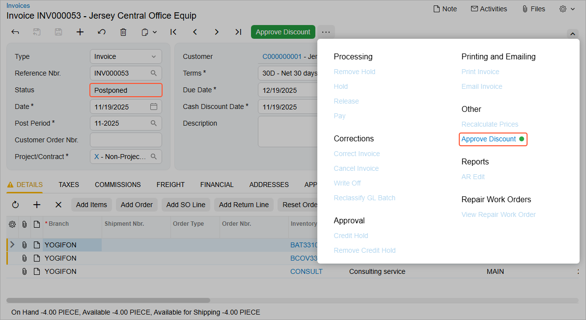

# Step 7: Testing the Transition {#_89f3ae7f-cb97-4071-b878-f2088c9d7728 .concept}

To test the transition, do the following:

1.  Rebuild the `PhoneRepairShop_Code` project.
2.  On the Repair Work Orders \(RS301000\) form, create an invoice for any repair work order.
3.  On the [Invoices](../UserGuide/SO_30_30_00.md) \(SO303000\) form, open the created invoice.
4.  In the **Document Discounts** box of the Summary area of the form, enter `5`.
5.  On the form toolbar, click **Remove Hold**.

    The status of the invoice changes to *Postponed*, as shown in the following screenshot. On the More menu, notice that only one command is available \(**Approve Discount**\). The equivalent button appears on the form toolbar.

    

6.  On the form toolbar, click **Approve Discount**.

    The status of the invoice changes to *Balanced*, and the value in the **Cash Discount Date** box is the business date.

7.  On the Repair Work Orders \(RS301000\) form, create another invoice for a different repair work order.
8.  On the [Invoices](../UserGuide/SO_30_30_00.md) \(SO303000\) form, open the created invoice.
9.  On the form toolbar, click **Remove Hold**.

    The status of the invoice changes to *Balanced*. Because you have not specified any value in the **Document Discounts** box, the system skipped the `Postponed` workflow state and moved the invoice to the next workflow state in the composite state \(`Balanced` in this case\).

**Parent topic:**[Composite Workflow States: To Update a Composite State](../DeveloperGuide/WorkflowAPI_Sequences_Activity_UpdateSequence.md)

