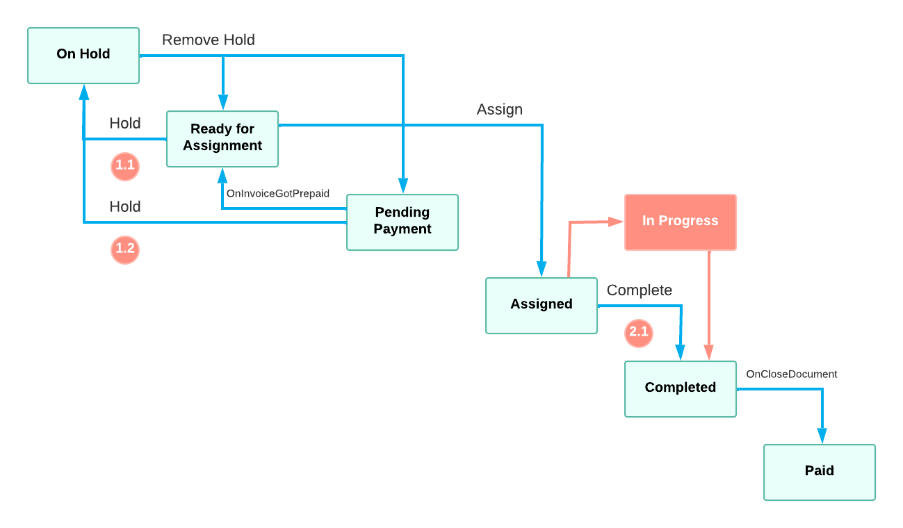

# Workflow-Identifying Fields of the Second Level: To Define a Workflow {#_dc692718-7cbe-46cb-9834-721413a91c73 .task}

The following activity will walk you through the process of defining workflows for the workflow-identifying field of the second level.

## Story { .section}

Suppose that on the Repair Work Orders \(RS30100\) form, a workflow for the repair work order may depend on values of two fields: `OrderType` and `Behavior`. The `OrderType` field is already used as the workflow-identifying field. Therefore, the `Behavior` field should be used as the workflow-identifying field of the second level.

The `Behavior` field can have the following values:

-   *B1*

    For this value, the user should not be able to put a repair work order on hold. That means, the transitions from the *Ready For Assignment* to *On Hold* state and from *Pending Payment* to *On Hold* state should not be available \(Items 1.1 and 1.2 on the diagram below\).

-   *B2*

    For this value, a new status of the repair work order should be available: *In Progress*. When a repair work order is in the *Assigned* status, a user should be able to click **Start** button and change the status of the order into *In Progress*. Then, a user should be able to click the **Complete** button which changes the status of the repair work order into *Completed*. That means, a new state and two new transitions should be available instead of an old transitions from the *Assigned* to *Completed* state \(Item 2.1 on the diagram below\).




## Process Overview { .section}

In this activity, you will first add the `UsrBehavior` custom field with corresponding string values to the Repair Work Orders \(RS301000\) form. Then, in the screen configuration for the Repair Work Orders \(RS30100\) form, you will specify the `UsrBehavior` field as the workflow-identifying field of the second level. For each value of the `UsrBehavior` field, you will add a workflow of the second level.

For the B1 value of the UsrBehavior field, you will modify the default workflow by removing the following transitions:

-   From the Ready For Assignment to On Hold state
-   From the Pending Payment to On Hold state

For the B2 value of the UsrBehavior field, you will modify the default workflow by doing the following:

-   Adding the In Progress state
-   Removing the transition to the Completed state
-   Adding a transition from the Assigned to In Progress state which is triggered by the new Start action

    You will also add the Start action to the screen configuration.

-   Adding a transition form the In Progress to Completed state which is triggered by the existing Complete action

## System Preparation { .section}

In an instance with the *T100* dataset, make sure that you have done the following:

-   Prepared an instance with the *PhoneRepairShop* customization project and enabled the workflow validation by performing the prerequisite activities in the [Preparing an Instance for Workflow Customization](WorkflowAPI_PrepareInstance_Mapref.md) chapter
-   Defined the default workflow for the Repair Work Orders \(RS301000\) form according to the customization description in [Company Story and Customization Description](WorkflowAPI_CustomizationStory.md)
-   Defined a workflow identifying field for the Repair Work Orders \(RS301000\) form as described in [Workflow-Identifying Fields: To Add a Workflow for a Value of the Workflow-Identifying Field](WorkflowAPI_WorkflowIdentifying_Add_Activity.md)

## Step 1: Add the Behavior Field \(Self-Guided Exercise\) { .section}

In this step, you will add the `UsrBehavior` field to the Repair Work Order \(RS30100\) form.

**Note:** The field must have the `Usr` prefix because it is a custom field.

To add the field, use the same instructions as described in [Step 1: Adding the OrderType Field and Corresponding Box to the UI](WorkflowAPI_WorkflowIdentifying_Activity_Add_AddCustomField.md).

## Step 2: Specify the Workflow-Identifying Field of the Second Level { .section}

In this step, you will specify the `UsrBehavior` field as the workflow-identifying field of the second level in the extension of `RSSVWorkOrderEntry_Workflow` class. You will do it using the FlowSubTypeIdentifierIs method. Do the following:

1.  In the `RSSVWorkOrderWorkflow_Extension` class which you defined in [Workflow-Identifying Fields: To Add a Workflow for a Value of the Workflow-Identifying Field](WorkflowAPI_WorkflowIdentifying_Add_Activity.md), define the set of constant string values and corresponding classes for the value of the `UsrBehavior` field which will later be used as values of the workflow-identifying field of the second level.

    **Note:** You can do it the same way as you did for the UsrOrderType field.

2.  In the Configure method, after the call to the FlowTypeIdentifierIs method, call the FlowSubTypeIdentifierIs method and specify the UsrBehavior field as the type parameter as shown in the following code.

    ```
    context.UpdateScreenConfigurationFor(screen => screen
      .FlowTypeIdentifierIs<RSSVWorkOrder_Extension.usrOrderType>()
      .FlowSubTypeIdentifierIs<RSSVWorkOrder_Extension.usrBehavior>());
    ```


## Step 3: Define Workflows for Each Value of the Workflow-Identifying Field of the Second Level { .section}

In this step, you will define a workflow for each value of the `UsrBehavior` field using the WithSubFlows method. This workflows will be applied to the *Simple* value of the `UsrOrderType` field.

**Note:** You do not need to define a complete workflow for each value of the `UsrBehavior` field because the workflows of the second level inherit their configuration from the workflow of the first level. You can define only the differences such as add states or modify transitions.

Do the following:

1.  In the WithFlows method call, in the Add&lt;OrderTypes.simple&gt; method, call the WithSubFlows method as shown in the following code.

    ```
    .Add<OrderTypes.simple>(flow => flow
      // states and transitions here
      .WithSubFlows(subFlows =>
      {
        ...
      }));
    ```

2.  Add the workflow for the *B1* value of the `UsrBehavior` field: In the WithSubFlows method, call the Add method and specify the *B1* value as the type parameter.

    ```
    .Add<OrderTypes.simple>(flow => flow
      // states and transitions here
      .WithSubFlows(subFlows =>
      {
        subFlows.Add<Behaviors.b1>("S1", subFlow => 
          // define states and transitions here
        );
        ...
       }));
    ```

3.  Add the workflow for the *B2* value of the `UsrBehavior` field: In the WithSubFlows method, call the Add method and specify the *B2* value as the type parameter.

    ```
    .Add<OrderTypes.simple>(flow => flow
      // states and transitions here
      .WithSubFlows(subFlows =>
      {
        subFlows.Add<Behaviors.b1>("S1", subFlow => 
          // define states and transitions here
        );
        subFlows.Add<Behaviors.b2>("S2", subFlow => 
          // define states and transitions here
        );
      }));
    ```


**Parent topic:**[Using Workflow-Identifying Fields of the Second Level](../DeveloperGuide/WorkflowAPI_Subflows_Mapref.md)

