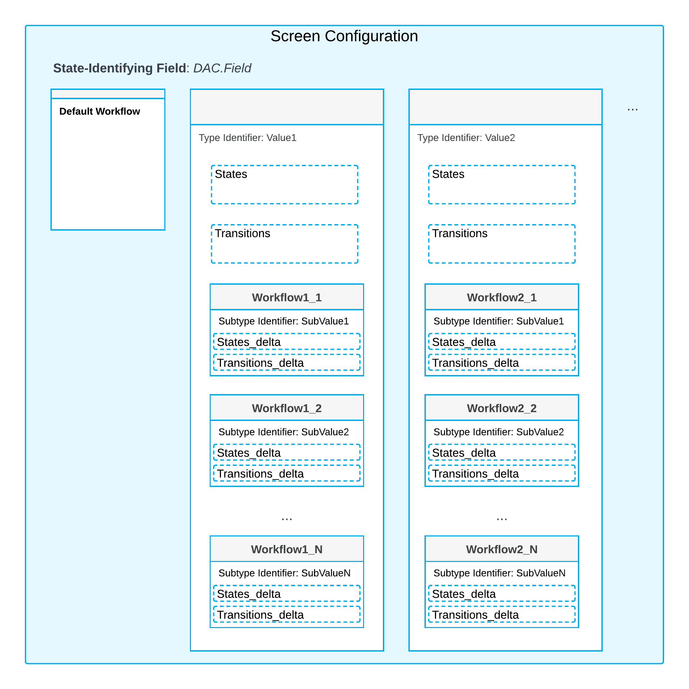

# Workflow-Identifying Fields of the Second Level: General Information {#_7c084166-d74a-4eda-a489-68c74e4144cb .concept}

This topic provides information about workflow identifiers \(that is, workflow-identifying fields, which are fields whose values determine the workflow to be used\) of the second level. You will also learn how to create different workflows that use these identifiers.

## Learning Objectives { .section}

In this chapter, you will learn the following:

-   What is a workflow-identifying field of the second level
-   How to define a subflow \(a workflow for a pair of the workflow-identifying field of the first and second level\)

## Applicable Scenarios { .section}

You use workflow identifiers of the second level when you have multiple types of entities on a form, and you need to create separate workflows for each of these entity types.

## Workflow-Identifying Fields of the Second Level { .section}

For a screen configuration which has a workflow-identifying field, you can specify a workflow-identifying field of the second level. This way you can create a workflow for each pair of values of these two fields.

**Tip:** Workflow-identifying field of the first level and the second level can also be called *type identifier* and the *subtype identifier* especially in the method names.

The system will apply the workflow based on the value of a workflow-identifying field of the first level \(defined using the FlowTypeIdentifierIs method\) and then further based on the value of the workflow-identifying field of the second level.

A workflow defined for the second level inherits its configuration from the workflow defined on the first level. The following diagram shows the types and subtypes of workflows based on their workflow-identifier field values.

## Definition of a Workflow of the Second Level {#section_vv2_1y4_y4b .section}

To create a workflow of the second level, do the following in the screen configuration:

1.  Define the workflow-identifying field of the first level by calling the FlowTypeIdentifierIs&lt;&gt;\(\) method
2.  Define the workflow-identifying field of the second level by calling FlowSubTypeIdentifierIs&lt;&gt;\(\) method
3.  For each value of the workflow-identifying field of the first level, define the set of workflows in the WithFlows\(\) method
4.  For each value of the workflow-identifying field of the second level, define the set of workflows in the WithSubFlows\(\) method

**Parent topic:**[Using Workflow-Identifying Fields of the Second Level](../DeveloperGuide/WorkflowAPI_Subflows_Mapref.md)

