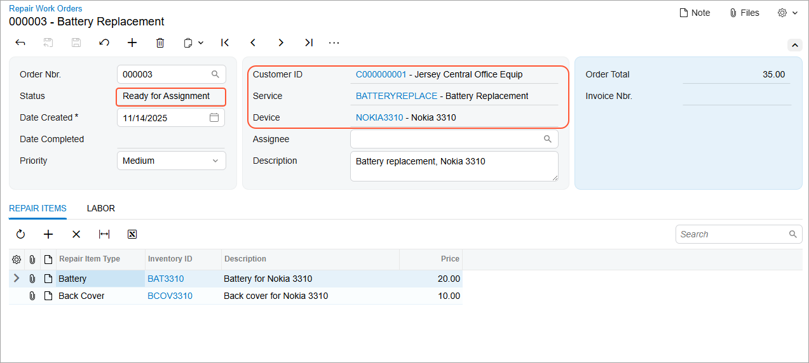

# Transitions: To Implement a Transition Triggered by an Action {#_8d04481d-a8f4-4146-9ade-69bdf463b685 .task}

This activity will walk you through the process of implementing a transition that is triggered by an action.

## Story { .section}

Suppose that a user should be able to remove a repair work order from hold when the order has the *On Hold* status. The user will be able to do this by clicking the **Remove Hold** button on the form toolbar or the corresponding command on the More menu. As a result, the status of the repair work order should be changed to *Ready For Assignment*.

You need to implement a simple transition from the `OnHold` workflow state to the `ReadyForAssignment` workflow state. This transition is performed without the system considering the prepayment requirements.

## Process Overview { .section}

To implement a transition from the `OnHold` workflow state to the `ReadyForAssignment` workflow state, you will use or define the following components in the screen configuration:

-   The `OnHold` workflow state, which is the initial workflow state for the transition.
-   The `ReadyForAssignment` workflow state, which is the target workflow state for the transition.

    You have defined both workflow states in [Workflow States: To Define a Workflow State](WorkflowAPI_States_Activity_DefiningState.md).

-   The `ReleaseFromHold` action, which is the element that triggers the transition.

    In this activity, you will use the implementation of the `ReleaseFromHold` action from [Workflow Actions: To Implement a Simple Action](WorkflowAPI_Actions_Activity_RemoveHold.md).

-   The transition.

## System Preparation { .section}

Make sure that you have done the following:

1.  Prepared an instance with the *PhoneRepairShop* customization project and enabled the workflow validation by performing the following prerequisite activities:
    1.  [Test Instance for Workflow Customization: To Deploy a Test Instance](WorkflowAPI_PrepareInstance_Activity_DeployInstance.md)
    2.  [Test Instance for Workflow Customization: To Turn On Workflow Validation](WorkflowAPI_PrepareInstance_Activity_EnableValidation.md)
2.  Prepared the screen configuration and defined the set of states by performing the [Screen Configuration: To Prepare a Screen Configuration for a Form Without a Predefined Workflow](WorkflowAPI_ScreenConfig_Activity_CreateNew.md) prerequisite activity.
3.  Defined the `ReleaseFromHold` action by performing the [Workflow Actions: To Implement a Simple Action](WorkflowAPI_Actions_Activity_RemoveHold.md) activity.
4.  Defined the `OnHold` and `ReadyForAssignment` states by performing the [Workflow States: To Define a Workflow State](WorkflowAPI_States_Activity_DefiningState.md) activity.

## Step 1: Defining a Transition { .section}

In this step, you will define a transition from the `OnHold` workflow state to the `ReadyForAssignment` workflow state. Do the following:

1.  In the `RSSVWorkOrderEntry_Workflow` class, in the static Configure method, locate the AddDefaultFlow method.
2.  Call the WithTransitions method in the lambda expression for the AddDefaultFlow method, as the following code shows.

    ```language-csharp
                        .WithTransitions(transitions =>
                        {
                        })
    ```

3.  Inside the lambda expression of the WithTransitions method, add the transition by calling the Add method, as the following code shows.

    ```language-csharp
                            transitions.Add(transition => transition
                                .From<States.onHold>().To<States.readyForAssignment>()
                                .IsTriggeredOn(graph => graph.ReleaseFromHold));
    ```

    In the code above, you have specified the following:

    -   The source workflow state for the transition \(which is `OnHold`\) as a type parameter of the From method
    -   The target workflow state for the transition \(which is `ReadyForAssignment`\) as a type parameter of the To method
    -   The entity that triggers the transition \(which is the `ReleaseFromHold` action\) in the IsTriggeredOn method
4.  Save your changes.

## Step 2: Testing the Transition { .section}

In this step, you will test the transition from the `OnHold` workflow state to the `ReadyForAssignment` workflow state. Do the following:

1.  Rebuild the `PhoneRepairShop_Code` project.
2.  In Acumatica ERP, on the Repair Work Orders \(RS301000\) form, create a record, and specify the following settings:
    -   **Customer ID**: *C000000001*
    -   **Service**: *Battery Replacement*
    -   **Device**: *Nokia 3310*
    -   **Description**: `Battery replacement, Nokia 3310`
3.  Make sure that the record has the *On Hold* status and that the **Remove Hold** button is displayed on the form toolbar and highlighted in green, as shown in the following screenshot.


    **Tip:** The More menu is not displayed because the workflow includes only one action and this action fits on the form toolbar. If there was only one workflow action and it could not be displayed on the form toolbar, then the More menu would be displayed.

4.  Save the repair work order.
5.  On the form toolbar, click **Remove Hold**.
6.  Notice that the status of the record has been changed to *Ready for Assignment* and that the **Customer ID**, **Service ID**, and **Device ID** boxes are unavailable, as shown in the following screenshot.

    


**Parent topic:**[Implementing Transitions](../DeveloperGuide/WorkflowAPI_Transitions_Mapref.md)

