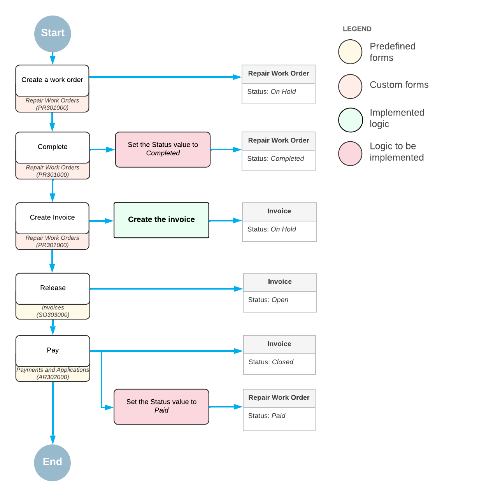

# Workflow-Identifying Fields: To Add a Workflow for a Value of the Workflow-Identifying Field {#_6733ea09-f0c0-4c31-9fd7-c783c6bfbb85 .task}

The following activity will walk you through the process of defining a workflow for a specific value of the workflow-identifying field.

## Story { .section}

Suppose that you have a repair work order that can be processed in the following ways:

-   Quickly while the customer awaits in the phone repair shop. In this case, the workflow can skip most of the traditional states and be paid right after it is created. So the workflow can have only three states \(`OnHold`, `Completed`, `Paid`\) and direct transitions from one to another.
-   In a few days while the order awaits the assigned employee. In this case, the standard default workflow can be applied.
-   In a few weeks because some of the required items are out of stock. In this case, the workflow might have an additional state, `AwaitingDelivery`, in addition to standard states of the workflow described in [Customization Description](WorkflowAPI_CustomizationStory_CustomizationDescription.md).

These ways of processing a repair work order are defined by the **Order Type** box which can have one of the following values:

-   *Simple*
-   *Standard*
-   *Awaiting Delivery*

In this activity, you will define a workflow for the *Simple* value of the **Order Type** box. The workflow is shown in the following diagram.

When the repair work order is created, it gets the *On Hold* status. Then a user can click the **Complete** action on the form toolbar, which changes the order to *Completed*. After that, a user can click **Create Invoice** on the form toolbar, which initiates creation of an invoice for this repair work order. When the invoice is created, a user can release and pay it on the [Invoices](../UserGuide/SO_30_30_00.md) \(SO303000\) and [Payments and Applications](../UserGuide/AR_30_20_00.md) \(AR302000\) forms respectively. As soon as the invoice is fully paid, the repair work order status should be changed to *Paid*.

## Process Overview { .section}

You will first add the `UsrOrderType` field to the `RSSVWorkOrder` DAC and respective database table. The field will hold the type of a repair work order and will be used on the Repair Work Orders \(RS301000\) form. Then, in the screen configuration for the Repair Work Orders \(RS301000\) form, you will specify this field as a workflow-identifying field. Then, you will add a workflow for the *Simple* value of the `UsrOrderType` field.

**Tip:** Creation of workflows for other values of the `UsrOrderType` field is not covered in this activity.

## System Preparation { .section}

Make sure that you have done the following:

1.  Prepared an instance with the *PhoneRepairShop* customization project and enabled the workflow validation by performing the following activities:
    1.  [Test Instance for Workflow Customization: To Deploy a Test Instance](WorkflowAPI_PrepareInstance_Activity_DeployInstance.md)
    2.  [Test Instance for Workflow Customization: To Turn On Workflow Validation](WorkflowAPI_PrepareInstance_Activity_EnableValidation.md)
2.  Prepared the screen configuration and defined the set of workflow states by performing the [Screen Configuration: To Prepare a Screen Configuration for a Form Without a Predefined Workflow](WorkflowAPI_ScreenConfig_Activity_CreateNew.md) activity.
3.  Performed the following prerequisite activities:
    1.  [Workflow Actions: To Implement an Action with Field Assignments](WorkflowAPI_Actions_Activity_WithFieldAssignments.md)
    2.  [Workflow Actions: To Configure the Conditional Appearance of the Action](WorkflowAPI_Actions_Activity_CreateInvoice.md)
    3.  [Workflow Events: To Use an Existing Event](WorkflowAPI_Events_Activity_UseExisting.md)

-   **[Step 1: Adding the OrderType Field and Corresponding Box to the UI](../DeveloperGuide/WorkflowAPI_WorkflowIdentifying_Activity_Add_AddCustomField.md)**  

-   **[Step 2: Specifying the Workflow-Identifying Field in the Workflow](../DeveloperGuide/WorkflowAPI_WorkflowIdentifying_Activity_Add_SpecifyField.md)**  

-   **[Step 3: Adding a Workflow for the Specific Value of the Workflow-Identifying Field](../DeveloperGuide/WorkflowAPI_WorkflowIdentifying_Activity_Add_AddWorkflow.md)**  

-   **[Step 4: Testing the Workflow](../DeveloperGuide/WorkflowAPI_WorkflowIdentifying_Activity_Add_Test.md)**  

**Parent topic:**[Defining Workflows with a Workflow Identifying Field](../DeveloperGuide/WorkflowAPI_WorkflowIdentifying_Mapref.md)

