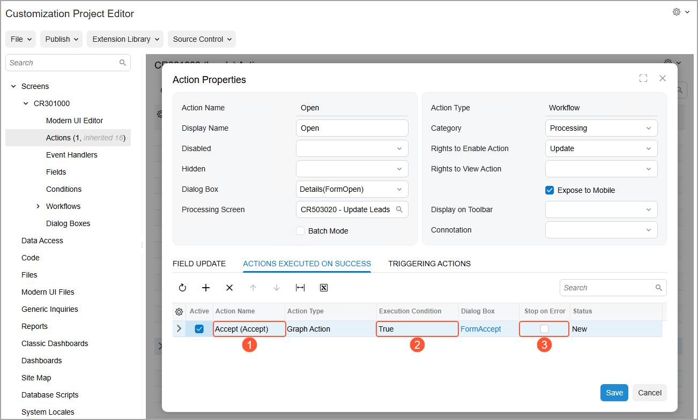
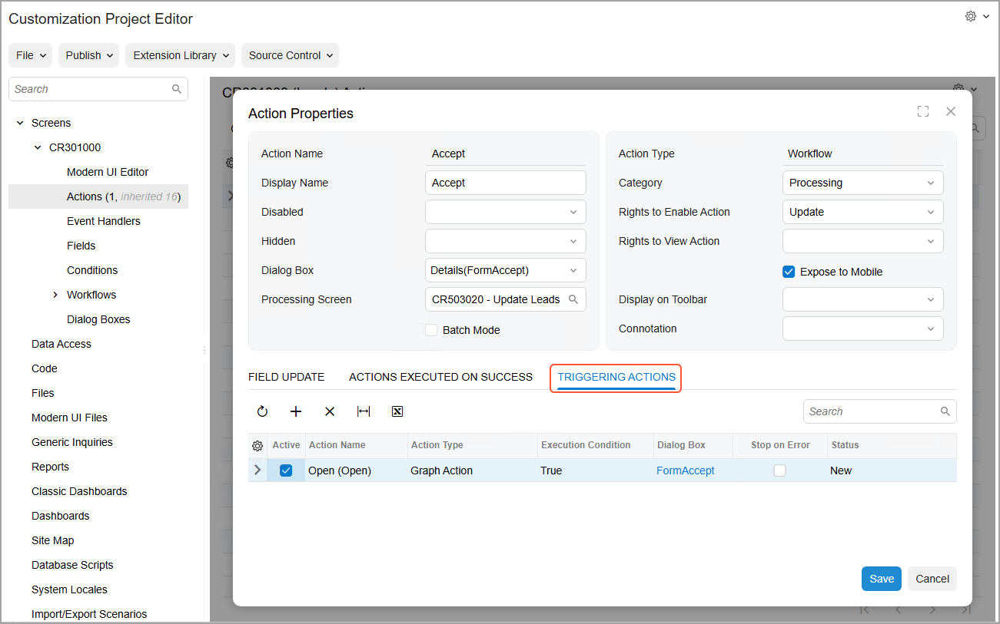
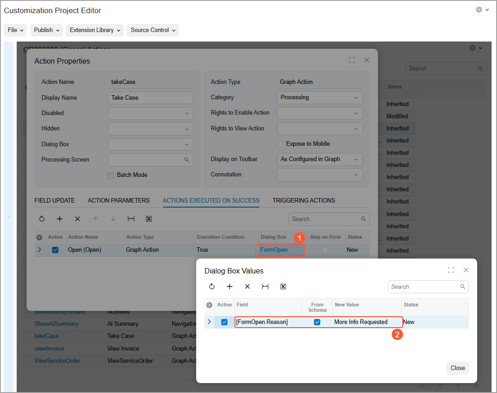

# Action Configuration: Action Sequences {#_e61fabdf-523b-4558-894e-6177219b18c3 .concept}

You can make the system automatically execute actions one after another if certain conditions are met. Thus, you can optimize system performance and speed up the processing of records. When a sequence of actions is performed, the system shows a dialog box with the progress and results of performing the sequence.

You can add any actions to the sequence, including actions whose code is defined in the graph.

## Learning Objectives { .section}

In this chapter, you will learn what action sequences are. You will also learn how to configure these sequences in a workflow.

## Applicable Scenarios { .section}

You implement action sequences in the following cases:

-   You want the system to execute multiple actions one after another if certain conditions are met.
-   You want the system to stop the processing of records if certain actions fail.
-   You need to see which actions have been performed successfully and which ones have failed.

## Sequential Action Execution { .section}

Each action can have multiple actions—referred to as *subscriber actions* or *subscribers*—that the system invokes after it executes this action. Each subscriber can also have its own subscribers. If a condition is specified for an action, the system executes a subscriber action only if the condition is met and the action is available in the current workflow state. The system executes the action even if it is hidden.

If a subscriber action is unavailable in the current state of the workflow, the system displays an error. The system then either continues the execution of other subscriber actions or stops the execution, depending on the settings specified for this action.

**Tip:** Only actions of the same form \(screen\) can be configured to run in a sequence.

If a user clicks a button \(or invokes a command\) that has an underlying action with subscribers, the system proceeds as follows:

1.  If a dialog box is specified for this action, the system displays it and updates the fields as specified on the **Field Update** tab of the **Action Properties** dialog box of the [Actions](../UserGuide/AU_20_10_50.md) page for the action.
2.  The system performs all other steps in the workflow. Specifically, the system does the following by using the settings on the [Actions](../UserGuide/AU_20_10_50.md) page for the workflow state:
    1.  Updates the specified fields \(on the **Fields**, **Fields to Update on Entry**, and **Fields to Update on Exit** tabs\).
    2.  Performs the transitions.
    3.  Updates the specified post-transition fields \(in the **Fields to Update After Transition** table\).
3.  If the action has been executed successfully, the system then executes its subscribers.

    If a dialog box is specified for a subscriber action, the system does not display this dialog box to the user; instead, the system uses the specified dialog box values.

4.  For each of the subscribers, the system performs all other steps in the workflow.
5.  If a subscriber action has its own subscribers, the system executes them one by one if their respective conditions are met and they exist in the current workflow state.

During the execution of each action in a sequence, the system displays a dialog box with the status of the action execution, as shown in the following screenshot. \(It is the same dialog box that the system displays when you click the **Quick Process** button on the [Sales Orders](../UserGuide/SO_30_10_00.md) \(SO301000\) form.\) For the actions of the *Run Report* or *Navigation: Create Record* type, the system opens the corresponding report or data entry form in a new browser tab, and continues the processing of other actions in the current tab.

For details on action types, see [Action Configuration: General Information](WorkflowUI_Actions_GeneralInfo.md).

## Addition of Subscribers {#section_vv2_1y4_y4b .section}

You add the subscribers to an action by using the **Actions Executed on Success** tab of the **Action Properties** dialog box on the [Actions](../UserGuide/AU_20_10_50.md) page in the Customization Project Editor. The following screenshot shows this dialog box for the `Open` action on the [Leads](../UserGuide/CR_30_10_00.md) \(CR301000\) form. Notice that this action has one subscriber: The `Accept` action \(see Item 1 in the following screenshot\), which the system always executes \(Item 2\).

**Tip:** You can instead specify that the system should execute the subscriber action only if a particular condition is met, by selecting this condition in the **Condition** column.

By default, the system executes all actions in a sequence even if any of these actions fails. If needed, you can make the system stop the execution of subscribers if a triggering action fails by selecting the **Stop on Error** check box \(Item 3\).

## Viewing of the Triggering Actions { .section}

You can see what actions trigger the execution of the current action on the **Triggering Actions** tab of the same dialog box \(see the following screenshot\).

Note that after you have added the `Release` action as a subscriber on the **Actions Executed on Success** tab for the `Close` action, the `Close` action automatically appears on the **Triggering Actions** tab in the **Action Properties** dialog box for the `Release` action.

## Editing of Dialog Boxes of Subscriber or Triggering Actions { .section}

If a subscriber action has a dialog box configured for it, the system displays the name of this dialog box as a link in the **Dialog Box** column \(see Item 1 in the following screenshot\). If you click this link, the **Dialog Box Values** dialog box opens, in which you can specify values other than the default ones. The screenshot shows the selection of the *More Info Requested* value \(Item 2\) instead of the default *In Process* value for the **Reason** box of the **Details** dialog box for the `Open` action.

If no values are specified explicitly in the **Dialog Box Values** dialog box, the system uses the default values specified on the [Dialog Boxes](../UserGuide/AU_20_10_40.md) page.

**Parent topic:**[Configuring Actions](../DeveloperGuide/WorkflowUI_Actions_Mapref.md)

