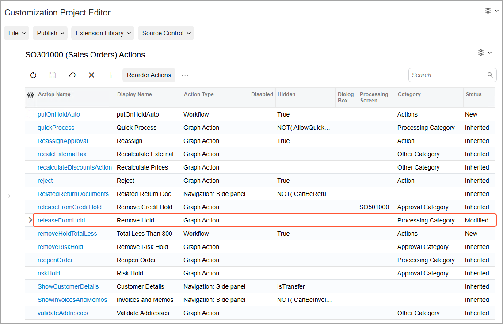

# Action Configuration: General Information {#_57a1265a-c8a8-4b0c-ae79-9db03a0e7eee .concept}

In a workflow, actions represent buttons on the form toolbar and commands on the More menu of a form.

## Learning Objectives { .section}

In this chapter, you will learn how to do the following:

-   Hide unneeded commands on the form
-   Add new actions to the workflow
-   Modify the added actions
-   Add categories of the More menu
-   Organize the commands into categories on the More menu

## Applicable Scenarios { .section}

You may need to configure actions when you are creating transitions or editing states in a workflow.

## Configuration of Actions in a Workflow { .section}

Actions are associated with buttons or commands \(or both\) in the user interface. When a user clicks a button or a command, the system may change the status of the record on the form according to the workflow settings. That is, these actions trigger transitions from one workflow state to another. You can use the same action to trigger transitions from a particular state to different states.

You configure actions for a particular screen. Therefore, before you start configuring actions, you need to make sure that the corresponding screen has been added to the customization project on the [Screens](../UserGuide/AU_20_10_00.md) page.

You configure workflow actions by using the [Actions](../UserGuide/AU_20_10_50.md) page of the Customization Project Editor. Actions added in the predefined workflow are automatically displayed on the page, and you can modify the properties of these actions.

To understand which of the listed actions are from the predefined workflow and which are new, you review the **Status** column for each action. Actions from the predefined workflow have the *Inherited* status, and all actions that you have added to the [Actions](../UserGuide/AU_20_10_50.md) page \(including existing graph actions\) have the *New* status. If you have modified an action from the predefined workflow, its status changes to *Modified* \(see the following screenshot\).

**Tip:** In the name that appears on the page, *Actions* is preceded by the form ID and then the form name in parentheses, so you can always see at a glance which form you are customizing.

## Types of Actions {#_079e73c4-c670-4ee1-87c9-82f9c6966a1e .section}

You can add the following types of actions by using the [Actions](../UserGuide/AU_20_10_50.md) page:

-   Actions that redirect a user to a different form or report
-   Workflow actions that change the state of the applicable record
-   Actions that open a side panel
-   Actions defined in a graph

**Tip:** Redirect actions can be created only on the [Actions](../UserGuide/AU_20_10_50.md) page.

The name and type of the action cannot be changed after the action is created.

## Categories on the More Menu { .section}

You can group commands under categories on the More menu, so that users can easily find them. For example, if a command is associated with an action related to changing the status of a record created on the form, it is usually displayed under the **Processing** category. Each category displays the commands whose actions are enabled based on the record’s state, as well as those whose actions are disabled for this state.

When you add an action on the [Actions](../UserGuide/AU_20_10_50.md) page, you specify the category on the More menu where the associated menu command will be displayed. By default, no category is specified for an action, which means that its command will be listed under the **Other** category.

The default list of categories depends on the form. You can add new categories and modify or delete existing ones. Also, you can change the order in which the categories are displayed on the More menu.

## Addition of Actions Defined in the Graph { .section}

In the workflow of an Acumatica ERP form, you can use actions that are defined in the graph that corresponds to the form. To add such action to the workflow of the form, you click **Add Existing Action** on the More menu of the [Actions](../UserGuide/AU_20_10_50.md) page opened for the form. By default, such actions are displayed on the form according to the properties of the [PXButton](https://help.acumatica.com/(W(124))/Help?ScreenId=ShowWiki&pageid=1a7069c4-95d5-456b-41ec-5b19371358db) attribute specified for the action, which the *As Configured in Graph* option in the [Action Properties Dialog Box](../UserGuide/AU_20_10_50.md#_aa40d598-72fc-4232-b46b-ef3bc75825d2) indicates.

## Viewing of Changes Between the Predefined and Customized Action { .section}

All predefined actions of the applicable screen are displayed on the [Actions](../UserGuide/AU_20_10_50.md) page by default. If you have modified a predefined action on this page, you can view the changes by clicking **View Changes** on the More menu. You can also return the action properties to the original predefined state, if needed.

**Parent topic:**[Configuring Actions](../DeveloperGuide/WorkflowUI_Actions_Mapref.md)

