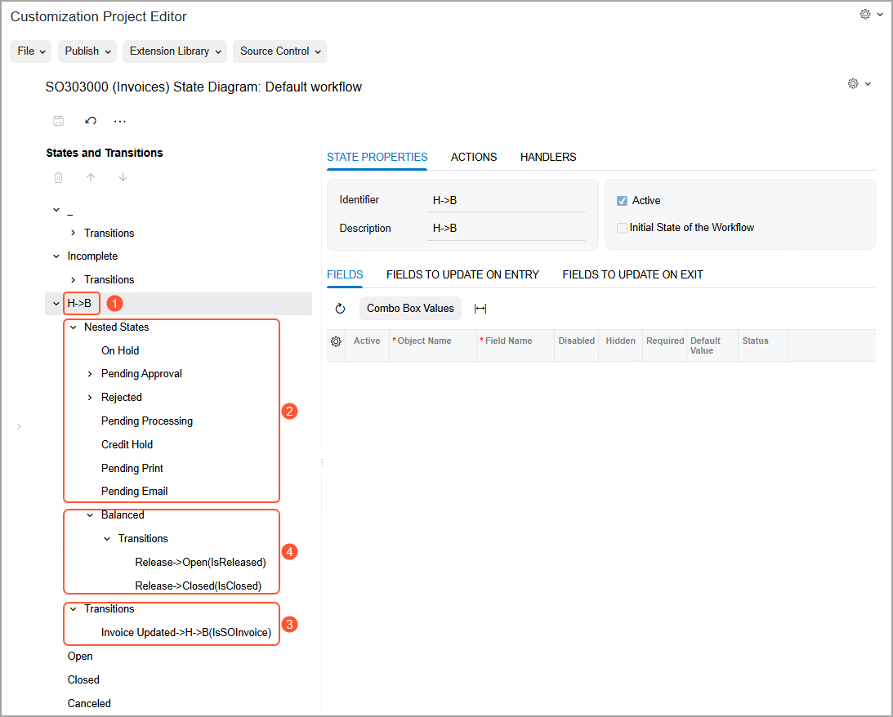

# Composite States: General Information {#_d60893e8-27ae-48f6-9da0-3d3ef2a4fa41 .concept}

This topic provides information about composite states in workflows in Acumatica ERP.

## Learning Objectives { .section}

In this chapter, you will learn what a composite state is and how to modify it in an inherited workflow.

## Applicable Scenarios { .section}

You use composite states if you want to specify common settings for a group of states in your workflow.

## Composite States in Workflows { .section}

A composite state of a workflow, which can also be referred to as a *parent workflow state*, is a workflow state that contains an ordered sequence of nested workflow states and the transitions to and from these states. With composite workflow states, you can specify common settings \(actions, fields to be updated, and transitions\) for a group of workflow states only once—in the composite state that includes these workflow states.

For each of the workflow states inside the composite state, you can do the following:

-   Specify whether this workflow state should be skipped by using a skip condition
-   Specify a transition to the next workflow state inside the composite state instead of a transition to a specific workflow state
-   Specify a transition to the workflow state that is the next one after the composite state if this composite state is itself a nested workflow state in another composite state
-   Override the settings inherited from the composite state, if needed

These capabilities make workflow customization much easier. You do not need to explicitly specify target workflow states for transitions. Thus, if you add or remove states in the workflow or change the order of states, you do not need to modify all the affected transitions.

The workflow for a record created on a form cannot be in a composite state; it can only be in one of its nested workflow states. When the workflow for a record enters any nested state in a composite state, the system checks the skip condition specified for this workflow state, if one has been defined. If the condition is fulfilled, the system does the following for the current workflow state:

1.  Assigns the default values for the fields as specified on the **State Properties** tab of the [Workflow \(Tree View\)](../UserGuide/AU_20_10_30.md) page for the form if the current state is the initial state of the workflow
2.  Does not check the fields that should be updated when the workflow for the record enters the state and leaves it
3.  Does not check any of the workflow settings, and moves the workflow for the record to the next state inside the composite state

If no skip condition is specified, the system uses the configuration for this workflow state. This means that the transitions are triggered only by actions or event handlers, and the system does not check the skip condition again while the workflow for the record remains in this state.

## Creation of a Composite State { .section}

To add a composite state, you first add a new or a predefined state, and then specify a parent state for it in the **Change Parent State** dialog box, which is available on the [Workflow \(Tree View\)](../UserGuide/AU_20_10_30.md) page of the Customization Project Editor.

## Example of a Composite State { .section}

The screenshot below shows the default workflow of the [Invoices](../UserGuide/SO_30_30_00.md) \(SO303000\) form on the [Workflow \(Tree View\)](../UserGuide/AU_20_10_30.md) page of the Customization Project Editor. The composite state \(see Item 1 in the screenshot\) contains nested states \(Item 2\) that are part of a typical invoice workflow, as well as transitions \(Item 3\) to and from the composite state and the nested states. Notice that the `Balanced` nested state also contains transitions \(Item 4\).

**Tip:** For a workflow with composite states, the diagram view of the page is not available, and the **Diagram View** button is not displayed on the More menu of the [Workflow \(Tree View\)](../UserGuide/AU_20_10_30.md) page.

**Parent topic:**[Using Composite States](../DeveloperGuide/WorkflowUI_CompositeStates_Mapref.md)

