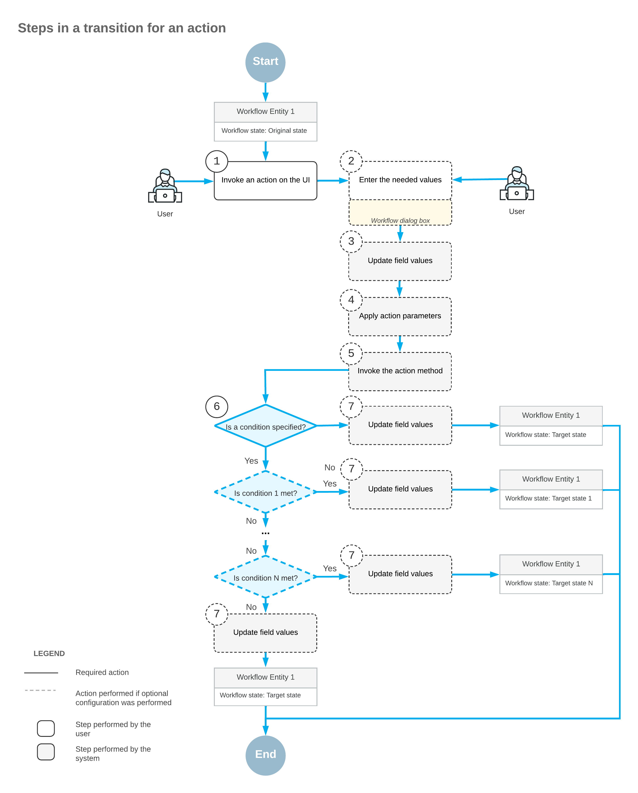
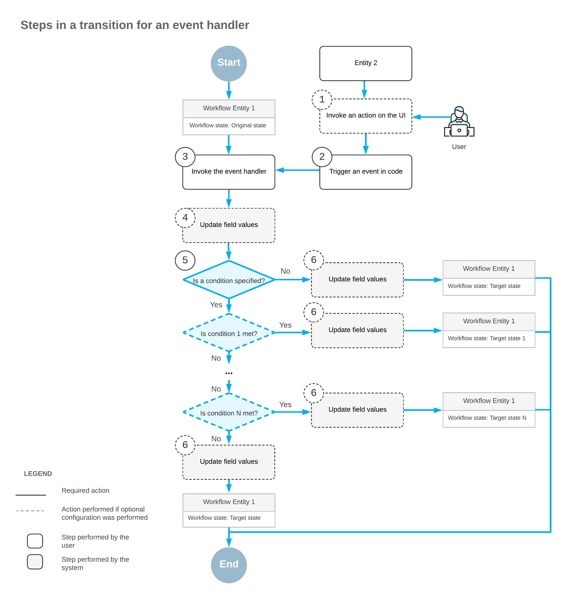
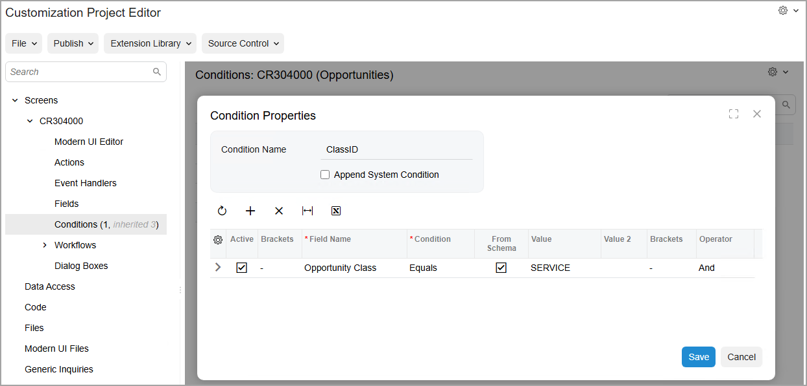
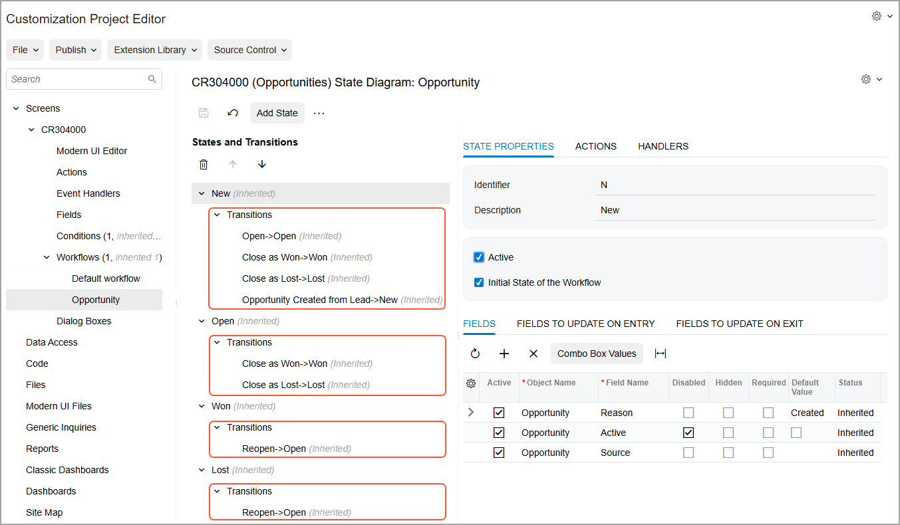

# Conditions and Transitions: General Information {#_d6f815e7-85c2-4010-a4b0-731d4a630c6e .concept}

A transition in a workflow is triggered if a user performs a particular operation or a specific event is raised in the code. An event can be raised when some change occurs on the current form to the selected record or on another form to another record.

You can use conditions to specify when actions should be performed and when transitions should be triggered. By using conditions, you can control when particular fields should appear on the form as well as what properties the fields have based on particular settings of the record.

## Learning Objectives { .section}

In this chapter, you will learn how to create conditions that will be used to modify actions. You will also learn how to add transitions between the states of the workflow.

## Applicable Scenarios { .section}

After you add states to the workflow, you need to configure transitions between these states. You use conditions to specify when particular transitions should be performed.

## Transition for an Action {#_235a2d37-5ce2-441d-b4e5-888f81bf31e9 .section}

In the following diagram, you can see the steps that the system performs when a user clicks a button or command to invoke an action in the UI of the current form. The system transits the entity to the target state, which can be different depending on the conditions.

First, a user clicks a button or command to invoke an action on the form \(Item 1 in the diagram\). If applicable, the dialog box you have specified for the action is displayed, and the user enters the needed values in this dialog box \(Item 2\). Then the system updates the fields you have specified based on the values the user has entered in the dialog box for the action \(Item 3\). Optionally, if the action is defined in a graph, the system applies the parameters that you have specified for the action \(Item 4\) and invokes the action method \(Item 5\); only actions defined in a graph can have a method to be invoked and properties to be applied. If you have specified both a transition that the action triggers and a condition for this transition, the condition is then checked \(Item 6\).

**Attention:** In each transition, you can check for only one condition. To check for multiple conditions, you have to define multiple transitions, one for each condition. The system checks transition conditions in the order in which the transitions are defined on the [Workflow \(Tree View\)](../Shared/../UserGuide/AU_20_10_30.md) or [Workflow \(Diagram View\)](../Shared/../UserGuide/AU_20_10_30_VisualEditor.md) page of the Customization Project Editor. Conditions are defined on the [Conditions](../Shared/../UserGuide/AU_20_10_10.md) page for the customized screen.

If you have specified the fields to be updated after the transition or the fields to be updated when a record enters or leaves the state, the system proceeds as follows \(Item 7\):

1.  In the original state, assigns new values to the fields that should be updated when a record exits the state. These new values affect all transitions from this state.
2.  Updates the fields that should be updated after this particular transition. This update affects only this transition.
3.  In the target state, assigns new values to the fields that should be updated when a record enters the state. These new values affect all transitions to this state.

Finally, the system changes the record's state to the target state you have specified for the transition.

## Transition for an Event Handler {#_0c60c9d0-d64d-4203-82c2-5b3bfa7961f1 .section}

In the following diagram, you can see the steps that the system performs during a transition to the target state when some change occurs on the current form to the current record or on a different form to another record. This raises an event in the code, which in turn invokes the event handler.

First, a user invokes an action in the UI of a different form for some other record \(Item 1 in the diagram\) or changes a value in a box on this form or another form. This triggers an event in the code \(Item 2\). Then the system invokes an event handler \(Item 3\) and updates any fields that you have specified for this event handler \(Item 4\). If you have specified a transition for this event handler and a condition for this transition, the condition is checked \(Item 5\).

**Attention:** In each transition, you can check for only one condition. To check for multiple conditions, you have to define multiple transitions, one for each condition. The system checks transition conditions in the order in which the transitions are defined on the [Workflow \(Tree View\)](../Shared/../UserGuide/AU_20_10_30.md) or [Workflow \(Diagram View\)](../Shared/../UserGuide/AU_20_10_30_VisualEditor.md) page of the Customization Project Editor. Conditions are defined on the [Conditions](../Shared/../UserGuide/AU_20_10_10.md) page for the customized screen.

If you have specified the fields to be updated after the transition or the fields to be updated when a record enters or leaves the state, the system proceeds as follows:

1.  In the original state, assigns new values to the fields that should be updated when a record exits the state. These new values affect all transitions from this state.
2.  Updates the fields that should be updated after this particular transition. This update affects only this transition.
3.  In the target state, assigns new values to the fields that should be updated when a record enters the state. These new values affect all transitions to this state.

Finally, the system changes the record's state to the target state you have specified for the transition.

## Configuration of Conditions and Transitions { .section}

You use the [Conditions](../UserGuide/AU_20_10_10.md) page of the Customization Project Editor to construct a condition that can later be specified as a property value for the following items on a particular form:

-   A UI control
-   An action, including an auto-run action
-   A transition

You can add new rows and modify existing rows of the conditions that you have created previously. You cannot modify predefined conditions.

The following screenshot shows the [Conditions](../UserGuide/AU_20_10_10.md) page for the [Opportunities](../UserGuide/CR_30_40_00.md) \(CR304000\) form with the **Condition Properties** dialog box opened for the ClassID condition.

**Tip:** In the name that appears on the [Conditions](../UserGuide/AU_20_10_10.md) page, *Conditions:* is followed by the form ID and then the form name in parentheses, so you can always see at a glance which form you are customizing. Notice that the page name shown in the screenshot is *Conditions: CR304000 \(Opportunities\)*.

You configure transitions by using the [Workflow \(Tree View\)](../UserGuide/AU_20_10_30.md) page of the workflow. The added transitions are displayed on the **States and Transitions** pane of this page. You can change the order in which the transitions are displayed on this pane, if needed.

The following screenshot shows transitions on the **States and Transitions** pane for the opportunity workflow.

You can also add transitions between states by using the [Workflow \(Diagram View\)](../UserGuide/AU_20_10_30_VisualEditor.md) page \(for details, see [Diagram View: General Information](WorkflowUI_CustomizingInheritedWorkflow_GeneralInfo.md)\).

**Parent topic:**[Configuring Conditions and Transitions](../DeveloperGuide/WorkflowUI_ConditionsTransitions_Mapref.md)

