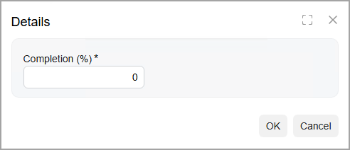

# Workflow Elements: To Add a Dialog Box {#_eb42784b-9a8d-40bb-aa15-e2392c5c6b00 .task}

The following activity will walk you through the process of creating a dialog box in a workflow.

## Story { .section}

According to the planned workflow of the [Task](../UserGuide/CR_30_60_20.md) \(CR306020\) form, when a user reopens a completed task on the form, the system needs to display a dialog box. In this dialog box, the user must specify the percent of task completion. Acting as the technical specialist, you will create this dialog box.

## Process Overview { .section}

By using the [Dialog Boxes](../UserGuide/AU_20_10_40.md) page, you will add a new dialog box to the workflow.

## System Preparation { .section}

Before you begin adding a dialog box, do the following:

1.  Launch the Acumatica ERP website with the *U100* dataset preloaded, and sign in as system administrator by using the *gibbs* username and the *123* password.

    **Tip:** The *gibbs* user is assigned the *Administrator* role, which has sufficient access rights to customize workflows.

2.  Make sure that you have completed the [Workflow Elements: To Modify Field Settings](WorkflowUI_ConfiguringWorkflowElements_Activity_ModifyFields.md) activity.

## Step: Creating a Dialog Box { .section}

To create the *Reopen* dialog box, do the following in the Customization Project Editor for the *TaskWorkflow* project:

1.  In the navigation pane, click **Screens** &gt; **CR306020** &gt; **Dialog Boxes**. The CR306020 \(Task\) Dialog Boxes page opens.
2.  On the pane toolbar of the **Dialog Boxes** pane, click the button with the plus sign.
3.  In the **New Dialog Box** dialog box, which opens, type `FormReopen` as the name, and click **Save**.
4.  On the **Dialog Boxes** pane, click the name of the added dialog box.
5.  In the **Title** box on the right pane, enter `Details`.
6.  In the **Dialog Box Fields** table, click **Add Row** on the table toolbar, and specify the following settings in the added row:
    -   **Schema Field**: *PX.Objects.CR.CRActivity.PercentCompletion*

        This is the name of the field that corresponds to the **Completion \(%\)** box of the [Task](../UserGuide/CR_30_60_20.md) \(CR306020\) form. You can start typing the name of the box to find the needed schema field.

    -   **Field Name**: `Completion`
    -   **Title**: *Completion \(%\)* \(specified automatically\)
    -   **From Schema**: Selected
    -   **Default Value**: `0`
    -   **Required**: *True*
    -   **Column Span**: `1`
7.  On the page toolbar, click **Save**.
8.  On the page toolbar, click **Preview Dialog Box**.

    The dialog box should look as shown in the following screenshot.

    

**Parent topic:**[Configuring Workflow Elements](../DeveloperGuide/WorkflowUI_ConfiguringWorkflowElements_Mapref.md)

