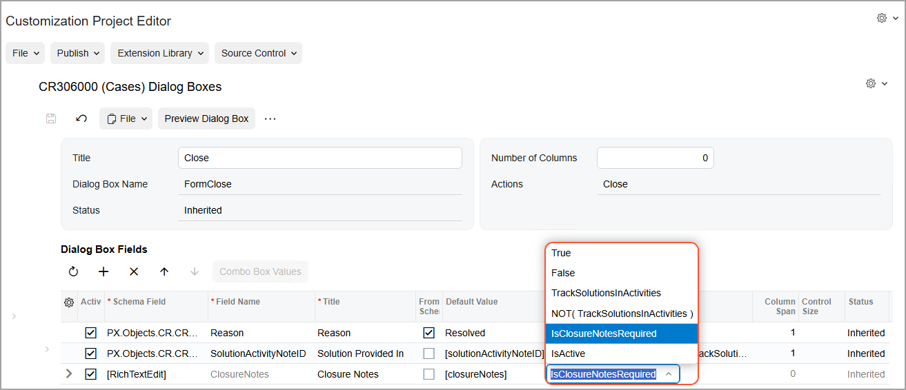
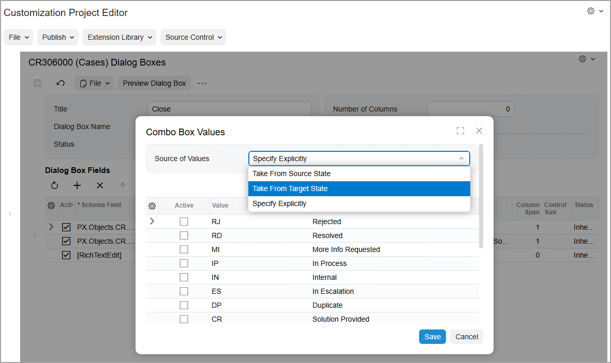
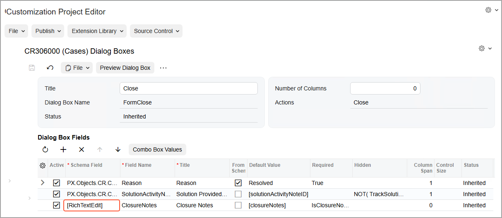
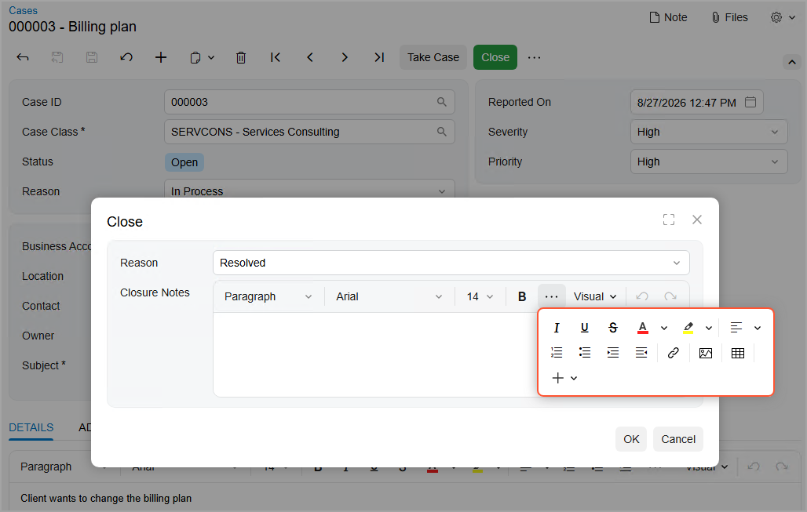

# Workflow Elements: General Information {#_ea427fe5-c281-484b-b092-0920f81458be .concept}

By using the [Fields](../UserGuide/AU_20_10_60.md) page, you can manage how particular boxes or check boxes are displayed on the form and what values can be selected from drop-down lists, depending on the status of the record on the form being modified.

You can also configure a dialog box that is shown to a user who clicks a particular action on a specific form. To give you the ability to define workflow dialog boxes, the Customization Project Editor provides the [Dialog Boxes](../UserGuide/AU_20_10_40.md) page.

## Learning Objectives { .section}

In this lesson, you will learn how to modify field settings and create dialog boxes.

## Applicable Scenarios { .section}

You specify field settings when you want to modify the display of the elements that correspond to these fields in the UI. You configure dialog boxes when you want users to provide additional information when they initiate an action that causes the record's transition to a different state.

## Field Configuration { .section}

You use the [Fields](../UserGuide/AU_20_10_60.md) page to modify the settings of a particular field of a specific form. Any of these settings can be applied unconditionally \(that is, it can always be *True* or *False*\), or be applied only when certain condition is met. You can modify the following field settings:

-   `Disabled`: An indicator of whether the corresponding element in the UI is available or unavailable.
-   `Hidden`: An indicator of whether the corresponding element in the UI is visible or invisible.
-   `Required`: An indicator of whether the corresponding element in the UI is required or optional.
-   Display Name: The name of the corresponding element as it is displayed in the UI.
-   Default Value: The default value for the corresponding box in the UI. This value will be inserted when a user adds a new record.

    You can enter the needed value for the element or select one of the values available in the database. You can also use the Formula Editor to specify values that depend on the values of other elements \(for example, *Type* or *Status*\).

-   List of combo box values: If the element is a combo box, the combo box values that can be selected in the box.

In the navigation pane of the Customization Project Editor, you open the [Fields](../UserGuide/AU_20_10_60.md) page by clicking **Fields** under the screen ID of the form for which you are modifying the field’s settings. The following screenshot shows the CR301000 \(Leads\) Fields page with the added CampaignID, EMail, and Phone3Type fields.

 Fields page")

**Tip:** In the name that appears on the page, *Fields* is preceded by the screen ID and then the screen name in parentheses, so you can always see at a glance which form you are customizing.

## Dialog Box Configuration { .section}

If you want the system to display a dialog box when a user clicks a particular button or command on a form, you first need to configure this dialog box. You then specify the dialog box in the **Action Properties** dialog box for the action associated with the button or command. \(For details, see [Action Configuration: General Information](WorkflowUI_Actions_GeneralInfo.md).\)

You configure dialog boxes on the [Dialog Boxes](../UserGuide/AU_20_10_40.md) page of the Customization Project Editor for a particular screen. You can add new dialog boxes and modify existing ones. For each dialog box, you specify the name that a dialog box will have when the system displays it to the user. You also specify all fields that represent elements in which the user will need to specify data. You can then specify default values for the added fields and mark the fields as required or hidden.

After you specify the needed settings for the dialog box, you can preview it by clicking **Preview Dialog Box** on the page toolbar or More menu of the page \(see Item 1 below\). The screenshot also shows the settings of the **Open** dialog box, which opens when a user opens a case on the [Cases](../UserGuide/CR_30_60_00.md) \(CR306000\) form \(Item 2\). Notice that the [Dialog Boxes](../UserGuide/AU_20_10_40.md) page also lists two more dialog boxes associated with the screen \(Item 3\). The first one opens when the user clicks **Pending Customer**; the second one opens when the user clicks **Close**.

 Dialog Boxes page")

**Tip:** In the page name, *Dialog Boxes* is preceded by the form ID and then the form name in parentheses, so you can always see at a glance which form’s dialog box you are customizing.

## Hiding of the Fields of a Dialog Box { .section}

You can hide any field \(element\) in a dialog box depending on a condition. To do this, in the **Hidden** column of the **Dialog Box Fields** table on the [Dialog Boxes](../UserGuide/AU_20_10_40.md) page, you select the condition for the particular field. If this condition is met, the field is not displayed in the dialog box.

If all fields of a dialog box are hidden, this dialog box is not displayed. If particular fields are hidden but have default values specified for them, these fields are not displayed in the dialog box; however, it is still possible to use these fields in the workflow.

If you no longer plan to display a particular field in the dialog box, you can also unconditionally hide the field in the dialog box by selecting *True* in the **Hidden** column for this box. This functionality can be useful if the field has been added in the predefined workflow but is not required in the customized workflow. If you hide the field by selecting *True* in the **Hidden** column, no additional workflow modifications are required to hide the field.

## Specifying of Conditions for Required Fields { .section}

You can make the element corresponding to any field in a dialog box conditionally required. To do this, in the **Required** column of the **Dialog Box Fields** table on the [Dialog Boxes](../UserGuide/AU_20_10_40.md) page, you select the condition for the particular field. If this condition is met, the corresponding element is marked as required in the dialog box.

**Tip:** In the **Required** column, you can instead select *True* of *False* to indicate that the field is always required or is never required, respectively.

The following screenshot shows the selection of the *ClosureNotesRequired* condition for the Closure Notes field of the dialog box that the system displays when the user closes a case.

**Attention:** If a required field is also marked as hidden and is empty, this field will be displayed in the dialog box \(that is, it will not be hidden despite the setting\).

## Values for a Drop-Down List in a Dialog Box { .section}

In a dialog box that the system displays when you invoke particular actions on a form, you can select the source of the values that will be available in a drop-down list. Instead of specifying drop-down values explicitly for multiple dialog boxes, you can indicate that these values should be the same as in the target state or source state of the transition. By using this functionality, you can use only one dialog box for all actions in a workflow.

You select the source of the values of a drop-down list in the **Combo Box Values** dialog box, which you open when you are viewing the [Dialog Boxes](../UserGuide/AU_20_10_40.md) page for a custom or customized workflow. To open this dialog box, you click a particular field in the **Dialog Box Fields** table and then clicking **Combo Box Values** on the table toolbar.

In the **Source of Values** box of the dialog box, you select one of the following options \(see the screenshot below\):

-   *Take From Source State*: The values from the source state of the transition are used. This is the default option for a drop-down list in a new dialog box.
-   *Take From Target State*: The values from the target state of the transition are used.
-   *Specify Explicitly*: The values are selected in the table in the **Combo Box Values** dialog box.

**Tip:** If an action triggers transitions to multiple target states, we recommend that you use the *Specify Explicitly* or *Take from Source State* option.

For details about transitions, see [Conditions and Transitions: General Information](WorkflowUI_ConditionsTransitions_GeneralInfo.md).

## Addition of Rich Text Editor Fields { .section}

You might want to require users to enter certain text in elements in the dialog boxes that are opened when the status of a record on a form changes. You might also want to give the users the ability to enter text in all formats supported by a rich text editor.

To add to a dialog box a field with rich text editor support, in the **Dialog Box Fields** table on the [Dialog Boxes](../UserGuide/AU_20_10_40.md) page, you select *\[RichTextEdit\]* in the **Schema Field** column. The following screenshot shows the settings to add the ClosureNotes field \(which corresponds to the box with the same name\) to the dialog box that the system displays when the user closes a case.

When the user clicks **Close** on the More menu \(under **Processing**\) on the [Cases](../UserGuide/CR_30_60_00.md) \(CR306000\) form to close a case, they can enter a comment in the text area. They can then use the buttons on the formatting toolbar to format the text and to insert images, links, and tables \(see the following screenshot\).

**Tip:** The text area always spans the dialog box; therefore, the **Column Span** and **Control Size** settings are not available for fields of the *\[RichTextEdit\]* type.

**Parent topic:**[Configuring Workflow Elements](../DeveloperGuide/WorkflowUI_ConfiguringWorkflowElements_Mapref.md)

