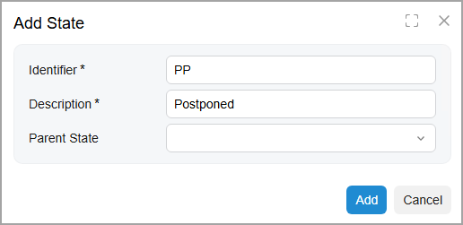
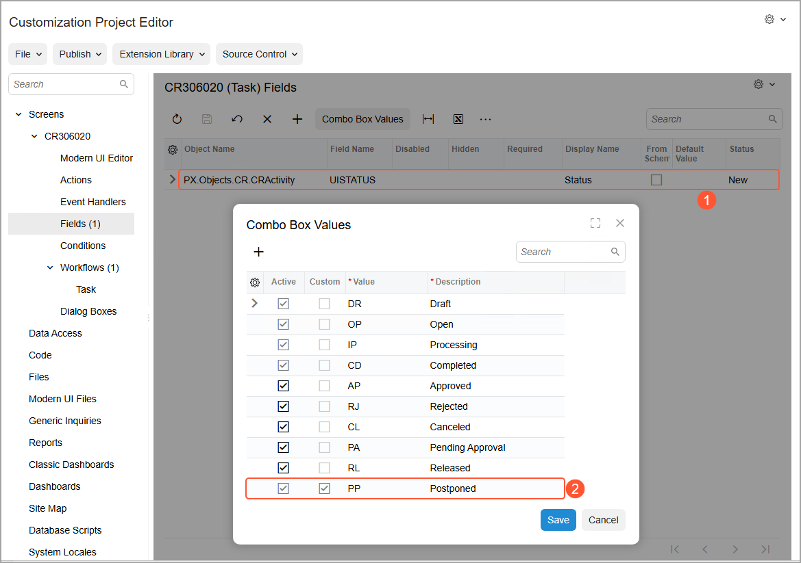

# Workflow Creation: To Add States {#_66048756-eeeb-4ab7-bd2e-d9b76a877bde .task}

The following activity will walk you through the process of adding new and predefined states to the workflow.

## Story {#section_fkj_tcp_jhc .section}

Acting as the technical specialist, you need to add predefined states and a new state to the workflow you have defined for the [Task](../UserGuide/CR_30_60_20.md) \(CR306020\) form.

## Process Overview {#section_gkj_tcp_jhc .section}

By using the [Workflow \(Tree View\)](../UserGuide/AU_20_10_30.md) page, you will add the following predefined states to the *Task* workflow:

-   `Draft`
-   `Processing`
-   `Completed`
-   `Open`

You will also add the new `Postponed` state to the workflow.

## System Preparation {#section_hkj_tcp_jhc .section}

Before you begin adding states to the workflow, do the following:

1.  Launch the Acumatica ERP website with the *U100* dataset preloaded, and sign in as system administrator by using the *gibbs* username and the *123* password.

    **Tip:** The *gibbs* user is assigned the *Administrator* role, which has sufficient access rights to customize workflows.

2.  Make sure that you have completed the [Workflow Creation: To Add a Workflow](WorkflowUI_CreatingWorkflow_Activity_CreateWorkflow.md) activity.

## Step 1: Adding the Predefined States to Your Workflow {#section_ikj_tcp_jhc .section}

To add the predefined states to your workflow, in the Customization Project Editor for the *TaskWorkflow* project, do the following:

1.  In the navigation pane, click **Screens** &gt; **CR306020** &gt; **Workflows** &gt; **Task**.

    The CR306020 \(Task\) State Diagram: Task page opens.

2.  On the More menu, click **Add Predefined State**.
3.  In the **Add Predefined State** dialog box, which opens, select *Draft* in the **State** box. Leave the **Parent State** box empty.
4.  Click **Add** to close the dialog box.

    The `Draft` state is added to the **States and Transitions** pane. Notice that the `Draft` state has a two-character identifier on the **State Properties** tab.

5.  By using instructions that are similar to Instructions 2–4, add the `Processing`, `Completed`, and `Open` predefined states to the workflow.

    Each state will be added to the **States and Transitions** pane below the previous state and will have a two-character identifier on the **State Properties** tab.

6.  In the **States and Transitions** pane, click the `Draft` state, and on the **State Properties** tab, make sure that the **Initial State of the Workflow** check box is selected.

    This state will be the initial state in the workflow. That is, when a user creates a new task, this task will have the *Draft* status.

7.  On the page toolbar, click **Save**.

## Step 2: Adding a New State to Your Workflow {#section_jkj_tcp_jhc .section}

In this step, you will add a new state to your workflow. While you are still working on the CR306020 \(Task\) State Diagram: Task page of the Customization Project Editor, do the following:

1.  On the page toolbar, click **Add State**.
2.  In the **Add State** dialog box, which opens, specify the following settings:

    -   **Identifier**: `PP`

        You use a two-character identifier for a custom state to have it in similar format as the predefined ones.

    -   **Description**: `Postponed`
    -   **Parent State**: Empty
    The dialog box should look as shown in the following screenshot.

    

3.  Click **Add** to close the dialog box and add the new state to the **States and Transitions** pane.
4.  On the page toolbar, click **Save**.
5.  In the navigation pane, click **Screens** &gt; **CR306020** &gt; **Fields**.

    The CR306020 \(Task\) Fields page opens. Notice that the table contains a row with the UISTATUS field, which is the state-identifying field specified for the screen on the [Workflows](../UserGuide/AU_20_10_20.md) page, as Item 1 below shows.

6.  On the page toolbar, click **Combo Box Values**.
7.  In the **Combo Box Values** dialog box, which is opened, notice that the new value \(*Postponed*\) has been added to it \(Item 2\). When a new state is added to a workflow, for the state-identifying field, the system adds a value with the same name.

    

8.  Close the dialog box.

**Parent topic:**[Creating Workflows](../DeveloperGuide/WorkflowUI_CreatingWorkflow_Mapref.md)

