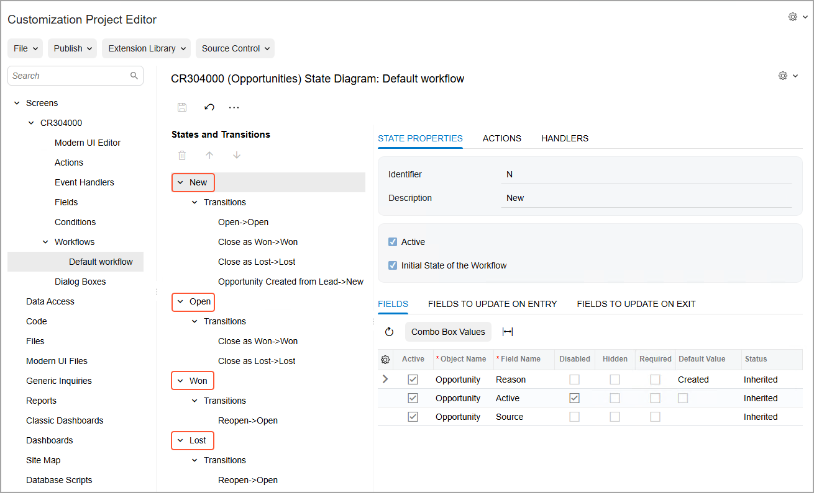

# Workflow Creation: Configuration of States {#_e5229743-eed1-43c7-bfef-62435b464648 .concept}

States in a workflow for an Acumatica ERP form represent the statuses of a record that is created on this form.

## State Configuration { .section}

The states of a workflow appear on the **States and Transitions** pane of the [Workflow \(Tree View\)](../UserGuide/AU_20_10_30.md) page. You can change the location of any states by clicking the state and then clicking **Move Up** or **Move Down** on the pane toolbar. You specify how a record moves between those states by adding transitions.

You can add new states and predefined states \(that is, states that already exist in the system\) to a workflow. When you add a new state to a workflow, the system adds to the customization project the field that is specified as the state identifier for the screen. You can view this field on the [Fields](../UserGuide/AU_20_10_60.md) page. Also, for the field, the system adds a dialog box value with the same name as the state name.

The system marks the first state as the initial state of the workflow. You can specify another state as the initial one.

For any state, you can specify the fields whose properties should be modified. You can also specify which fields should be updated when a record on the form enters the state and when the record leaves the state.

The following screenshot shows the states on the **States and Transitions** pane for the opportunity workflow.

**Parent topic:**[Creating Workflows](../DeveloperGuide/WorkflowUI_CreatingWorkflow_Mapref.md)

