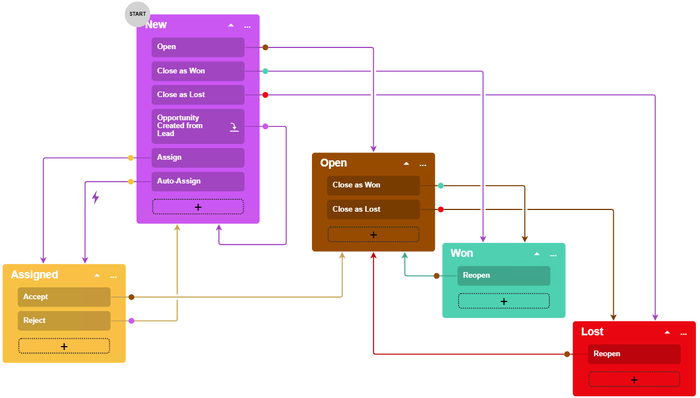

# Diagram View: To Add the Auto-Run Action {#_9940f02a-ad2f-4066-bdc0-5e912953c961 .task}

The following activity will walk you through the process of creating an auto-run action \(that is, an action that the system performs automatically when a particular condition is met\).

## Story {#section_pwf_wbp_jhc .section}

If the **Owner** box on the [Opportunities](../UserGuide/CR_30_40_00.md) \(CR304000\) form is filled and the opportunity has the *New* status, the status of the opportunity should be automatically changed to *Assigned*. Acting as the technical specialist, you need to add another transition from the `New` state to the `Assigned` state for the workflow used by the form. The transition should be triggered automatically if the **Owner** box is not empty.

## Process Overview {#section_qwf_wbp_jhc .section}

By using the [Conditions](../UserGuide/AU_20_10_10.md) page, you will create a condition that checks the **Owner** box. By using the [Workflow \(Diagram View\)](../UserGuide/AU_20_10_30_VisualEditor.md) page, you will add a new transition from the `New` state to the `Assigned` state and create a hidden action that triggers the transition.

## System Preparation {#section_rwf_wbp_jhc .section}

Before you begin performing the steps of this activity, do the following:

1.  Launch the Acumatica ERP website with the *U100* dataset preloaded, and sign in as system administrator by using the *gibbs* username and the *123* password.

    **Tip:** The *gibbs* user is assigned the *Administrator* role, which has sufficient access rights to customize workflows.

2.  Make sure that you have learned how to add actions, as described in [Action Configuration: General Information](WorkflowUI_Actions_GeneralInfo.md).
3.  Make sure that you have completed the [Diagram View: To Add New Actions and Transitions](WorkflowUI_CustomizingInheritedWorkflow_Activity_AddActionsTransitions.md) activity.

## Step 1: Creating a Condition {#section_swf_wbp_jhc .section}

In this step, you will add a condition that checks the **Owner** box. In the Customization Project Editor for the *Opportunities* customization project, perform the following instructions:

1.  In the navigation pane, click **Screens** &gt; **CR304000** &gt; **Conditions**. The Conditions: CR304000 \(Opportunities\) page opens.
2.  On the page toolbar, click **Add New Record**.
3.  In the **Condition Properties** dialog box, which opens, enter `OwnerSpecified` as the **Condition Name**.
4.  On the table toolbar, click **Add Row**, and specify the following settings in the added row:
    -   **Field Name**: *Owner*
    -   **Condition**: *Is Not Empty*
5.  Click **Save** to save your changes and close the dialog box.

    The added condition appears in the table with the conditions on the page.

## Step 2: Adding a New Transition Between States {#section_twf_wbp_jhc .section}

To add a transition, in the Customization Project Editor for the *Opportunities* customization project, perform the following instructions:

1.  In the navigation pane, click **Screens** &gt; **CR304000** &gt; **Workflows** &gt; **OpportunitiesAssigned**.

    The CR304000 \(Opportunities\) State Diagram: OpportunitiesAssigned page opens.

2.  On the page toolbar, click **Diagram View** to switch to the diagram view of the workflow.
3.  In the diagram, in the box with the `New` state, click and hold the plus button, and draw a line from the box with the `New` state to the box with the `Assigned` state.
4.  In the **Add Transition** dialog box, which opens, click **Create** to add a new action.
5.  In the **New Action** dialog box, which opens, specify the following settings:
    -   **Action Name**: `AutoAssign`
    -   **Display Name**: `Auto-Assign`
6.  Click **Save** to close the dialog box.
7.  In the **Target State** box of the **Add Transition** dialog box, make sure *Assigned* is selected.
8.  Click **Add** to close the dialog box.
9.  On the page toolbar, click **Save**.

## Step 3: Modifying the Created Action {#section_uwf_wbp_jhc .section}

To make the created `Auto-Assign` action hidden on the [Opportunities](../UserGuide/CR_30_40_00.md) \(CR304000\) form of Acumatica ERP and performed automatically when the **Owner** box of the form is filled in, perform the following instructions:

1.  While you are still working with the diagram view of the CR304000 \(Opportunities\) State Diagram: OpportunitiesAssigned page, click the More button in the box with the *New* state, and click **Edit State** on the context menu.
2.  On the **Actions** tab of the **State** dialog box, which opens, find the row with the `AutoAssign` action. In the **Auto-Run Condition** column, select *OwnerSpecified*.
3.  Click **OK** to close the dialog box.
4.  On the page toolbar, click **Save**.
5.  In the navigation pane of the Customization Project Editor, click **Screens** &gt; **CR304000** &gt; **Actions**.

    The CR304000 \(Opportunities\) Actions page opens.

6.  In the table, click the *AutoAssign* link.
7.  In the **Hidden** box of the **Action Properties** dialog box, which opens, select *True*.
8.  Click **Save** to save your changes and close the dialog box.

After you have performed these instructions and returned to the diagram view of the workflow, the diagram should look similar to the one in the following diagram. \(The results may look slightly different on different devices.\)

**Parent topic:**[Customizing Workflows with the Diagram View](../DeveloperGuide/WorkflowUI_CustomizingInheritedWorkflow_Mapref.md)

