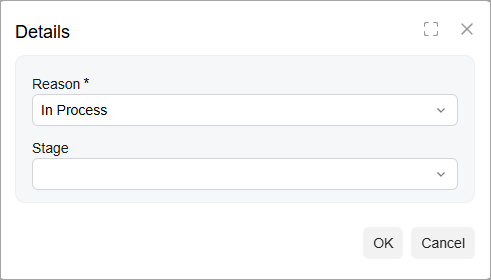
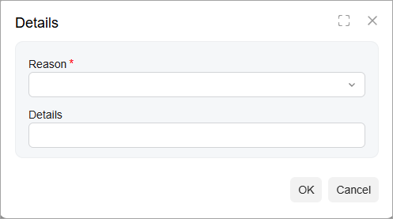
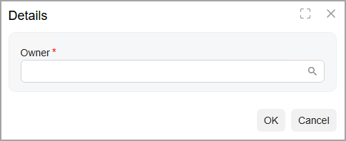

# Diagram View: To Add Dialog Boxes {#_8826fe68-b85e-4f39-a1a1-68e49b438e4c .task}

The following activity will walk you through the process of adding dialog boxes for the workflow. No matter whether you are editing a workflow on the [Workflow \(Diagram View\)](../UserGuide/AU_20_10_30_VisualEditor.md) page or the [Workflow \(Tree View\)](../UserGuide/AU_20_10_30.md) page, you add the dialog boxes on the [Dialog Boxes](../UserGuide/AU_20_10_40.md) page.

## Story { .section}

In the HardwareViewpoint company, a salesperson should add additional information when they perform the following actions with an opportunity on the [Opportunities](../UserGuide/CR_30_40_00.md) \(CR304000\) form of Acumatica ERP:

-   While accepting the opportunity, specify the reason and the stage of the opportunity
-   While rejecting the opportunity, select the reason and provide additional details for it
-   While assigning the opportunity, select the owner of the opportunity

Acting as the technical specialist, you need to add dialog boxes that prompt users for this information when they click the corresponding commands or buttons to invoke the `Accept`, `Reject`, and `Assign` actions.

## Process Overview { .section}

By using the [Dialog Boxes](../UserGuide/AU_20_10_40.md) page, you will create the dialog box for the `Accept` action of the *OpportunitiesAssigned* workflow. As self-guided exercises, you will also create the dialog boxes for the `Reject` and `Assign` actions of the workflow.

## System Preparation { .section}

Before you begin adding a new state, do the following:

1.  Launch the Acumatica ERP website with the *U100* dataset preloaded, and sign in as system administrator by using the *gibbs* username and the *123* password.

    **Tip:** The *gibbs* user is assigned the *Administrator* role, which has sufficient access rights to customize workflows.

2.  Make sure you have learned how to add dialog boxes, as described in [Workflow Elements: General Information](WorkflowUI_ConfiguringWorkflowElements_GeneralInfo.md).
3.  Make sure you have completed the [Diagram View: To Specify Combo Box Values for States](WorkflowUI_CustomizingInheritedWorkflow_Activity_AddFields.md) activity.

## Step 1: Creating a Dialog Box for the Accept Action { .section}

In this step, you will create a dialog box that will be displayed when a user clicks the **Accept** button or the corresponding command on the [Opportunities](../UserGuide/CR_30_40_00.md) \(CR304000\) form. Do the following in the Customization Project Editor for the *Opportunities* customization project:

1.  In the navigation pane, click **Screens** &gt; **CR304000** &gt; **Dialog Boxes**.
2.  On the **Dialog Boxes** pane of the CR304000 \(Opportunities\) Dialog Boxes page, which opens, click the plus button. The system opens a dialog box, **New Dialog Box**, so that you can specify the name of the dialog box.
3.  In the **Dialog Box Name** box of the dialog box, type `FormAccept`, and click **Save**.
4.  On the **Dialog Boxes** pane, click the name of the added dialog box.
5.  In the **Title** box on the right pane, enter `Details`.
6.  On the page toolbar, click **Save**.

## Step 2: Adding Fields to the Dialog Box for the Accept Action { .section}

In this step, you will add the **Reason** and **Stage** boxes to the dialog box for the `Accept` action. While you are still on the CR304000 \(Opportunities\) Dialog Boxes page with the *FormAccept* dialog box selected, do the following:

1.  In the **Dialog Box Fields** table, click **Add Row** on the table toolbar, and specify the following settings in the added row:
    -   **Schema Field**: *PX.Objects.CR.CROpportunity.Resolution*

        This is the name of the field that corresponds to the **Reason** box on the [Opportunities](../UserGuide/CR_30_40_00.md) \(CR304000\) form.

    -   **Field Name**: `Reason`
    -   **Title**: *Reason* \(specified automatically\)
    -   **From Schema**: Selected
    -   **Default Value**: *In Process*
    -   **Required**: *True*
    -   **Column Span**: `1`
2.  On the page toolbar, click **Save**.
3.  Specify the combo box values for the field as follows:
    1.  On the table toolbar, click **Combo Box Values**.
    2.  In the **Combo Box Values** dialog box, which opens, select *Specify Explicitly* in the **Source of Values** box.
    3.  In the table, which appears in the dialog box, select the check boxes in the **Active** column for the *IP* \(*In Process*\) and *SV* \(*Service*\) values.
    4.  Click **Save** to close the dialog box.
    5.  On the page toolbar, click **Save**.
4.  In the **Dialog Box Fields** table, click **Add Row** on the table toolbar again, and specify the following settings in the added row:
    -   **Schema Field**: *PX.Objects.CR.CROpportunity.StageID*

        This is the name of the field that will correspond to the **Stage** box in the UI.

    -   **Field Name**: `Stage`
    -   **Title**: *Stage* \(specified automatically\)
    -   **From Schema**: Cleared
    -   **Default Value**: Cleared
    -   **Required**: Cleared
    -   **Column Span**: `1`
5.  On the page toolbar, click **Save**.
6.  On the page toolbar, click **Preview Dialog Box**.

    The dialog box should look as shown in the following screenshot.

    

## Step 3: Creating a Dialog Box for the Reject Action—Self-Guided Exercise { .section}

In this self-guided exercise, you will add a dialog box for the `Reject` action with the `FormReject` name and the `Details` title.

You need to add to the dialog box the following fields:

-   *Reason*

    The field has the following settings in the **Dialog Box Fields** table:

    -   **Schema Field**: *PX.Objects.CR.CROpportunity.Resolution*
    -   **Field Name**: `Reason`
    -   **Title**: *Reason* \(specified automatically\)
    -   **From Schema**: Selected
    -   **Default Value**: Cleared
    -   **Required**: *True*
    -   **Column Span**: `1`
    The following combo box values should be available for the field: *PR* \(*Price*\) and *DD* \(*Delivery Date*\).

-   *Details*

    The field has the following settings in the **Dialog Box Fields** table:

    -   **Schema Field**: *PX.Objects.CR.CROpportunity.Details*
    -   **Field Name**: `Details`
    -   **Title**: *Details* \(specified automatically\)
    -   **From Schema**: Cleared
    -   **Default Value**: Cleared
    -   **Required**: Cleared
    -   **Column Span**: `1`

The dialog box should look as shown in the following screenshot.

## Step 4: Creating a Dialog Box for the Assign Action—Self-Guided Exercise { .section}

In this self-guided exercise, you will add a dialog box for the `Assign` action with the `FormAssign` name and the `Details` title.

You need to add to the dialog box the Owner field of the `PX.Objects.CR.CROpportunity.OwnerID` schema field, which is required in the dialog box. That is, when a user clicks the button or command corresponding to the `Assign` action, the user will need to select the owner of the opportunity in this dialog box.

The dialog box should look as shown in the following screenshot.

**Parent topic:**[Customizing Workflows with the Diagram View](../DeveloperGuide/WorkflowUI_CustomizingInheritedWorkflow_Mapref.md)

