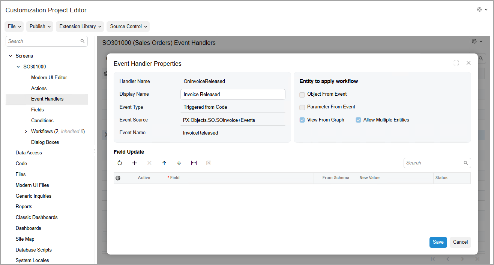

# Event Handlers: General Information {#_0f049674-5be8-41f7-953c-068297726727 .concept}

Acumatica ERP supports two types of events and event handlers that process these events. Events of the first type are triggered when changes occur to certain fields of a form. Event of the second type are triggered from the code.

For both types of events, you can configure event handlers on the [Event Handlers](../UserGuide/AU_20_10_70.md) page of the Customization Project Editor, as described in the following sections, or in the code. For details on how to configure events and event handlers in the code, see [Workflow Events: General Information](WorkflowAPI_Events_GeneralInfo.md).

## Learning Objectives { .section}

In this chapter, you will learn how to modifying existing event handlers for a workflow.

## Applicable Scenarios { .section}

You configure an event handler in a workflow to handle an event that is raised in the code when some change occurs on the current form to the current entity or on a different form to another entity. You modify the event handler when you want to specify what fields should be updated after the system handles the event.

You also add a new event handler to the workflow to handle an event that is raised when changes occur to certain fields of a form on the UI.

## Configuration of Event Handlers { .section}

You create and modify event handlers for a particular form by using the [Event Handlers](../UserGuide/AU_20_10_70.md) page of the Customization Project Editor. When you click the link in the **Handler Name** column in the table on the page, the **Event Handler Properties** dialog box is opened, which shows the properties of the event handler \(see the following screenshot\). The list of properties may differ depending on the event handler. Notice that each event handler has a **Display Name**, which is displayed on the [Workflow \(Diagram View\)](../UserGuide/AU_20_10_30_VisualEditor.md) page and on the [Workflow \(Tree View\)](../UserGuide/AU_20_10_30.md) page \(see [Workflow Creation: General Information](WorkflowUI_CreatingWorkflow_GeneralInfo.md) for details\).

Event handlers added in the predefined workflow are automatically displayed on the page, and you can modify the properties of these event handlers. To understand which of the listed event handlers are predefined and which are new, you can refer to the **Status** setting of each event handler. Predefined event handlers have the *Inherited* status, and all event handlers that you have added to the list on the [Event Handlers](../UserGuide/AU_20_10_70.md) page have the *New* status. If you has edited the properties of a system event handler, its status changes to *Modified*.

The following types of event handlers are supported:

-   *Triggered from Code*
-   *Triggered by Field Change*

For event handlers of both types, you can modify the fields that should be updated after the system handles the event. For event handlers of the *Triggered by Field Change* type, you can also specify the fields whose change should trigger the event. In this case, the fields of only the primary DACs can be used. You can specify the same fields for multiple event handlers.

## Using of Event Handlers in the Workflow {#section_vv2_1y4_y4b .section}

You can use event handlers to trigger transitions between states of the workflow.

You add existing event handlers to the customized or custom workflow on the [Workflow \(Tree View\)](../UserGuide/AU_20_10_30.md) or [Workflow \(Diagram View\)](../UserGuide/AU_20_10_30_VisualEditor.md) page for this workflow.

On the [Workflow \(Tree View\)](../UserGuide/AU_20_10_30.md) page \(that is, in the tree view of the workflow\), you use the table on the **Handlers** tab of a particular state to add the needed event handler. On the [Workflow \(Diagram View\)](../UserGuide/AU_20_10_30_VisualEditor.md) page \(that is, in the diagram view of the workflow\), you open the **State** dialog box for a particular state and add the existing event handlers on the **Handlers** tab of this dialog box.

**Parent topic:**[Configuring Event Handlers](../DeveloperGuide/WorkflowUI_EventHandlers_Mapref.md)

