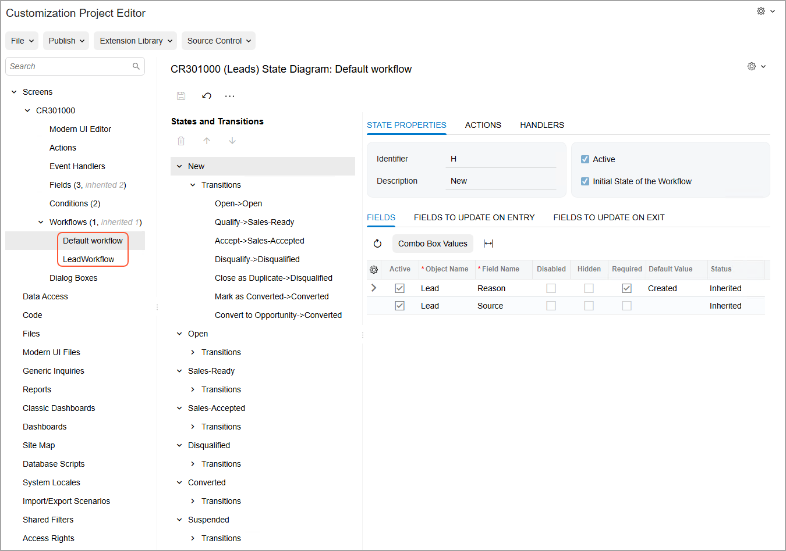

# Inherited Workflows: General Information {#_cc6a0294-e309-43da-9cbb-202bed8b7ac2 .concept}

Some Acumatica ERP forms have at least one predefined workflow, which is a workflow that has been developed for a form in the out-of-the-box version of the system. If you want to make changes to a predefined workflow, you create an inherited workflow, which is based on the predefined one, and modify it as needed.

## Learning Objectives { .section}

In this chapter, you will learn how to create inherited workflows.

## Applicable Scenarios { .section}

You create an inherited workflow if you need to make changes to the predefined workflow so that it is better suited for your business processes.

## Use of Inherited Workflows { .section}

An inherited workflow based on a predefined workflow inherits all modifications of the predefined workflow. Customizing an inherited workflow can save you time over creating a custom workflow from scratch, especially if you want to make only minor changes to the functionality of predefined workflow. You can view the difference between the predefined workflow and the inherited workflow, and cause the inherited workflow to revert to the predefined workflow.

**Tip:** An inherited workflow is also described as a *customized workflow*. These terms are interchangeable and they both describe facets of this workflow: It inherits its settings from the predefined workflow, and it is a customized version of the predefined workflow.

For each inherited workflow that you create, the system adds a node for the page under the **Workflows** node. The following screenshot shows the nodes of the workflows for the [Leads](../UserGuide/CR_30_10_00.md) \(CR301000\) form: the predefined workflow \(*Default workflow*\) and the inherited workflow \(*LeadWorkflow*\).

If a predefined workflow is changed in an upgrade after the development of any inherited workflows based on the predefined workflow, each of these workflows will inherit the changes. If a customization project contains an inherited workflow based on a predefined workflow and a newer version of the predefined workflow is available in Acumatica ERP, a customizer can upgrade the customization project with the inherited workflow with the latest changes from the system.

For details on upgrading an inherited workflow based on a predefined workflow with the latest changes in the system, see [Upgrade of Workflows: General Information](WorkflowUI_UpgradingWorkflows_GeneralInfo.md).

**Parent topic:**[Working with Inherited Workflows](../DeveloperGuide/WorkflowUI_InheritedWorkflows_Mapref.md)

