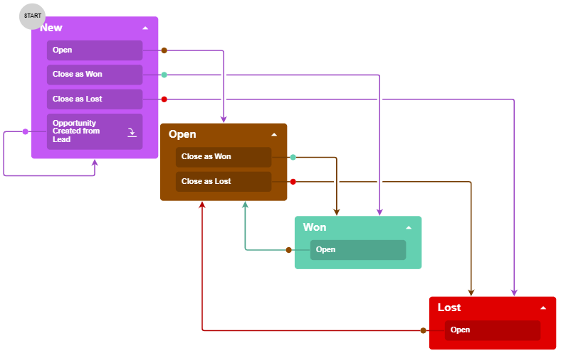
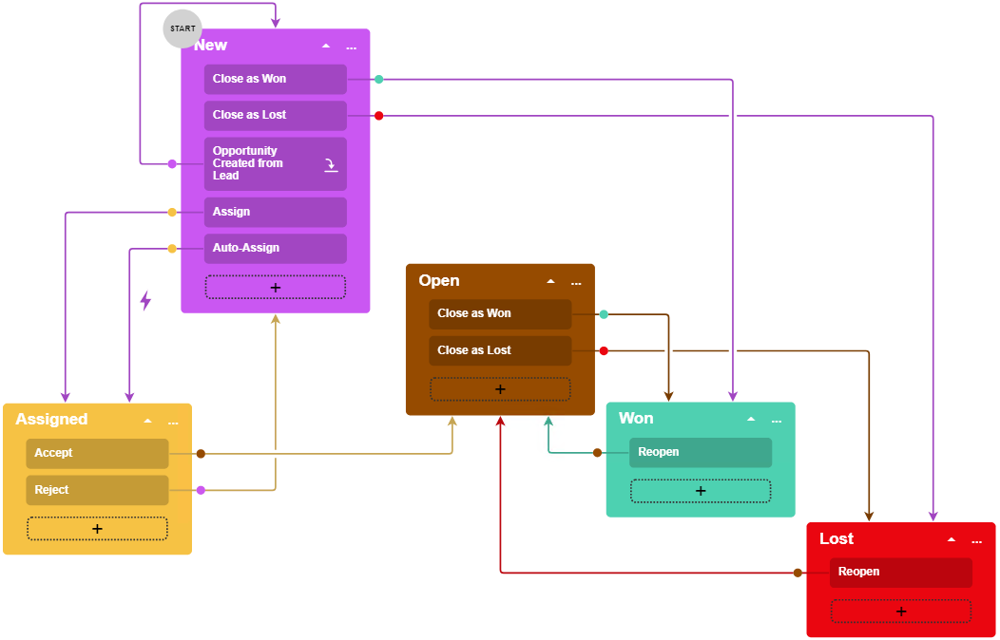

# Inherited Workflows: Planning the Customization of a Workflow {#_cc2d59c5-3808-4358-b40b-a450a031a5d5 .concept}

If the predefined workflow for a form does not fit your business processes, you might want to make modifications to it. This topic describes this process by using the example of the [Opportunities](../UserGuide/CR_30_40_00.md) \(CR304000\) form.

## Overview of the Customized Workflow for the Opportunities Form {#section_c1y_1lp_jhc .section}

The predefined workflow for the [Opportunities](../UserGuide/CR_30_40_00.md) \(CR304000\) form includes the states, actions, and transitions shown in the following screenshot.

**Tip:** The diagram view of the workflow shown above is available in only the Classic UI.

Suppose that in your customization efforts, you need to incorporate a process of assigning a new opportunity before giving it the *Open* status. You need a new status, *Assigned*, for opportunities. A user should be able to do the following:

-   Change the status from *New* to *Assigned* by clicking **Assign** on the [Opportunities](../UserGuide/CR_30_40_00.md) form. For an opportunity to be assigned, its owner must be selected in the **Owner** box.
-   Change the status from *Assigned* to *Open* by clicking **Accept** on the form.
-   Change the status from *Assigned* to *New* by clicking **Reject**.

Also, you need to add a hidden action named `Auto-Assign`, which is performed automatically if the **Owner** box is filled and the opportunity has the *New* status. The `Auto-Assign` action changes the status of the opportunity to *Assigned*.

When a user clicks **Accept** or **Reject**, the user should provide the reason for changing the state. When a user clicks **Assign**, the user should specify the **Owner** of the opportunity. In both of these situations, you will use a dialog box to obtain the needed setting.

The modified workflow would look like the one shown in the following screenshot.

**Parent topic:**[Working with Inherited Workflows](../DeveloperGuide/WorkflowUI_InheritedWorkflows_Mapref.md)

