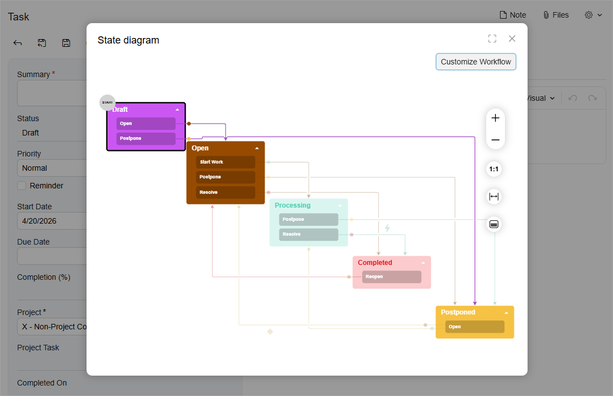

# Testing of the Customization Project: To Test a Custom Workflow {#_e7b07adf-9cd8-4a84-a661-83b2cc79fc80 .task}

The following activity will walk you through the process of testing a custom workflow.

## Story { .section}

Acting as the technical specialist, you need to publish your customization project and then test the changes on the [Task](../UserGuide/CR_30_60_20.md) \(CR306020\) form and make sure that the new workflow works as expected.

## Process Overview { .section}

On the [Customization Projects](../UserGuide/SM_20_45_05.md) \(SM204505\) form of Acumatica ERP, you will publish your customization project. On the [Task](../UserGuide/CR_30_60_20.md) \(CR306020\) form, you will then test the new workflow.

## System Preparation { .section}

Before you begin testing the customization, do the following:

1.  Launch the Acumatica ERP website with the *U100* dataset preloaded, and sign in as system administrator by using the *gibbs* username and the *123* password.

    **Tip:** The *gibbs* user is assigned the *Administrator* role, which has sufficient access rights to customize workflows.

2.  Make sure that you have completed the [Conditions and Transitions: To Add Transitions](WorkflowUI_ConditionsTransitions_Activity_Transitions.md) activity.

## Step 1: Publishing the Customization Project { .section}

To publish the *TaskWorkflow* customization project, do the following:

1.  On the [Customization Projects](../UserGuide/SM_20_45_05.md) \(SM204505\) form, click the *TaskWorkflow* project name to open the customization project.
2.  On the menu of the Customization Project Editor, click **Publish** &gt; **Publish Current Project**.

    The system starts publishing the customization project and displays the progress in the **Compilation** pane, which appears at the bottom of the Customization Project Editor window.

3.  After the system finishes updating the required data, click **Close Compilation Pane** in the **Compilation** pane.

## Step 2: Testing the Draft State { .section}

In Acumatica ERP, test the `Draft` state as follows:

1.  On the form toolbar of the Tasks \(EP4040PL\) list of records, click **New Record**.
2.  On the [Task](../UserGuide/CR_30_60_20.md) \(CR306020\) form, which opens, notice the following:
    -   The value in the **Status** box is *Draft* and this box is unavailable for editing.
    -   The **Start Date** box has been filled in automatically with the current date.
    -   The **Completion \(%\)** box is unavailable.
    -   On the More menu, two commands are available: **Open** and **Postpone**. Also notice that **Open** is marked with a green dot.
    -   On the form toolbar, the **Open** button is highlighted in green.
    -   On the form title bar, click **Settings** &gt; **Show State Diagram**.

        The **State Diagram** dialog box opens. The diagram should look like the one shown in the following screenshot.

        

    -   Close the dialog box.

## Step 3: Testing the Open State { .section}

While you are still on the [Task](../UserGuide/CR_30_60_20.md) \(CR306020\) form, test the `Open` state as follows:

1.  In the **Summary** box, enter `Process customer request`.
2.  In the **Owner** box of the **Details** tab, select *Kimberly Gibbs*.
3.  On the form toolbar, click **Save**.
4.  On the form toolbar, click **Open**.

    The status of the task changes to *Open*.

5.  Clear the **Owner** box, and try to save your changes.

    The system displays an error for this box.

6.  In the **Owner** box, select *Kimberly Gibbs*, and save your changes.
7.  On the form, notice the following:
    -   On the More menu, three commands are available: **Start Work**, **Resolve**, and **Postpone**.
    -   On the form toolbar, the **Start Work** button is highlighted in green.

## Step 4: Testing the Processing State and the Resolve Action { .section}

Test the `Processing` state and the `Resolve` action as follows:

1.  While you are still on the [Task](../UserGuide/CR_30_60_20.md) \(CR306020\) form, on the form toolbar, click **Start Work**.
2.  On the form, notice the following:
    -   The status of the task has been changed to *Processing*.
    -   On the More menu, two commands are available: **Resolve** and **Postpone**.
    -   On the form toolbar, the **Resolve** command is highlighted in green.
3.  On the form toolbar, click **Resolve**.
4.  On the form, notice the following:
    -   The status of the task is *Completed*.
    -   On the More menu, only one command is available: **Reopen**.

## Step 5: Testing the Reopen Action and the Completed Condition { .section}

While you are still on the [Task](../UserGuide/CR_30_60_20.md) \(CR306020\) form, test the `Reopen` action and the Completed condition as follows:

1.  On the form toolbar, click **Reopen**.
2.  In the **Details** dialog box, which opens, enter `10` in the **Completion \(%\)** box.
3.  Click **OK** to close the dialog box.

    The status of the task changes to *Open*, and the value in the **Completion \(%\)** box is *10*.

4.  On the form toolbar, click **Postpone**.

    The status of the task changes to *Postponed*, and on the More menu, only one command is available: **Open**.

5.  On the form toolbar, click **Open**.

    The status of the task changes to *Processing* because the value in the **Completion \(%\)** box is *10* \(which is greater than *0*\).

6.  In the **Completion \(%\)** box, enter `100`.
7.  Save your changes.

    The status of the task changes to *Completed* automatically.

**Parent topic:**[Testing the Customization](../DeveloperGuide/WorkflowUI_TestingCustomization_Mapref.md)

