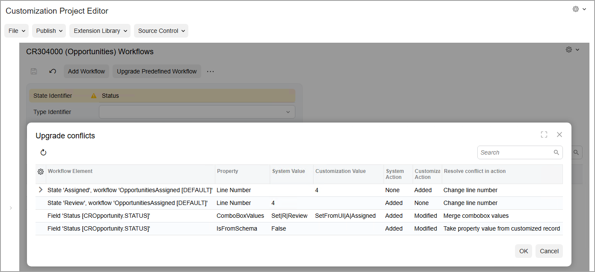
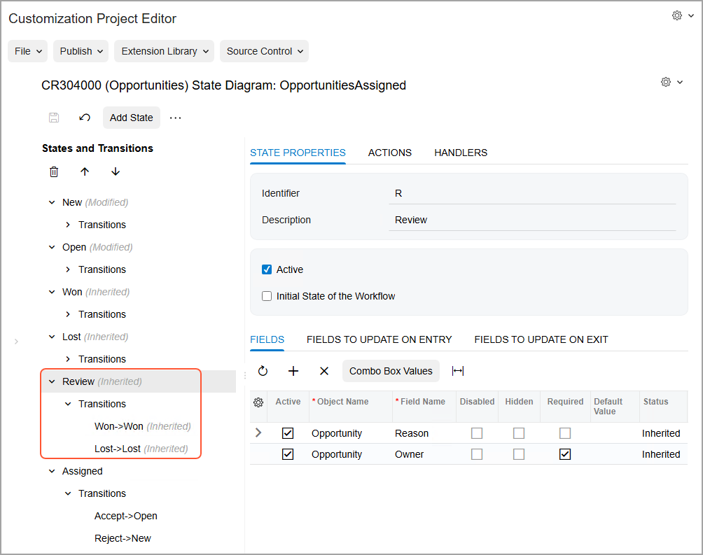

# Upgrade of Workflows: To Upgrade a Customization Project That Contains an Inherited Workflow {#_1ff31756-6857-43e6-96dd-cb37fdd9a604 .task}

The following activity will walk you through the process of upgrading a customization project that contains an inherited workflow with the changes introduced in the predefined workflow of Acumatica ERP. With this upgrade, you will include these changes in the customization project. That is, the changes introduced in the predefined workflow of Acumatica ERP will be reflected in both the predefined workflow that is included in the customization project and the inherited workflow that is based on this predefined workflow.

## Story { .section}

Suppose that after you have created an inherited workflow for the [Opportunities](../UserGuide/CR_30_40_00.md) \(CR304000\) form, Acumatica developers have modified the predefined workflow for this form: In the predefined workflow, the `Review` state and the `Need Review` action have been added. \(In this activity, you will load the changes to the predefined workflow by importing and publishing the `OpportunitySystemWorkflowChanges.zip` customization package.\)

Acting as a technical specialist, you need to upgrade the version of the predefined workflow in the customization project so that both the predefined workflow that is included in the customization project and the inherited workflow that is based on this predefined workflow contain the changes introduced by Acumatica developers.

## Process Overview { .section}

By using the [Customization Projects](../UserGuide/SM_20_45_05.md) \(SM204505\) form, you will upgrade the version of the predefined workflow of the [Opportunities](../UserGuide/CR_30_40_00.md) \(CR304000\) form in the *Opportunities* customization project.

## System Preparation { .section}

Before you begin upgrading the workflows, do the following:

1.  Launch the Acumatica ERP website with the *U100* dataset preloaded, and sign in as system administrator by using the *gibbs* username and the *123* password.

    **Tip:** The *gibbs* user is assigned the *Administrator* role, which has sufficient access rights to customize workflows.

2.  Unpublish your current customization project or projects by doing the following:
    1.  Open the [Customization Projects](../UserGuide/SM_20_45_05.md) \(SM204505\) form.
    2.  On the form toolbar, click **Unpublish All**.
3.  Make sure that you have completed the [Diagram View: To Adjust the System State](WorkflowUI_CustomizingInheritedWorkflow_Activity_UpdateSystemState.md) activity; alternatively, you can import the [`Opportunities.zip`](https://training.acumatica.com/University/W150/Opportunities.zip) customization package.
4.  Load changes to the predefined workflow of the [Opportunities](../UserGuide/CR_30_40_00.md) \(CR304000\) form as follows:
    1.  Open the [Customization Projects](../UserGuide/SM_20_45_05.md) \(SM204505\) form.
    2.  On the form toolbar, click **Import**.
    3.  In the **Open Package** dialog box, which is opened, click **Choose File**, and select the [`OpportunitySystemWorkflowChanges.zip`](https://training.acumatica.com/University/W150/OpportunitySystemWorkflowChanges.zip) file.
    4.  In the **Open Package** dialog box, click **Upload**.

        The *OpportunitySystemWorkflowChanges* customization project is added to the list on the [Customization Projects](../UserGuide/SM_20_45_05.md) form.

    5.  Select the unlabeled check box in the row with the *OpportunitySystemWorkflowChanges* customization project.
    6.  On the form toolbar, click **Publish**.

## Step: Upgrading the Version of the Predefined Workflow in the Customization Project { .section}

To upgrade the version of the predefined workflow in the customization project, perform the following instructions:

1.  On the [Customization Projects](../UserGuide/SM_20_45_05.md) \(SM204505\) form, click the link with the *Opportunities* customization project.

    The Customization Project Editor opens for the *Opportunities* customization project.

2.  In the table on the [Screens](../UserGuide/AU_20_10_00.md) page, notice that the system displays a warning icon in the **Screen ID** column.
3.  In the navigation pane, click **Screens** &gt; **CR304000** &gt; **Workflows**.

    The CR304000 \(Opportunities\) Workflows page opens. Notice that the system displays a warning icon for the **State Identifier** box.

4.  On the page toolbar, click **Upgrade Predefined Workflow**.

    The **Upgrade Conflicts** dialog box opens, as shown in the following screenshot. The dialog box contains information about the conflicts and actions that the system will take to resolve the conflicts.

    

5.  In the dialog box, click **OK** to resolve the conflicts and merge the changes.

    As a result, the version of the predefined workflow is updated in the customization project. Both the predefined workflow that is included in the customization project and the inherited workflow that is based on this predefined workflow now use the version of the predefined workflow that is used in the system.

6.  In the navigation pane of the Customization Project Editor, click **Screens** &gt; **CR304000** &gt; **Workflows** &gt; **OpportunitiesAssigned**.

    The CR304000 \(Opportunities\) State Diagram: OpportunitiesAssigned page opens. The customized workflow should look as shown in the following screenshot. Notice that the `Review` state, which has been added in the modified predefined workflow, is marked as inherited.

    

**Parent topic:**[Upgrading Workflows](../DeveloperGuide/WorkflowUI_UpgradingWorkflows_Mapref.md)

