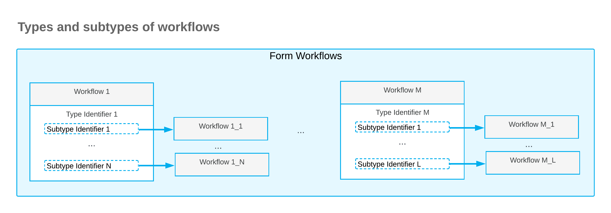
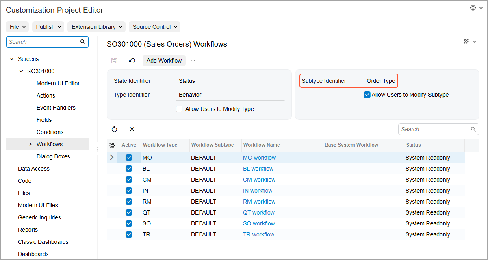
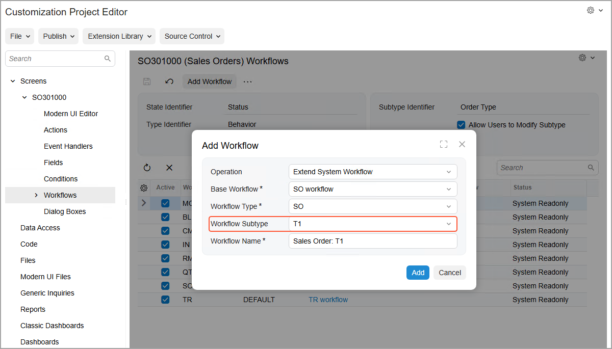
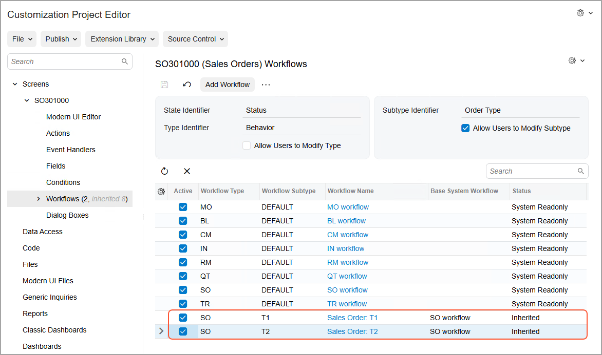

# Workflow-Identifying Fields of the Second Level: General Information {#_d7ade033-dfb8-4cbb-a91f-3022ba2198dd .concept}

This topic provides information about workflow identifiers \(that is, workflow-identifying fields, which are fields whose values determine the workflow to be used\) of the second level. You will also learn how to create different workflows that use these identifiers.

## Learning Objectives { .section}

In this chapter, you will learn how to create separate workflows for various workflow identifiers of the second level.

## Applicable Scenarios { .section}

You use workflow identifiers of the second level when you have multiple types of entities on a form, and you need to create separate workflows for each of these entity types.

## Example of Workflow Identifiers of the Second Level { .section}

In Acumatica ERP, the workflows for the [Sales Orders](../UserGuide/SO_30_10_00.md) \(SO30100\) form are based on the predefined automation behavior, which can be one of the following:

-   *Sales Order*
-   *Transfer Order*
-   *Invoice*
-   *Quote*
-   *Credit Memo*
-   *RMA Order*
-   *Blanket Order*
-   *Mixed Order*

**Tip:** You cannot create custom automation behaviors.

On the [Order Types](../UserGuide/SO_20_10_00.md) \(SO201000\) form, you can create multiple order types that are based on the same automation behavior. Without the use of workflow identifiers of the second level, on the [Workflows](../UserGuide/AU_20_10_20.md) page, you cannot create separate workflows for these custom order types, because for a particular order type, the system uses the workflow of the automation behavior this order type is based on.

If for a form, a developer has specified a type identifier for a workflow in the code \(by using Workflow API\), then you can select a workflow-identifying field of the second level for this form. As a result, you can create a workflow for each pair of the type identifier value and the subtype identifier value. This functionality provides greater flexibility for the creation of workflows.

## Forms with Subtype Identifiers { .section}

In an out-of-the-box system, you can create workflows that use the subtype identifier for the following forms:

-   [Sales Orders](../UserGuide/SO_30_10_00.md) \(SO30100\)
-   [Purchase Orders](../UserGuide/PO_30_10_00.md) \(PO301000\)
-   [Purchase Receipts](../UserGuide/PO_30_20_00.md) \(PO302000\)
-   [Landed Costs](../UserGuide/PO_30_30_00.md) \(PO303000\)
-   [Subcontracts](../UserGuide/SC_30_10_00.md) \(SC301000\)
-   [Service Orders](../UserGuide/FS_30_01_00.md) \(FS300100\)
-   [Appointments](../UserGuide/FS_30_02_00.md) \(FS300200\)

On other forms of Acumatica ERP, you can implement multiple workflows first by using the type identifier; if needed, you can use the subtype identifier.

## Creation of Separate Workflows for Identifiers of the Second Level { .section}

On the [Workflows](../UserGuide/AU_20_10_20.md) page of the Customization Project Editor, you can define workflow selection to be based on the value of a type identifier and then further based on the value of the subtype identifier. A workflow defined for the subtype identifier value inherits its configuration from the workflow defined for the value of the type identifier. The following diagram shows the types and subtypes of workflows based on their workflow-identifier field values.

Suppose that on the [Order Types](../UserGuide/SO_20_10_00.md) \(SO201000\) form, you have created two custom order types \(*T1* and *T2*\) that are based on the *Sales Order* automation behavior. For each form that has a workflow-identifying field specified in the predefined system workflow, as is the case with the [Sales Orders](../UserGuide/SO_30_10_00.md) \(SO303000\) form, the system displays a workflow-identifying field of the second level on the [Workflows](../UserGuide/AU_20_10_20.md) page \(the Order Type field in the following screenshot\).

**Tip:** For the [Sales Orders](../UserGuide/SO_30_10_00.md) form, the value of the subtype identifier is specified in the code, and the **Subtype Identifier** box of the [Workflows](../UserGuide/AU_20_10_20.md) page is read-only. For other forms, this box is available for editing.

Then in the **Add Workflow** dialog box, which opens when you click the **Add Workflow** button on the page toolbar of the [Workflows](../UserGuide/AU_20_10_20.md) page, you can select one of the created order types \(*T1* or *T2*\) as a workflow subtype \(see the following screenshot\).

**Important:** Only one workflow per order type is supported.

You then can define both created workflows as active by selecting the **Active** check box \(see the following screenshot\). Note that the base workflow \(*SO Workflow* in this case\) remains active as well. The system will use this workflow for sales orders that are based on other order types and that have the *Sales Order* automation behavior—that is, sales orders of the *eCommerce Order*, *Sales Order with Allocation*, and *Sales Order* types.

After you create a separate workflow for each custom order type, you can perform the usual operations with these workflows by using the [Workflow \(Tree View\)](../UserGuide/AU_20_10_30.md) or [Workflow \(Diagram View\)](../UserGuide/AU_20_10_30_VisualEditor.md) pages: add, remove, or modify states, actions, fields, and transitions.

If you do not need to create separate workflows for each of the order types, you can keep the workflow with the *Default* subtype active. The system will use this workflow for sales orders that meet the following criteria:

-   The behavior used for the sales orders is the same as the workflow type \(for example, the behavior is *SO* and the workflow type is *SO*\).
-   Separate workflows have not been defined with this type and with a subtype that is the same as the order type.

**Parent topic:**[Using Workflow-Identifying Fields of the Second Level](../DeveloperGuide/WorkflowUI_WorkflowIdentifyingSecondLevel_Mapref.md)

