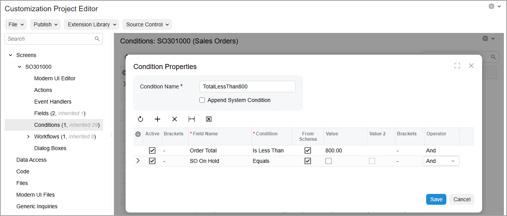

# Workflow-Identifying Fields: To Add Conditions with User-Defined Fields {#_9a435db9-f007-47a0-9e29-4811bc3d3a0b .task}

The following activity will walk you through the process of creating workflow conditions with user-defined fields.

*User-defined fields* are fields an organization can add directly to the Acumatica ERP data entry forms to gather information that is important to the organization but does not already appear on the form. The fields can be displayed on the **User-Defined Fields** tab if the user should enter their values, or they can be hidden if they will be used internally. These fields are based on predefined and site-specific attributes that have been defined in the system. For details on user-defined fields, see [Managing Attributes and User-Defined Fields](../UserGuide/CS__con_Attributes_and_User_Defined_Fields.md).

## Story {#section_f44_vpp_jhc .section}

Acting as a technical specialist, you need to add the following conditions to the workflow of sales orders on the [Sales Orders](../UserGuide/SO_30_10_00.md) \(SO301000\) form:

-   *TotalMoreThan800*, which will be used to automatically put a sales order on hold if its **Order Total** is greater than $800 and the sales order has not been yet reviewed
-   *TotalLessThan800*, which will be used to automatically remove a sales order from hold if its **Order Total** is less than $800 and it has not been put on hold manually

The system does not store information about whether the sales order has been reviewed or whether it has been put on hold manually. Therefore, you need to create user-defined fields for the workflow of sales orders with the *SO* order type. One user-defined field will be used to check if a sales order has been put on hold manually, and another will be used to check whether it has already been removed from hold. Because these fields will be used only internally, you will define them to be hidden.

## Process Overview {#section_g44_vpp_jhc .section}

On the [Attributes](../UserGuide/CS_20_50_00.md) \(CS205000\) form, you will create the attributes that you will use for user-defined fields. You will then add user-defined fields for these attributes on the [Sales Orders](../UserGuide/SO_30_10_00.md) \(SO301000\) form. As an optional step, you will add the created fields to the customization project on the [UI Configurations](../UserGuide/AU_23_00_10.md) page of the Customization Project Editor.

By using the [Fields](../UserGuide/AU_20_10_60.md) page, you will make the fields hidden on the [Sales Orders](../UserGuide/SO_30_10_00.md) \(SO301000\) form because these fields represent internal flags that should not be displayed to users.

By using the [Conditions](../UserGuide/AU_20_10_10.md) page, you will add the conditions that use the user-defined fields.

## System Preparation {#section_h44_vpp_jhc .section}

Before you begin adding a new state, do the following:

1.  Launch the Acumatica ERP website with the *U100* dataset preloaded, and sign in as a system administrator by using the *gibbs* username and the *123* password.

    **Tip:** The *gibbs* user is assigned the *Administrator* role, which has sufficient access rights to customize workflows.

2.  Make sure that you have learned how to configure conditions, as described in [Conditions and Transitions: General Information](WorkflowUI_ConditionsTransitions_GeneralInfo.md).
3.  Make sure that you have completed the [Workflow-Identifying Fields: To Create an Inherited Workflow](WorkflowUI_WorkflowIdentifying_Activity_CreateWorkflow.md) activity.

## Step 1: Creating Attributes {#section_i44_vpp_jhc .section}

In this step, you will create the attributes that will correspond to the user-defined fields. In Acumatica ERP, perform the following instructions:

1.  On the [Attributes](../UserGuide/CS_20_50_00.md) \(CS205000\) form, create an attribute with the following settings:

    -   **Attribute ID**: `SOONHOLD`
    -   **Description**: `SO On Hold`
    -   **Control Type**: *Checkbox*
    You will use this attribute to check whether a sales order has been put on hold manually, and to keep the sales order on hold if its **Order Total** is less than $800.

2.  On the form toolbar, click **Save**.
3.  Add another attribute with the following settings:

    -   **Attribute ID**: `SOREVIEW`
    -   **Description**: `SO Reviewed`
    -   **Control Type**: *Checkbox*
    You will use this attribute to check whether a sales order was manually removed from hold previously.

4.  On the form toolbar, click **Save**.

## Step 2: Adding User-Defined Fields to the Form {#section_j44_vpp_jhc .section}

In this step, you will add to the [Sales Orders](../UserGuide/SO_30_10_00.md) \(SO301000\) form the user-defined fields that correspond to the attributes you have created. In Acumatica ERP, perform the following instructions:

1.  Open the [Sales Orders](../UserGuide/SO_30_10_00.md) \(SO301000\) form.
2.  On the form title bar, click **Settings** &gt; **UI Configuration**.
3.  In the UI Configuration pane, click **Manage User-Defined Fields**.

    The **Manage User-Defined Field Fields** dialog box opens.

4.  On the table toolbar of the **Added User-Defined Fields** pane, click **Add Row**.
5.  In the lookup table for the added row, select *SOONHOLD*.
6.  On the table toolbar, click **Add Row** again, and select *SOREVIEW* in the added row.
7.  Click **Apply** to close the dialog box.
8.  Click the Settings button in the top-right corner of the untitled section with the **Customer** box.

    The **Section Configuration** dialog box opens

9.  In the **Available Elements** section, click the **SO On Hold** field under the **User-Defined Fields** node, and then click the arrow button to add the field to the **Selected Elements** pane.
10. Repeat the instructions for the **SO Reviewed** field.
11. Click **Apply**.
12. On the form title bar, click **Apply to All**.
13. In the **Apply to All** dialog box, which opens, click **Overwrite Personal Configuration**.

    The new fields are added to the Summary area of the form.

**Tip:** For specified types of sales orders, you can control whether each added user-defined field is required, whether it is hidden, and whether its default value should be used. To do so, you use the **Properties** pane of the **Manage User-Defined Field Fields** dialog box. In the table on this pane, you select any of the following check boxes for each field for the needed sales order type: **Required**, **Hidden**, and **Default Value**.

## Step 3 \(Optional\): Adding the Form Configuration to the Customization Project {#section_l44_vpp_jhc .section}

As an optional step, you can add the form configuration \(which contains the user-defined fields\) to your customization project. In this case, it will be possible to export the customization project and then import and publish it on another instance without the need to create and add user-defined fields on this instance manually. Do the following:

1.  For the *SalesOrdersCheckHold* customization project, in which you have created a customized workflow in [Workflow-Identifying Fields: To Create an Inherited Workflow](WorkflowUI_WorkflowIdentifying_Activity_CreateWorkflow.md), open the Customization Project Editor.
2.  In the navigation pane, click **Screen Configurations**.

    The [UI Configurations](../UserGuide/AU_23_00_10.md) page opens.

3.  On the page toolbar, click **Add New Record**.
4.  In the **Add Screen Configurations** dialog box, which opens, select the unlabeled check box in the row with the SO301000 screen ID.
5.  Click **Save** to close the dialog box and save your changes.

    The selected form configuration is added to the customization project.

## Step 4: Hiding the User-Defined Fields from the Form {#section_m44_vpp_jhc .section}

To add the user-defined fields to the workflow and hide them on the [Sales Orders](../UserGuide/SO_30_10_00.md) \(SO301000\) form, in the Customization Project Editor for the *SalesOrdersCheckHold* customization project, perform the following instructions:

1.  In the navigation pane, click **Screens** &gt; **SO30100** &gt; **Fields**.

    The SO30100 \(Sales Orders\) Fields page opens.

2.  On the page toolbar, click **Add New Record**.
3.  In the **Add Field** dialog box, which opens, specify the following settings:
    -   **Container**: *Document \(Order Summary\)*
    -   **DAC**: *PX.Objects.SO.SOOrder \(Sales Order\)* \(specified automatically\)
    -   **Field Name**: *SO On Hold*
4.  Select the unlabeled check box in the added row.
5.  Click **Add &amp; Close** to save your changes and close the dialog box.

    The added field appears in the table on the SO30100 \(Sales Orders\) Fields page.

6.  On the page toolbar, click **Add New Record** again, and specify the following settings:
    -   **Container**: *Document \(Order Summary\)*
    -   **DAC**: *PX.Objects.SO.SOOrder \(Sales Order\)* \(specified automatically\)
    -   **Field Name**: *SO Reviewed*
7.  Select the unlabeled check box in the added row.
8.  Click **Add &amp; Close** to save your changes and close the dialog box.
9.  In the rows with the AttributeSOONHOLD and AttributeSOREVIEW fields, select *True* in the **Hidden** column.
10. Save your changes.

    The SO30100 \(Sales Orders\) Fields page with the added fields should look as shown in the following screenshot.

     Fields page")

## Step 5: Adding Conditions {#section_o44_vpp_jhc .section}

In this step, you will add conditions to be used for *SO* sales orders in the *SalesOrdersCheckHold* customization project. In the Customization Project Editor for this customization project, perform the following instructions:

1.  In the navigation pane, click **Screens** &gt; **SO30100** &gt; **Conditions**.

    The Conditions: SO30100 \(Sales Orders\) page opens.

2.  On the page toolbar, click **Add New Record**.
3.  In the **Conditions Properties** dialog box, which opens, type `TotalMoreThan800` as the condition name.
4.  Add two rows with the following settings.

    |Field Name|Condition|From Schema|Value|Operator|
    |----------|---------|-----------|-----|--------|
    |*Order Total*|*Is Greater Than or Equal To*|Selected|`800`|*And*|
    |*SO Reviewed*|*Equals*|Selected|Empty|*And*|

5.  Make sure that the **Active** check box is selected for the added rows.
6.  Click **Save** to save your changes and close the dialog box.

    The added condition appears in the list of conditions on the Conditions: SO30100 \(Sales Orders\) page.

7.  By using instructions that are similar to Instructions 2 through 6, add the `TotalLessThan800` condition to check whether the **Order Total** is less than $800. Specify the following settings in the rows of the **Conditions Properties** for this condition.

    |Field Name|Condition|From Schema|Value|Operator|
    |----------|---------|-----------|-----|--------|
    |*Order Total*|*Is Less Than*|Selected|`800`|*And*|
    |*SO On Hold*|*Equals*|Selected|Empty|*And*|

    The condition should look as shown in the following screenshot.

    

**Parent topic:**[Customizing Workflows with a Workflow-Identifying Field](../DeveloperGuide/WorkflowUI_WorkflowIdentifying_Mapref.md)

