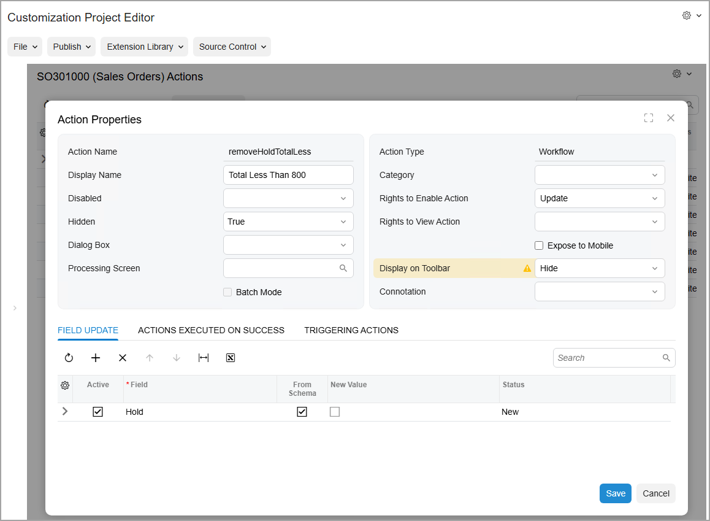

# Workflow-Identifying Fields: To Automate Transitions by Using Conditions \(in the Tree View\) {#_248d888b-a5e9-4de9-bf60-6a3f955a401a .task}

The following activity will walk you through the process of adding to a workflow new transitions that are performed automatically by conditions. You will use the [Workflow \(Tree View\)](../UserGuide/AU_20_10_30.md) page to perform this activity.

## Story { .section}

In the predefined sales order workflow, when a user clicks **Remove Hold** on the form toolbar or More menu of the [Sales Orders](../UserGuide/SO_30_10_00.md) \(SO301000\) form, the *releaseFromHold* action triggers the transition from the `On Hold` state to one of the following states: `Open`, `Pending Processing`, or `Awaiting Payment`.

In the customized workflow, acting as a technical specialist, you need to add new transitions from the `On Hold` state to each of these states. The added transitions should be performed if the **Order Total** is less than $800—that is, a sales order should be automatically removed from hold only if this condition is met. With these changes implemented, a sales order on the [Sales Orders](../UserGuide/SO_30_10_00.md) form will remain on hold only if its **Order Total** is greater than $800 or if a user puts it on hold manually. In all other cases, the sales order will be removed from hold automatically.

If a sales order is removed from hold automatically, it should be moved to the same state \(depending on which conditions are fulfilled\) to which it would have moved if it had been removed from hold manually.

## Process Overview { .section}

By using the [Workflow \(Tree View\)](../UserGuide/AU_20_10_30.md) page, you will create a transition from the `On Hold` state to the `Open` state. To do so, on this page, you will create a new action that triggers this transition, and specify the conditions for it. You will then add transitions from the `On Hold` state to the `Pending Processing` state and to the `Awaiting Payment` state.

## System Preparation { .section}

Before you begin performing the steps of this activity, do the following:

1.  Launch the Acumatica ERP website with the *U100* dataset preloaded, and sign in as system administrator by using the *gibbs* username and the *123* password.

    **Tip:** The *gibbs* user is assigned the *Administrator* role, which has sufficient access rights to customize workflows.

2.  Make sure that you have learned how to add actions and transitions, as described in [Action Configuration: General Information](WorkflowUI_Actions_GeneralInfo.md) and [Conditions and Transitions: General Information](WorkflowUI_ConditionsTransitions_GeneralInfo.md).
3.  Make sure that you have completed the [Workflow-Identifying Fields: To Add Conditions with User-Defined Fields](WorkflowUI_WorkflowIdentifying_Activity_AddConditions.md) activity.

## Step 1: Adding a New Transition Between the On Hold state and the Open state { .section}

You will create a new transition from the `On Hold` state to the `Open` state. In the Customization Project Editor for the *SalesOrdersCheckHold* customization project, perform the following instructions:

1.  In the navigation pane, click **Screens** &gt; **SO301000** &gt; **Workflows** &gt; **Sales Order**.

    The SO301000 \(Sales Orders\) State Diagram: Sales Order page opens.

2.  In the **States and Transition** pane, click the `On Hold` state.
3.  On the page toolbar, click **Add Transition**.
4.  In the **Add Transition** dialog box, which opens, click **Create** to the right of the **Trigger Name** box to add a new action.
5.  In the **New Action** dialog box, which opens, specify the following settings:
    -   **Action Name**: `removeHoldTotalLess`
    -   **Display Name**: `Total Less Than 800`
6.  Click **Save** to close the dialog box.
7.  In the **Target State** box of the **Add Transition** dialog box, select *Open*, and make sure that the action you have created is specified in the **Trigger Name** box.
8.  Click **Add** to close the dialog box.

    Notice that the new transition is added to the `On Hold` state and is now listed in the **States and Transitions** pane below the other transitions from this state. Also notice that on the **Actions** tab of the `On Hold` state, the `Total Less Than 800` action that you have created is added to the table below the other actions of this state.

9.  On the page toolbar, click **Save**.

Instead of using the existing `Remove Hold` action, you have added the `Total Less Than 800` action to distinguish between the following cases:

-   A sales order has been reviewed and removed from hold manually.

    In this case, the system selects the **SO Reviewed** check box on the [Sales Orders](../UserGuide/SO_30_10_00.md) \(SO301000\) form for the sales order.

-   A sales order has been removed from hold automatically because its **Order Total** is less than $800 and it has never been put on hold manually.

    The system does not select the **SO Reviewed** check box on the [Sales Orders](../UserGuide/SO_30_10_00.md) \(SO301000\) form in this case; instead, it performs the added `Total Less Than 800` action.

You added the `Total Less Than 800` action because when the system performs the existing `Remove Hold` action, you want it to select the **SO Reviewed** check box so that it does not put a sales order on hold again. \(This is the first case from the list above.\) When the status of a sales order changes to *Open* automatically \(which is the second case from the list\), you want the system to leave this check box cleared.

## Step 2: Duplicating Settings of the Predefined Transition in the Added Transition { .section}

To modify the transition from the `On Hold` state to the `Open` state, while you are still working with the tree view of the SO301000 \(Sales Orders\) State Diagram: Sales Order page in the Customization Project Editor, perform the following instructions:

1.  In the **States and Transition** pane, click **On Hold** &gt; **Transitions** &gt; **Remove Hold-&gt;Open** to review the predefined transition.

    In the **Fields to Update After Transition** table of the **Transition Properties** tab, notice the settings in the row for the *InclCustOpenOrders* field. You will duplicate these settings in the added transition.

2.  In the **States and Transition** pane, click the **Total Less Than 800-&gt;Open** transition.
3.  In the **Fields to Update After Transition** table of the **Transition Properties** tab, click **Add Row** on the table toolbar, and specify the following settings in the added row:
    -   **Field Name**: *InclCustOpenOrders*
    -   **From Schema**: Selected
    -   **New Value**: Selected
4.  On the page toolbar, click **Save**.

The custom transition from the `On Hold` state to the `Open` state should have the same settings as the respective transition triggered by the predefined `Remove Hold` action.

## Step 3: Duplicating the Settings of the Predefined Action in the Added Action { .section}

Because the `Total Less Than 800` action should remove a sales order from hold, the Hold field should be set to *False* when this action is performed, as is the case in the predefined `releaseFromHold` action. Also, this action should not be visible to users, because it is an auxiliary action that the system uses to automatically remove the sales order from hold on the [Sales Orders](../UserGuide/SO_30_10_00.md) \(SO301000\) form if it has an **Order Total** of less than $800 and it has not been put on hold manually. To modify these settings, perform the following instructions:

1.  In the navigation pane of the Customization Project Editor, click **Screens** &gt; **SO301000** &gt; **Actions**.

    The SO301000 \(Sales Orders\) Actions page opens.

2.  In the table, click the *removeHoldTotalLess* link.
3.  In the **Action Properties** dialog box, which opens, do the following:

    1.  In the **Hidden** box, select *True*.
    2.  On the **Field Update** tab, click **Add Row** on the table toolbar, and specify the following settings in the added row:

        -   **Active**: Selected
        -   **Field**: *Hold*
        -   **From Schema**: Selected
        -   **New Value**: Cleared
        **Tip:** You can ensure that the predefined `releaseFromHold` action has the same settings on the **Field Update** tab.

    The settings should look as shown in the following screenshot.

    

4.  Click **Save** to close the dialog box.

## Step 4: Automating the Action Execution { .section}

You need to add a condition for the `Total Less Than 800` action so that this action is performed automatically. With this action, a sales order should not remain on hold if its **Order Total** is less than $800 and it has not been put on hold manually.

To add a condition for the `Total Less Than 800` action, perform the following instructions:

1.  In the navigation pane of the Customization Project Editor, click **Screens** &gt; **SO301000** &gt; **Workflows** &gt; **Sales Order**.

    The SO301000 \(Sales Orders\) State Diagram: Sales Order page opens.

2.  In the **States and Transitions** pane, click the `On Hold` state.
3.  On the **Actions** tab, click the row with the `Total Less Than 800` action, and select *TotalLessThan800* in the **Auto-Run Condition** column.
4.  On the page toolbar, click **Save**.

## Step 5: Adding a Transition from the On Hold State to the Pending Processing State { .section}

In this step, you add a new transition from the `On Hold` state to the `Pending Processing` state; this transition will be triggered by the `Total Less Than 800` action. In the tree view of the SO301000 \(Sales Orders\) State Diagram: Sales Order page of the Customization Project Editor, perform the following instructions:

1.  In the **States and Transitions** pane, click the `On Hold` state.
2.  On the page toolbar, click **Add Transition**.
3.  In the **Add Transition** dialog box, which opens, specify the following settings:
    -   **Trigger Name**: *Total Less Than 800*
    -   **Condition**: *HasPaymentsInPendingProcessing*

        This is the same condition that is specified for the transition triggered by the `Remove Hold` action.

    -   **Target State**: *Pending Processing*
4.  Click **Add** to close the dialog box.
5.  On the page toolbar, click **Save**.

The transition from the `On Hold` state to the `Pending Processing` state should have the same properties as the respective transition triggered by the predefined `Remove Hold` action. Thus, you have added this transition by duplicating the respective transition triggered by this predefined action.

## Step 6: Adding a Transition from the On Hold State to the Awaiting Payment State { .section}

To add a transition from the `On Hold` state to the `Awaiting Payment` state, while you are still working with the tree view of the SO301000 \(Sales Orders\) State Diagram: Sales Order page of the Customization Project Editor, perform the following instructions:

1.  In the **States and Transitions** pane, select the `On Hold` state.
2.  On the page toolbar, click **Add Transition**.
3.  In the **Add Transition** dialog box, which opens, specify the following settings:
    -   **Trigger Name**: *Total Less Than 800*
    -   **Condition**: *IsPaymentRequirementsViolated*

        This is the same condition that is specified for the transition triggered by the `Remove Hold` action.

    -   **Target State**: *Awaiting Payment*
4.  Click **Add** to close the dialog box.
5.  On the page toolbar, click **Save**.

The transition from the `On Hold` state to the `Awaiting Payment` state should have the same properties as the respective transition triggered by the predefined `Remove Hold` action. Thus, you have added this transition by duplicating the respective transition triggered by this predefined action.

**Parent topic:**[Customizing Workflows with a Workflow-Identifying Field](../DeveloperGuide/WorkflowUI_WorkflowIdentifying_Mapref.md)

