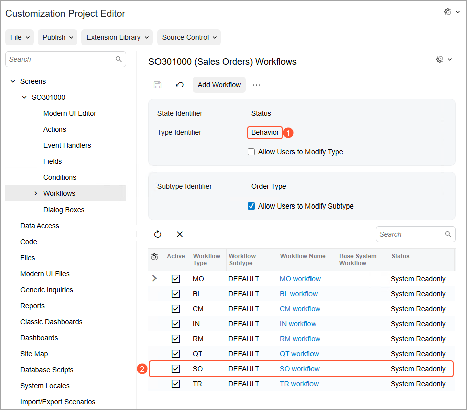

# Workflow-Identifying Fields: Planning Customization of a Workflow {#_680eed58-717f-4e2a-a459-e97005665c62 .concept}

The [Sales Orders](../UserGuide/SO_30_10_00.md) \(SO301000\) form provides workflows for multiple types of documents, such as sales orders, invoices, and credit memos. A separate workflow type is used for each of these documents. The type of the workflow is identified by the value of the Behavior internal field, which is unavailable on the form. \(You can learn the field that is used as the workflow-identifying field for the form by reviewing the value of the **Type Identifier** box on the [Workflows](../UserGuide/AU_20_10_20.md) page that is open for the form, as Item 1 in the following screenshot shows.\) For sales orders, the Behavior field has the *SO* value, which is the type of the workflow for sales orders, as you can see on the [Workflows](../UserGuide/AU_20_10_20.md) page \(Item 2\).

Suppose that in your customization efforts, you need to implement the following changes to the workflow of sales orders on the [Sales Orders](../UserGuide/SO_30_10_00.md) form:

-   The system should release a new sales order from hold automatically if the **Order Total** is less than $800.
-   The system should put a sales order with any status on hold if the **Order Total** is greater than or equal to $800.
-   If a sales order with the **Order Total** greater than or equal to $800 has been manually removed from hold once, it should not be possible to put this sales order on hold again, even if its **Order Total** has been increased.

To implement these changes, you need to customize the workflow of the *SO* workflow type for the [Sales Orders](../UserGuide/SO_30_10_00.md) form. Because the system does not store information about whether the sales order has been reviewed or whether it has been put on hold manually, you need to create user-defined fields for the workflow of sales orders with the *SO* type. One field will be used to check if a sales order has been put on hold manually, and another to check whether it has already been removed from hold. You need to implement conditions that use these user-defined fields and automate transitions by using these conditions. You also need to modify system actions so that they can change the values of these custom fields.

**Parent topic:**[Customizing Workflows with a Workflow-Identifying Field](../DeveloperGuide/WorkflowUI_WorkflowIdentifying_Mapref.md)

