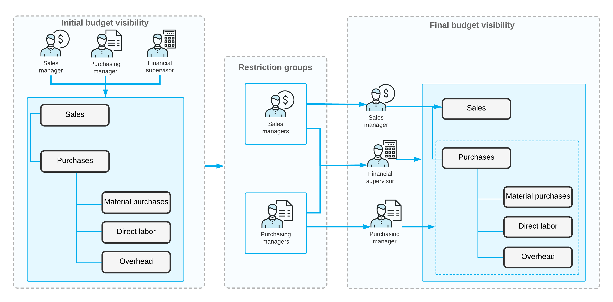

# Access to Budget Nodes: General Information {#_19246a5e-1a71-499b-97b9-9aeb047d6b42 .concept}

In Acumatica ERP, organizations implement general access restrictions by assigning roles to users of the system and controlling access to the resources by assigning the needed access rights to the roles. The roles assigned to users then allow them to access the needed resources to perform the specific tasks required for their jobs. If needed, restriction groups can be used to meet additional security requirements.

This approach can be especially useful with budget articles. If a role allows a user to view or edit GL budget articles, the user can view all the articles, including those that might be sensitive. By using restriction groups, you can limit the visibility of sensitive budget articles so that only particular users can see and work with these articles.

## Learning Objectives { .section}

In this chapter, you will learn how to configure access rights for multiple users by creating restriction groups.

## Applicable Scenarios { .section}

You assign access to budget articles for multiple user roles if you want users belonging to particular roles to have access to particular budget nodes, and all other users not to have this access.

## Management of the Visibility of GL Budget Articles by User { .section}

In Acumatica ERP, you can configure restriction groups with direct and inverse restrictions. Groups with direct restriction \(the *A* and *B* types\) make the entities included in the group visible to users who are included in the group; other users cannot view these entities. Groups in inverse restrictions \(the *A Inverse* and *B Inverse* types\) hide the entities included in the group from users who are also included in the group; users who are not assigned to this group can view and use these entities. For details on the types of restriction groups, see [Types of Restriction Groups](../UserGuide/SM__con_Types_of_Restriction_Groups.md).

You can configure a direct restriction group that will limit users’ visibility of GL budget articles \(leaf articles or nodes at any level\). As a result, the users included in the group will be able to see the budget articles \(and these articles' subarticles, if there are any\).

For example, suppose that the *Wages* budget article should be available to only the chief financial officer of your organization. To configure the visibility of this budget article, you need to do the following on the [GL Budget Access](../UserGuide/GL_10_50_30.md) \(GL105030\) form:

1.  You create a restriction group \(for example, *Group for Wages Budget Article*\) with direct restriction.
2.  You add to the group the user account of the chief financial officer.
3.  You add to the group the *Wages* budget article.

For more details about restriction groups, see [Restriction Groups in Acumatica ERP](../UserGuide/SM__con_Overview_of_Restriction_Groups.md).

**Tip:** The restriction groups that you configure are applied only to new budgets—that is, they are applied to those budgets that are created after the access was configured.

If you need to apply a restriction group to an existing budget, you should do the following:

1.  On the [Budgets](../UserGuide/GL_30_20_10.md) \(GL302010\) form, you select the needed budget.
2.  On the form toolbar, you click **Manage Budget**.
3.  In the **Manage Budget** dialog box, you select *Convert Budget Using Current Budget Configuration* in the **Select Action** box, and click **OK**.
4.  You onfirm the action and click **Save** to save the budget.

## Workflow of Configuring Access to Budget Nodes { .section}

The following diagram illustrates how you can assign access to nodes of a budget by configuring direct restriction groups of type *A*, which means that the budget nodes included in these groups will be visible to the users included in these groups.

In the diagram, the budget node was initially visible to all users assigned to the *Sales Manager*, *Purchasing Manager*, and *Financial Supervisor* roles. By setting up a restriction group with direct restriction, you make the **Sales** node of the budget tree visible to the users with the *Sales Manager* role, and the subnodes of the **Purchases** node visible to users with the *Purchasing Manager* role. The *Financial Supervisor* has been included in both groups, so users with this role can access all nodes of the budget tree.

**Parent topic:**[Access to Budget Nodes](../ImplementationGuide/Finance_Assigning_Access_to_Budget_Nodes_Mapref.md)

