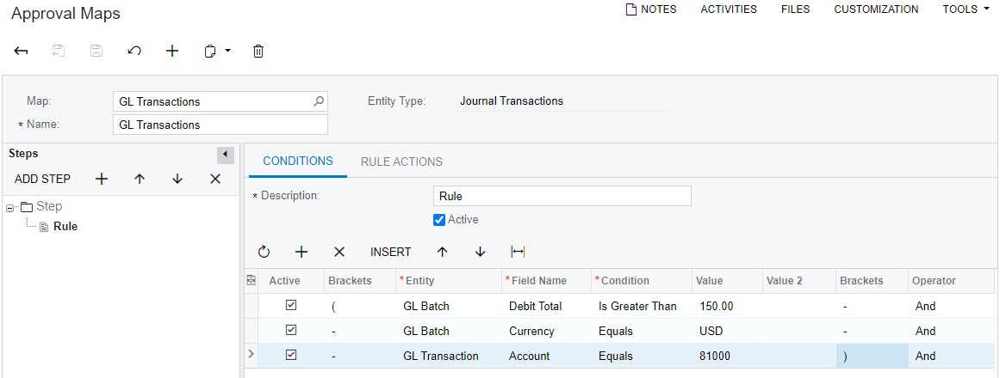

# Approval Configuration: Implementation Activity {#_85dd01b5-fcac-435e-a254-2766ba3b48cc .task}

In the following implementation activity, you will learn how to set up approvals for GL transactions—journal transactions entered directly in the general ledger.

**Attention:** This activity is based on the *U100* dataset. If you are using another dataset or if any system settings have been changed in *U100*, these changes can affect the workflow of the activity and the results of the processing. To avoid issues, restore the *U100* dataset to its initial state.

## Story {#section_ax3_mjv_vxb .section}

Suppose that according to the internal requirements of SweetLife Fruits &amp; Jams, specific GL transactions have to be reviewed by a financial supervisor. The supervisor must approve each GL transaction with the *Normal* type that has an amount exceeding $150 \(in US dollars\) and is posted to the *81000 \(Other Expenses\)* account. If a transaction meets these conditions, this transaction can be posted after it has been approved by the financial supervisor. If the financial supervisor rejects the transaction, they must specify the reason for rejection.

Acting as a system administrator, you need to configure an approval map for this type of transactions and assign Anna Johnson, a financial supervisor, as the approver of these transactions.

## Process Overview {#section_dx3_mjv_vxb .section}

In this activity, you will first enable the *Approval Workflow* feature on the [Enable/Disable Features](../UserGuide/CS_10_00_00.md) \(CS100000\) form. On the [Approval Maps](../UserGuide/EP_20_50_15.md) \(EP205015\) form, you will create an approval map, specifying the approver, the conditions for GL transactions, and the actions to be performed on approval of the GL transactions that match those conditions. Finally, on the [General Ledger Preferences](../UserGuide/GL_10_20_00.md) \(GL102000\) form, you will add the approval map on the **Approval** tab and specify the email template for it.

## System Preparation {#section_fx3_mjv_vxb .section}

Before you start configuring approvals for GL transactions, launch the Acumatica ERP website, and sign in to a company with the *U100* dataset preloaded. You should sign in as the system administrator with the *gibbs* username and the *123* password.

## Step 1: Enabling the Needed Feature {#section_hx3_mjv_vxb .section}

To enable the *Approval Workflow* feature, do the following:

1.  On the [Enable/Disable Features](../UserGuide/CS_10_00_00.md) \(CS100000\) form, click **Modify** on the form toolbar.
2.  Under **Platform**, select the **Approval Workflow** check box.
3.  On the form toolbar, click **Enable** to enable the feature.

## Step 2: Creating an Approval Map for GL Transactions {#section_jx3_mjv_vxb .section}

To create an approval map, do the following:

1.  Open the [Assignment and Approval Maps](../UserGuide/EP_20_55_00.md) \(EP205500\) form.
2.  On the form toolbar, click **Add Approval Map**.
3.  On the [Approval Maps](../UserGuide/EP_20_50_15.md) \(EP205015\) form, which is opened, specify the following settings in the Summary area:
    -   **Name**: `GL Transactions`
    -   **Entity Type**: *Journal Transactions*
4.  In the **Steps** pane, click **Add Step**, and click the **Rule** node.
5.  In the right pane, make sure that the following settings are specified:
    -   **Description**: *Rule*
    -   **Active**: Selected
6.  On the **Conditions** tab, click **Add Row** on the table toolbar, and specify the following settings in the added row:
    -   **Brackets**: *\(*
    -   **Entity**: *GL Batch*
    -   **Field Name**: *Debit Total*
    -   **Condition**: *Is Greater Than*
    -   **Value**: `150`
    -   **Brackets**: *-* \(inserted by default\)
    -   **Operator**: *And* \(inserted by default\)
7.  Click **Add Row** again, and specify the following settings for the second row:
    -   **Brackets**: *-* \(inserted by default\)
    -   **Entity**: *GL Batch*
    -   **Field Name**: *Currency*
    -   **Condition**: *Equals* \(inserted by default\)
    -   **Value**: *USD* \(inserted by default\)
    -   **Brackets**: *-* \(inserted by default\)
    -   **Operator**: *And* \(inserted by default\)
8.  Click **Add Row** again, and specify the following settings for the third row:
    -   **Brackets**: *-* \(inserted by default\)
    -   **Entity**: *GL Transaction*
    -   **Field Name**: *Account*
    -   **Condition**: *Equals* \(inserted by default\)
    -   **Value**: *81000*
    -   **Brackets**: *\)*
9.  On the form toolbar, click **Save**.

    The following screenshot shows the conditions specified on the **Conditions** tab.

    

10. On the **Rule Actions** tab, specify the following settings:
    -   **Approver**: *Employee*
    -   **Employee**: *Anna Johnson*
    -   **Reason for Rejection**: *Is Required*
11. On the form toolbar, click **Save** to save your changes.

## Step 3: Specifying the Approval Settings for GL Transactions {#section_mx3_mjv_vxb .section}

To specify the settings for approval of GL transactions, do the following:

1.  Open the [General Ledger Preferences](../UserGuide/GL_10_20_00.md) \(GL102000\) form.
2.  On the **Approval** tab, click **Add Row** on the table toolbar.
3.  In the added row, specify the following settings:
    -   **Type**: *Normal*

        The approval map will be used only for transactions of this type that are created on the [Journal Transactions](../UserGuide/GL_30_10_00.md) \(GL301000\) form.

    -   **Approval Map**: *GL Transactions*

        This is the approval map that you created in Step 2.

    -   **Pending Approval Notification**: *Journal Transaction Approval*

        This is the predefined email template for journal transactions. In a production environment, you would review the existing template and update it, if necessary, or create a new template \(either from scratch or based on the predefined template\).

4.  On the form toolbar, click **Save** to save your settings.

**Parent topic:**[Configuring Approvals](../ImplementationGuide/config_Approvals_Functionality.md)

