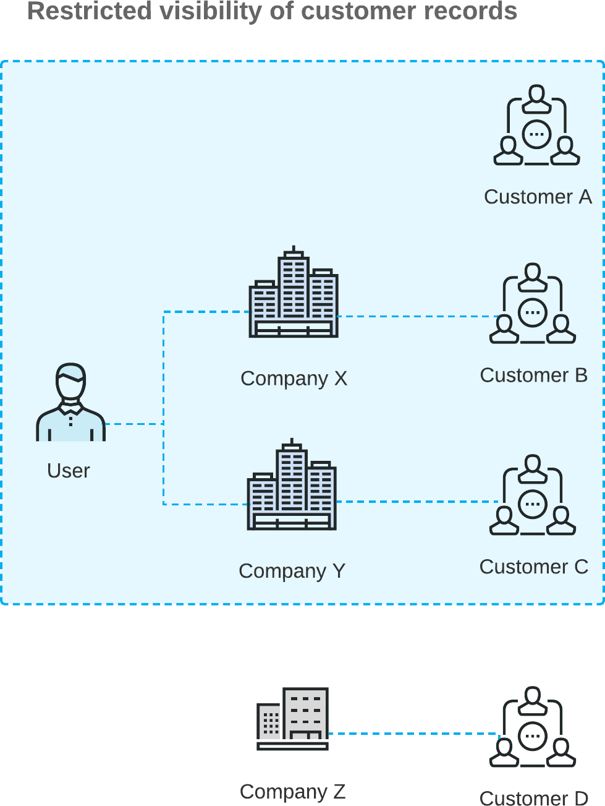

# Customer Visibility: General Information {#_2828845f-1fd4-4c37-806e-3406cb57b72e .concept}

When multiple companies with their own accounting departments are configured within the same tenant, you may want to limit access to customer accounts so that they can be viewed by only employees of a particular company, branch, or company group and used in the documents originating from these entities.

If the *Multiple Base Currencies* feature is enabled on the [Enable/Disable Features](../UserGuide/CS_10_00_00.md) \(CS100000\) form, the **Restrict Visibility To** setting on the **Financial** tab of the [Customers](../UserGuide/AR_30_30_00.md) \(AR303000\) form is required for regular customers. You should associate each customer with an appropriate entity by selecting the entity in the **Restrict Visibility To** box. The base currency of the entity with which the customer is associated will be the currency in which the system stores the customer's balance and credit limit. As a result, customers can be used only in the transactions originating from the branches that have the same base currency as the currency of the entity that is associated with the customer.

## Learning Objectives { .section}

In this chapter, you will learn how to do the following:

-   Restrict the visibility of a customer for a particular company
-   Explore how customers can be accessed by various users based on these restrictions
-   Update the **Restrict Visibility To** setting of customers by using an import scenario

## Applicable Scenarios { .section}

You may want to restrict the visibility of customer records in the following cases:

-   You have customers that work with a particular entity \(a company, a branch, or a company group\), and you do not want employees of other companies or branches to have access to the entity.
-   You are using the *Multiple Base Currencies* feature, and you need to limit the usage of customers to an entity \(a company, branch, or a company group\).

## Restricted Visibility of Customer Records { .section}

You use the **Restrict Visibility To** box on the **Financial** tab of the [Customers](../UserGuide/AR_30_30_00.md) \(AR303000\) form to control the visibility of the selected customer. A customer in Acumatica ERP can be associated with one of the following:

-   A branch: The customer is associated with a branch \(that is, the visibility of the customer is limited to the branch\) if the branch is selected in the **Restrict Visibility To** box for the customer. In this case, the customer can be accessed by users assigned to the role specified for the branch in the **Access Role** box of the **Branch Details** tab \(**Configuration Settings** section\) of the [Branches](../UserGuide/CS_10_20_00.md) \(CS102000\) form. The customer can be selected in documents originating from this branch.

    **Attention:** The branch where a particular document has originated is referred to as the *originating branch* of the document. By default, the originating branch is the branch to which the user is signed in during document creation; this value can be overridden. In the documents associated with a customer, the default value of the originating branch—the **Branch** box on the **Financial** tab of the [Invoices and Memos](../UserGuide/AR_30_10_00.md) \(AR301000\) form—is copied from the default branch specified for the customer in the **Default Branch** box on the **Shipping** tab of the [Customers](../UserGuide/AR_30_30_00.md) form. If the default branch is not specified, the current branch will be used as the originating branch of a document.

-   A company: The customer is associated with a company \(that is, the visibility of the customer is limited to the company\) if the company is selected in the **Restrict Visibility To** box for the customer. In this case, the customer can be accessed by a user that has access to at least one of the company’s branches \(or to the company if it has no branches\). That is, the customer can be accessed by a user with the access role specified in the **Access Role** box \(**Configuration Settings** section\) on the **Branch Details** tab of the [Branches](../UserGuide/CS_10_20_00.md) form for the branch, or the **Company Details** tab of the [Companies](../UserGuide/CS_10_15_00.md) \(CS101500\) form for the company. The customer can be selected in documents originating from any branch of the company.
-   A company group: If a company group has been set up in the system, as described in [Company Groups: Implementation Activity](config_Finance_Company_Group_Implem_Activity.md), the customer can be associated with this company group if the company group is selected in the **Restrict Visibility To** box for a customer. With the visibility of the customer restricted to a company group, the customer can be accessed by a user that has access to at least one of the companies included in the group. The customer can be selected in documents originating from any branch of any company included in the group.
-   No entity: If the customer is not associated with a branch, company, or company group \(that is, if the **Restrict Visibility To** box is left blank\), it can be accessed by any user. The customer can be selected in documents originating from any branch.

If you want to control customer visibility for all customers of a particular customer class, you use the **Restrict Visibility To** box on the **General** tab of the [Customer Classes](../UserGuide/AR_20_10_00.md) \(AR20100\) form similarly to specify the visibility for the class as a whole. When a new customer of the class is created, this setting is used as the default setting for the customer, but you can override it.

These capabilities are available if the *Customer and Vendor Visibility Restriction* feature has been enabled on the [Enable/Disable Features](../UserGuide/CS_10_00_00.md) \(CS100000\) form. The feature can be disabled at any time. If the feature is disabled, the system will no longer apply any of the specified visibility restrictions to customers. For details on setting up vendor visibility, see [Visibility of Vendor Records](Finance_Restricting_Vendor_Visibility_Mapref.md). For details on setting up customer and vendor visibility for a company group, see [Company Groups](config_Finance_Company_Group_Mapref.md).

**Tip:** If you have the *Row-Level Security* feature enabled and any restriction groups have been configured in the system, they will be applied in addition to the customer visibility restriction functionality. For details on restriction groups, see [Customers: Security Configuration](../UserGuide/AR__con_Customer_Security.md).

## Configuration Example { .section}

The following diagram illustrates an example of restricted access to customer records.

The diagram shows that the user in the *Company X* and *Company Y* access roles can work with *Customer B* \(which is associated with *Company X*\) and *Customer C* \(which is associated with *Company Y*\). Additionally, the user can work with *Customer A*; access to this customer is not limited to any company or branch because the **Restrict Visibility To** box on the [Customers](../UserGuide/AR_30_30_00.md) \(AR303000\) form is empty. However, the user cannot view the *Customer D* record, because this customer is associated with *Company Z*, to which the user does not have access based on the user's assigned roles.

In the system, users can create documents for the following customers:

-   *Customer A* if *Company X*, *Company Y*, or *Company Z* is the company with the originating branch
-   *Customer B* if *Company X* is the company with the originating branch
-   *Customer C* if *Company Y* is the company with the originating branch
-   *Customer D* if *Company Z* is the company with the originating branch

**Parent topic:**[Visibility of Customer Records](../ImplementationGuide/Finance_Restricting_Customer_Visibility_Mapref.md)

