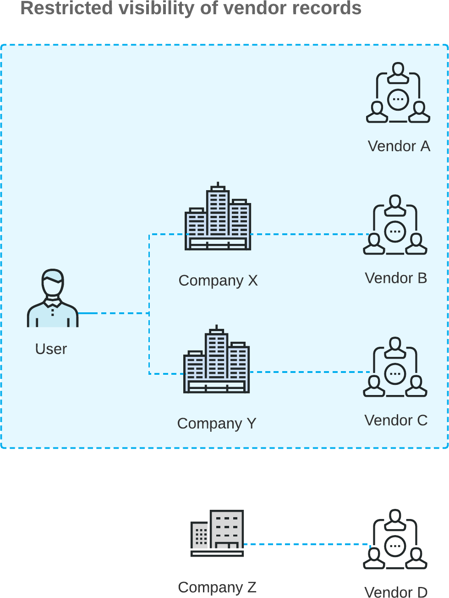

# Vendor Visibility: General Information {#_d9fd61fa-756c-4e3d-9ae0-4ba9ba51dbd2 .concept}

When multiple companies with their own accounting departments are configured within the same tenant, you may want to restrict the visibility of vendor accounts to employees of a particular company, branch, or company group.

If the *Multiple Base Currencies* feature is enabled on the [Enable/Disable Features](../UserGuide/CS_10_00_00.md) \(CS100000\) form, the **Restrict Visibility To** setting on the **Financial** tab of the [Vendors](../UserGuide/AP_30_30_00.md) \(AP303000\) form becomes required for regular vendors. You should associate each vendor with an appropriate entity by selecting the entity in the **Restrict Visibility To** box. The base currency of the entity with which the vendor is associated will be the currency in which the system stores the vendor's balance. As a result, vendors can be used only in the transactions originating from the branches that have the same base currency as the base currency of the entity that is associated with the vendor.

## Learning Objectives { .section}

In this chapter, you will learn how to do the following:

-   Restrict the visibility of a vendor to a particular branch
-   Explore how vendors can be accessed by various users based on these restrictions
-   Update the **Restrict Visibility To** setting of vendors by using an import scenario

## Applicable Scenarios { .section}

You may want to restrict the visibility of vendor records in the following cases:

-   You have vendors that work with a particular branch, company, or a company group, and you do not want employees of other companies to have access to them.
-   You are using the *Multiple Base Currencies* feature, and you need to limit the usage of vendors to an entity \(a company, branch, or a company group\).

## Restricted Visibility of Vendor Records { .section}

You use the **Restrict Visibility To** box on the **Financial** tab of the [Vendors](../UserGuide/AP_30_30_00.md) \(AP303000\) form to control the visibility of the selected vendor. A vendor in Acumatica ERP can be associated with one of the following:

-   A branch: The visibility of the vendor is restricted to a branch \(that is, the vendor is associated with the branch\) if the branch is selected in the **Restrict Visibility To** box for the vendor. In this case, the vendor can be accessed by users assigned to the role specified for the branch in the **Access Role** box of the **Branch Details** tab \(**Configuration Settings** section\) of the [Branches](../UserGuide/CS_10_20_00.md) \(CS102000\) form. The vendor can be selected in documents originating from this branch.

    **Attention:** The branch where a particular document has originated is referred to as the *originating branch* of the document. By default, the originating branch is the branch to which the user is signed in during document creation; this value can be overridden. In the documents associated with a vendor, the default value of the originating branch—the **Branch** box on the **Financial** tab of the [Bills and Adjustments](../UserGuide/AP_30_10_00.md) \(AP301000\) form—is copied from the default branch specified for the vendor in the **Default Branch** box on the **Purchase Settings** tab of the [Vendors](../UserGuide/AP_30_30_00.md) \(AP303000\) form. If the default branch is not specified, the current branch will be used as the originating branch of a document.

-   A company: The visibility of the vendor is restricted to a company \(that is, the vendor is associated with the company\) if the company is selected in the **Restrict Visibility To** box for the vendor. In this case, the vendor can be accessed by a user that has access to at least one of the company’s branches \(or to the company if it has no branches\). That is, the vendor can be accessed by a user with the access role specified in the **Access Role** box \(**Configuration Settings** section\) on the **Branch Details** tab of the [Branches](../UserGuide/CS_10_20_00.md) form for the branch, or the **Company Details** tab of the [Companies](../UserGuide/CS_10_15_00.md) \(CS101500\) form for the company. The vendor can be selected in documents originating from any branch of the company.
-   A company group: If a company group has been set up in the system, as described in [Company Groups: Implementation Activity](config_Finance_Company_Group_Implem_Activity.md), the vendor can be associated with this company group if the company group is selected in the **Restrict Visibility To** box for the vendor. With the visibility of the vendor restricted to a company group, the vendor can be accessed by a user that has access to at least one of the companies included in the group. The vendor can be selected in documents originating from any branch of any company included in the group.
-   No entity: If the visibility of the vendor is not restricted to a branch, company, or company group \(that is, if the **Restrict Visibility To** box is left blank\), it can be accessed by any user. The vendor can be selected in documents originating from any branch.

If you want to control vendor visibility for all vendors of a particular vendor class, you use the **Restrict Visibility To** box on the **General** tab of the [Vendor Classes](../UserGuide/AP_20_10_00.md) \(AP20100\) form similarly to specify the visibility for the class as a whole. When a new vendor of the class is created, this setting is used as the default setting for the vendor, but you can override it.

These capabilities are available if the *Customer and Vendor Visibility Restriction* feature has been enabled on the [Enable/Disable Features](../UserGuide/CS_10_00_00.md) \(CS100000\) form. The feature can be disabled at any time. If the feature is disabled, the system will no longer apply any of the specified visibility restrictions to vendors. For details on setting up customer visibility, see [Visibility of Customer Records](Finance_Restricting_Customer_Visibility_Mapref.md). For details on setting up customer and vendor visibility for a company group, see [Company Groups](config_Finance_Company_Group_Mapref.md).

**Tip:** If any restriction groups have been configured in the system, they will be applied in addition to the vendor visibility restriction functionality. For details on restriction groups, see [Vendor Security](../UserGuide/RS__con_Vendor_Security.md).

## Configuration Example { .section}

The following diagram illustrates an example of restricted access to vendor records.

The diagram shows that the user in the *Company X* and *Company Y* access roles can work with *Vendor B* \(which is associated with *Company X*\) and *Vendor C* \(which is associated with *Company Y*\). Additionally, the user can work with *Vendor A*; access to this vendor is not limited to any company or branch because the **Restrict Visibility To** box on the [Vendors](../UserGuide/AP_30_30_00.md) \(AP303000\) form is empty. However, the user cannot view the *Vendor D* record, because this vendor is associated with *Company Z*, to which the user does not have access based on the user's assigned roles.

In the system, users can create documents for the following vendors:

-   *Vendor A* if *Company X*, *Company Y*, or *Company Z* is the company with the originating branch
-   *Vendor B* if *Company X* is the company with the originating branch
-   *Vendor C* if *Company Y* is the company with the originating branch
-   *Vendor D* if *Company Z* is the company with the originating branch

**Parent topic:**[Visibility of Vendor Records](../ImplementationGuide/Finance_Restricting_Vendor_Visibility_Mapref.md)

