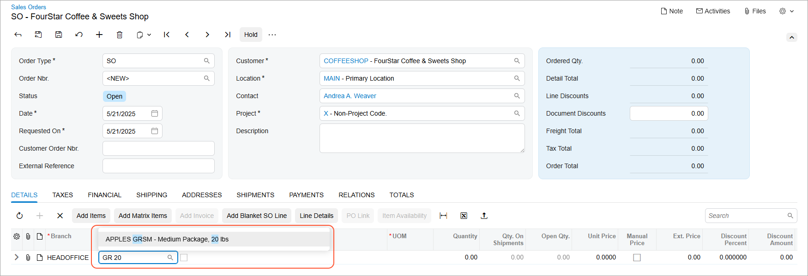

# Full-Text Search: General Information {#_92918d6e-71dd-4b7d-afa3-4fa40546a2a7 .concept}

The **standard search** in Acumatica ERP scans the database row by row. You can enter the starting characters or any other part of the inventory ID or description, depending on the configured search settings. This search works well on small and medium-sized databases—those with fewer than 1 million inventory item records.

But if you're managing a high-volume inventory, you can use the **full-text search**. It uses a token-based search index for matching. With this search, the search query can include elements from the inventory ID and its description simultaneously. In the full-text search query, you must include only the beginnings of words or inventory ID segments \(if the INVENTORY segmented key consists of several segments\). You can also use full words in the search query. This search works best with databases containing more than 1 million records.

## Learning Objectives { .section}

In this chapter, you will learn how to do the following:

-   Enable the required feature
-   Prepare a search index for the full-text search

## Applicable Scenarios { .section}

You may need to learn how to enable and configure the full-text search if both of the following conditions are met:

-   Your company has a database containing more than 1 million inventory item records.
-   The standard search does not provide sufficient performance on data-entry forms.

## Full-Text Search for Inventory { .section}

To use the full-text search, first make sure your environment meets these requirements:

-   Your instance is running Microsoft SQL Server.
-   The full-text components have been installed in your Microsoft SQL Server instance. For more information, see the [Full-Text Search](https://learn.microsoft.com/en-us/sql/relational-databases/search/full-text-search?view=sql-server-ver16) article.

Then, do the following:

1.  Go to the [Enable/Disable Features](../UserGuide/CS_10_00_00.md) \(CS100000\) form and enable the *Full-Text Search for Inventory* feature in the *Experimental Features* group of features.
2.  Rebuild the search index in the database:
    1.  Open the [Rebuild Full-Text Entity Index](../UserGuide/SM_20_95_00.md) \(SM209500\) form.
    2.  In the table, select the unlabeled check box for the *InventoryItem* entity.
    3.  Click **Process** on the form toolbar.
3.  Wait for the indexing to complete. On large databases, this may take time. You can monitor progress directly on the [Rebuild Full-Text Entity Index](../UserGuide/SM_20_95_00.md) form or on the **Running Processes** tab of the [System Monitor](../UserGuide/SM_20_15_30.md) \(SM201530\) form. As soon as the system completes index building, you’re ready to go.

    The system updates the search index automatically when you add or modify inventory items. You need to perform this action only once, after you enable the *Full-Text Search for Inventory* feature.


**Tip:** If you use multiple Acumatica ERP tenants, we recommend enabling the full-text search only in the production tenant.

## Expansion of Search Results { .section}

You can increase the maximum number of results returned and processed by the search engine for every search query. This ability may be useful if both of the following conditions are met:

-   Your database contains a large number of similar records that differ only slightly in inventory ID.
-   Search queries sometimes do not return the needed results when you search by parts of inventory IDs or descriptions.

To increase the quantity of search results, you add the `InventoryFTSResultsMax` key to the web.config file of the application. Here is an example string:

```
<add key="InventoryFTSResultsMax" value="500" />
```

We recommend starting with a value of 500 and increasing it in the same increments.

**Important:** Increasing the maximum number of search results can reduce the performance of the full-text search.

## Example of a Full-Text Search Query {#section_f5p_kb1_kfc .section}

Suppose that your inventory includes many records with different inventory items. You need to find the stock item with the following settings:

-   **Inventory ID**: *Apples GRSM*
-   **Description**: *Medium Package, 20 lbs*

To find this stock item, you start typing `gr 20` in the **Inventory ID** box in a line of a sales order. The system finds the most relevant result, as shown below, by matching parts of both the ID and the description.



## Forms Supporting the Full-Text Search for Inventory { .section}

You can perform the full-text search by the inventory ID, description, and alternate ID \(if available\) when you start typing in the **Inventory ID** column or in the **Inventory Lookup** dialog box of the following forms:

-   [Sales Orders](../UserGuide/SO_30_10_00.md) \(SO301000\)
-   [Invoices](../UserGuide/SO_30_30_00.md) \(SO303000\)
-   [Purchase Orders](../UserGuide/PO_30_10_00.md) \(PO301000\)
-   [Requests](../UserGuide/RQ_30_10_00.md) \(RQ301000\)
-   [Requisitions](../UserGuide/RQ_30_20_00.md) \(RQ302000\)
-   [Issues](../UserGuide/IN_30_20_00.md) \(IN302000\)
-   [Receipts](../UserGuide/IN_30_10_00.md) \(IN301000\)
-   [Adjustments](../UserGuide/IN_30_30_00.md) \(IN303000\)
-   [Transfers](../UserGuide/IN_30_40_00.md) \(IN304000\)

You can also search by typing the inventory ID and description on the **Details** tab of all the forms listed above, plus [Opportunities](../UserGuide/CR_30_40_00.md) \(CR304000\) and [Sales Quotes](../UserGuide/CR_30_45_00.md) \(CR304500\) forms.

**Parent topic:**[Full-Text Search](../ImplementationGuide/OrdrMgmt_Full_Text_Search_Mapref.md)

