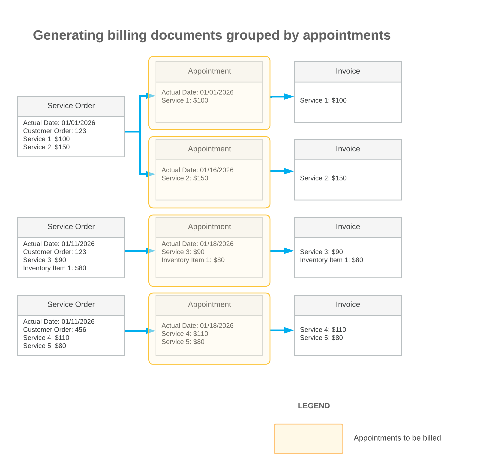
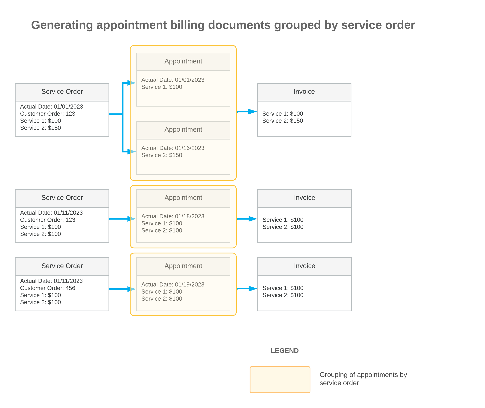
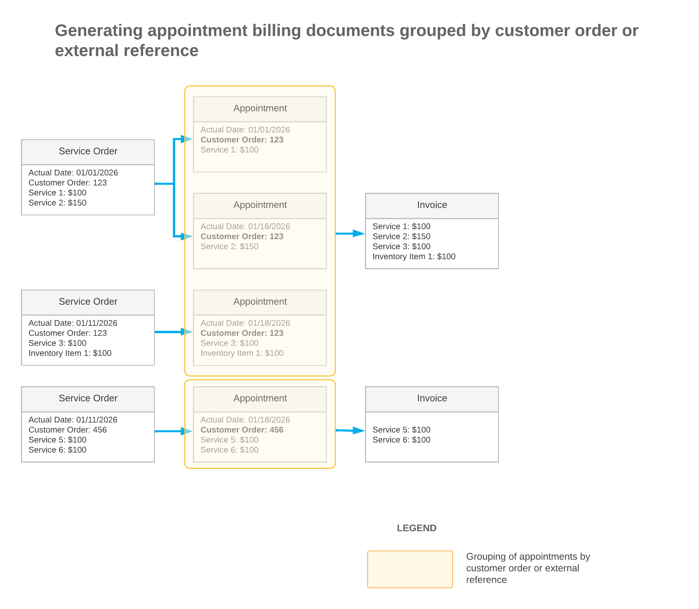
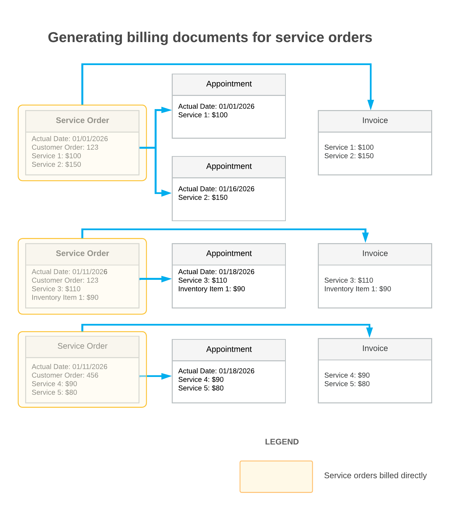
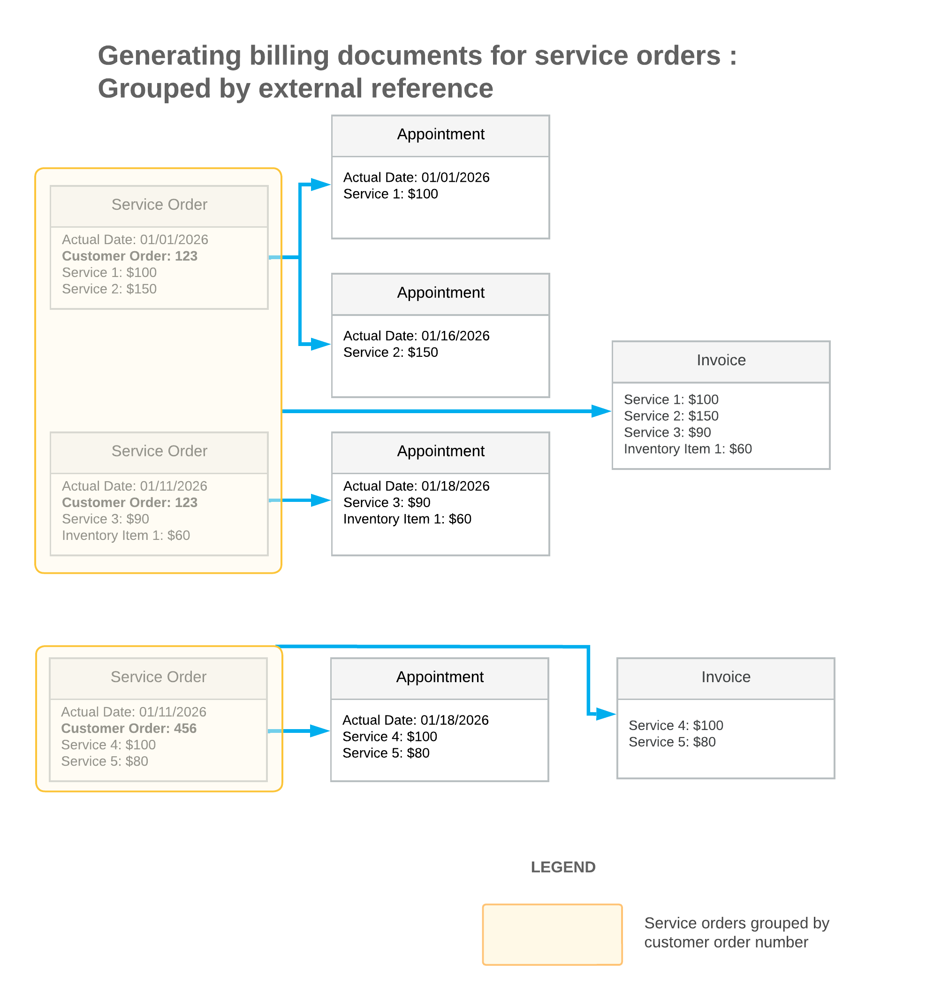
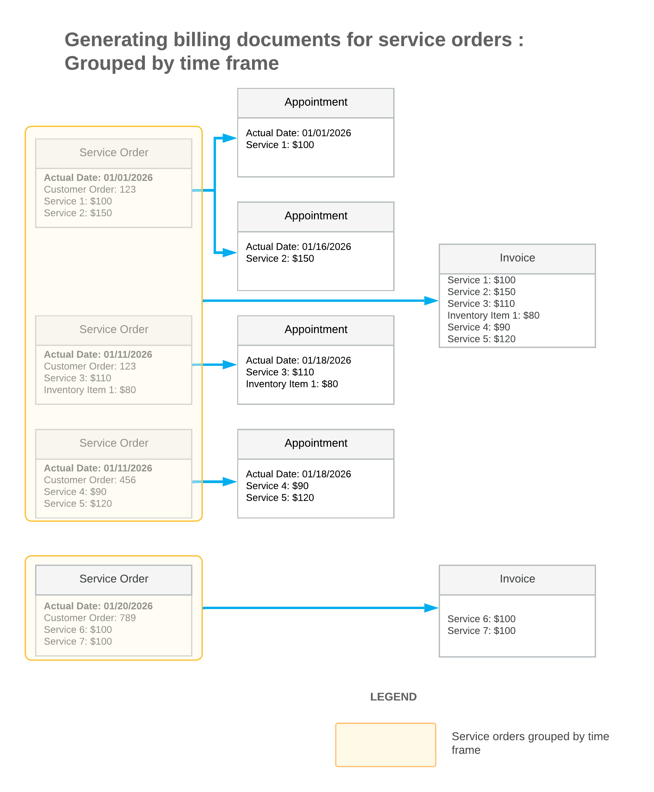
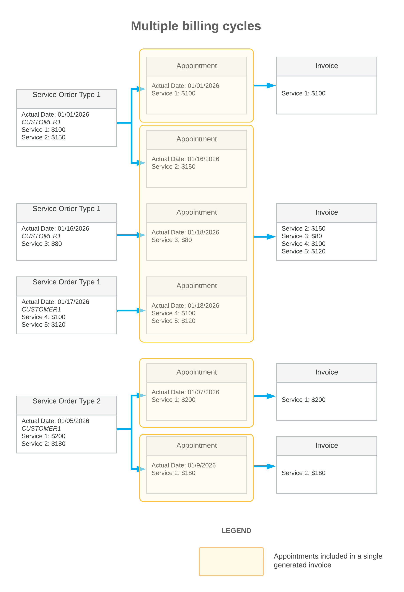

# Billing Cycles: Examples {#_376ee94c-dee0-4520-b3f7-dc63257feae3 .concept}

The system uses billing cycles, which are defined on the [Billing Cycles](../UserGuide/FS_20_60_00.md) \(FS206000\) form, to determine how customers will be billed after their service orders and appointments have been processed in the system. On the [Customers](../UserGuide/AR_30_30_00.md#) \(AR303000\) form, you assign one billing cycle or multiple billing cycles to a particular customer. A billing cycle can be assigned to any number of customers.

This topic provides examples with diagrams that illustrate how billing is performed based on the billing cycle settings for generating and grouping billing documents. All diagrams are based on the same service orders and appointments, with the last service order having no associated appointment.

**Tip:** In Acumatica ERP service management functionality, a *billing document* refers to a document or transaction generated when the billing process is executed for a service document. Depending on the service order type settings, it can be a sales order, SO invoice, AR invoice or project transaction.

## Generating Billing Documents from Appointments; Grouping by Appointment { .section}

Suppose that you have defined a billing cycle with the following settings on the [Billing Cycles](../UserGuide/FS_20_60_00.md) \(FS206000\) form and assigned it to a customer:

-   **Run Billing For**: Appointments
-   **Group Billing Documents By**: Appointments

The following diagram shows that the system generates a separate billing document for each appointment. Each document includes the details of all services performed during the related appointment.

In the diagram, you can see the details and key settings of the following elements: the service orders \(first column\), the appointments \(second column\), and the generated billing documents \(third column\). Each yellow box represents a group of documents included in a generated billing document.

## Generating Billing Documents from Appointments; Grouping by Service Order { .section}

Suppose that you have defined a billing cycle with the following settings on the [Billing Cycles](../UserGuide/FS_20_60_00.md) form and assigned it to a customer:

-   **Run Billing For**: Appointments
-   **Group Billing Documents By**: Service Orders

The following diagram shows that the system generates one billing document for all appointments linked to the same service order. Each billing document includes the details of every appointment associated with that order.

In the diagram, you can see the details and key settings of the following elements: the service orders \(first column\), the appointments \(second column\), and the generated billing documents \(third column\). Each yellow box represents a group of documents included in a generated billing document.

## Generating Billing Documents from Appointments; Grouping by Customer Order or External Reference { .section}

Suppose that you have defined a billing cycle with the following settings on the [Billing Cycles](../UserGuide/FS_20_60_00.md) \(FS206000\) form and assigned it to a customer:

-   **Run Billing For**: Appointments
-   **Group Billing Documents By**: Customer Order

The following diagram shows that the system generates one billing document for all appointments linked to the same customer order. To group appointments, the system uses the number specified in the **Customer Order** or **External Reference** box, respectively, in the Summary area of the [Service Orders](../UserGuide/FS_30_01_00.md) \(FS300100\) form.

In the diagram, you can see the details and key settings of the following elements: the service orders \(first column\), the appointments \(second column\), and the generated billing documents \(third column\). Each yellow box represents a group of documents included in a generated billing document.

## Generating Billing Documents from Appointments; Grouping by Time Frame { .section}

Suppose that you have defined a billing cycle with the following settings on the [Billing Cycles](../UserGuide/FS_20_60_00.md) form and assigned it to a customer:

-   **Run Billing For**: Appointments
-   **Group Billing Documents By**: Time Frame \(on the 15th of every month\)

The following diagram shows that one billing document is generated for the appointment that took place before January 15, and another for the three appointments that occurred before February 15.

")

In the diagram, you can see the details and key settings of the following elements: the service orders \(first column\), the appointments \(second column\), and the generated billing documents \(third column\). Each yellow box represents a group of documents included in a generated billing document.

## Generating Billing Documents from Service Orders; Grouping by Service Order { .section}

Suppose that you have defined a billing cycle with the following settings and assigned it to a customer:

-   **Run Billing For**: Service Orders
-   **Group Billing Documents By**: Service Orders

The following diagram shows that the system generates one billing document for each service order, regardless of whether any appointments have been created or processed for it.

In the diagram, you can see the details and key settings of the following elements: the service orders \(first column\), the appointments \(second column\), and the generated billing documents \(third column\). Each yellow box represents a group of documents included in a generated billing document.

## Generating Billing Documents from Service Orders; Grouping by Customer Order or External Reference { .section}

Suppose that you have defined a billing cycle with the following settings and assigned it to a customer:

-   **Run Billing For**: Service Orders
-   **Group Billing Documents By**: Customer Order

The following diagram shows that the system generates one billing document for all service orders linked to the same customer order, regardless of whether appointments have been created or processed for those orders.

In the diagram, you can see the details and key settings of the following elements: the service orders \(first column\), the appointments \(second column\), and the generated billing documents \(third column\). Each yellow box represents a group of documents included in a generated billing document.

## Generating Billing Documents from Service Orders; Grouping by Time Frame { .section}

Suppose you have defined a billing cycle with the following settings and assigned it to a customer:

-   **Run Billing For**: Service Orders
-   **Group Billing Documents By**: Time Frame \(on the 15th of every month\)

The following diagram shows that the system generates one billing document for each service order created before the 15th of each month, regardless of whether appointments have been created and processed for those service orders.

In the diagram, you can see the details and key settings of the following elements: the service orders \(first column\), the appointments \(second column\), and the generated billing documents \(third column\). Each yellow box represents a group of documents included in a generated billing document.

## Generating Billing Documents for Multiple Billing Cycles { .section}

Suppose you periodically create service orders of different types for a customer. You create service orders of one type on a regular basis and have decided to generate a single billing document for all appointments of that type completed within a specific period. For another type, service orders are created less frequently, so you have decided to generate a billing document for each appointment immediately after it is completed.

You have defined billing cycles with the following settings and assigned them to the customer for each service order type:

-   Billing cycle settings for the first service order type:
    -   **Run Billing For**: Appointments
    -   **Group Billing Documents By**: Time Frame \(on the 15th of every month\)
-   Billing cycle settings for the second service order type:
    -   **Run Billing For**: Appointments
    -   **Group Billing Documents By**: Appointments

Based on these settings, the system generates billing documents on the 15th of every month for the first service order type, grouping all appointments completed within that period into a single billing document. Each billing document contains details on each service across all appointments included in the group. For the second service order type, the system generates a separate billing document for each appointment, regardless of whether the appointment belongs to the same service order as another. Each billing document contains details on each service for that appointment.

The diagram below shows the service orders of different types created for one customer \(first column\), the corresponding appointments \(second column\), and the billing documents generated based on the billing cycle settings \(third column\). Each yellow box represents the grouping of appointments included in a single generated invoice.

**Parent topic:**[Billing Cycles](../ImplementationGuide/ServMgmt_Billing_Cycles_Mapref.md)

