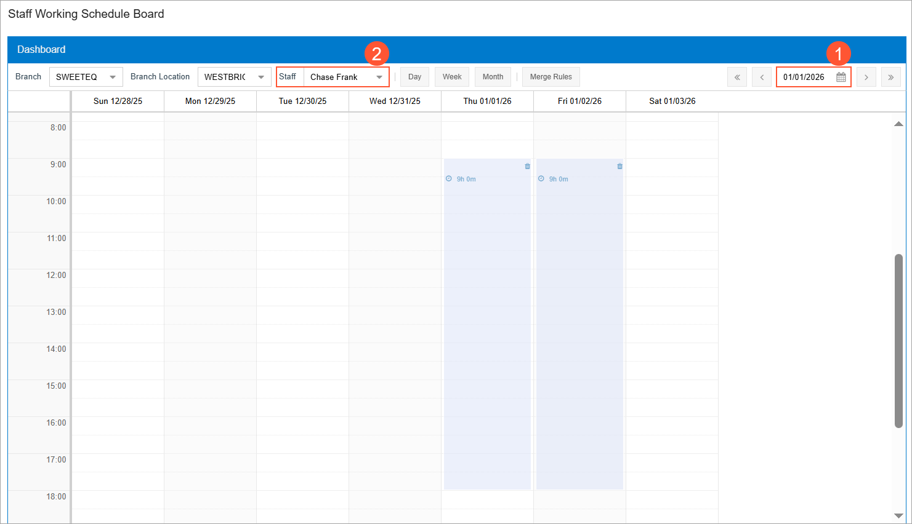
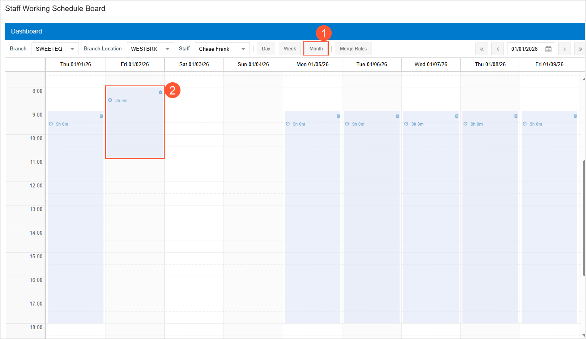

# Staff Schedules: Adjusting Working Hours on the Schedule Board {#_aa22bc2b-18b0-4319-ba0c-894d445a3235 .task}

The staff working schedule board is a dashboard that shows a staff member’s available and unavailable time. The board is two-dimensional: the horizontal axis displays dates, and the vertical axis shows times within each date. The system positions elements according to these two dimensions.

Unspecified time \(such as nighttime hours\) appears on a white background. Available working hours are shaded in blue, while occupied time—when appointments are scheduled—is shaded in red.

You use the staff working schedule board to modify generated work schedules by deleting time slots or adjusting the start and end times of work.

**Attention:** This activity is based on the *U100* dataset. If you are using another dataset or if any system settings have been changed in *U100*, these changes can affect the workflow of the activity and the results of the processing. To avoid issues, restore the *U100* dataset to its initial state.

## Story { .section}

Suppose that the SweetLife Service and Equipment Sales Center wants to manage staff availability more effectively. The service manager needs to see each staff member’s working and unavailable hours, schedule appointments, and adjust working hours directly on the staff schedule board.

Acting as the service manager, you’ll modify the working hours for a specific day. \(In this activity, you’ll also remove working hours for one day for training purposes.\)

## Configuration Overview { .section}

In the *U100* dataset, which you'll use to complete this lesson, the following setup has been configured. These settings ensure that the environment is ready for performing the activity:

-   The minimum system configuration, which is described in [Company with Branches that Do Not Require Balancing: General Information](config_Company_with_Branches_No_Balancing_GeneralInfo.md), has been performed.
-   The *SWEETLIFE* company has been created on the [Companies](../UserGuide/CS_10_15_00.md) \(CS101500\) form. This company has multiple branches created on the [Branches](../UserGuide/CS_10_20_00.md#) \(CS102000\) form, including *SWEETEQUIP \(Service and Equipment Sales Center\)*.
-   On the [Service Management Preferences](../UserGuide/FS_10_01_00.md) \(FS100100\) form, the minimum settings have been specified, including specifying the numbering sequences and work calendar, for the service management functionality to be used.
-   On the [Branch Locations](../UserGuide/FS_20_25_00.md#) \(FS202500\) form, the *WEST BRIGHTON* branch location of the *SWEETEQUIP* \(*Service and Equipment Sales Center*\) branch has been created.
-   On the [Users](../UserGuide/SM_20_10_10.md) \(SM201010\) form, the *frank* user account has been created, and the *EP00000042 \(Chase Frank\)* employee has been associated with the user account. That is, the employee name has been selected in the **Linked Entity** box.
-   On the [Employees](../UserGuide/EP_20_30_00.md#) \(EP203000\) form, *EP00000042 \(Chase Frank\)* has been defined. On the **General** tab \(**Employee Settings** section\), the **Staff Member in Service Management** check box has been selected, so you can assign this employee to perform services.
-   On the [Staff Schedule Rules](../UserGuide/FS_20_20_01.md) \(FS202001\) form, the work schedule rule has been defined for *EP00000042 - Chase Frank*, and on the [Generate Staff Schedules](../UserGuide/FS_50_04_00.md) \(FS500400\) form, the work schedule has been generated.

## Process Overview { .section}

On the [Staff Working Schedule Board](../UserGuide/FS_30_05_00.md) \(FS300500\) form, you will review a staff member's schedule for the next month, modify the working hours for a specific day, and then remove the working hours for a particular day.

## System Preparation { .section}

Before you start this activity, do the following:

1.  Launch the Acumatica ERP website, and sign in to a company with the *U100* dataset preloaded; you should sign in as a service manager by using the *davis* username and the *123* password.
2.  Make sure that the *Service Management* feature is enabled on the [Enable/Disable Features](../UserGuide/CS_10_00_00.md#) \(CS100000\) form.
3.  On the Company and Branch Selection menu in the top pane of the Acumatica ERP screen, select the *Service and Equipment Sales Center* branch.
4.  In the Date box in the upper-right corner of the Acumatica ERP screen, specify *1/1/2026* on the calendar.
5.  Make sure that the following prerequisite activity has been completed: [Staff Schedules: To Create a Schedule Rule and Generate the Work Schedule](ServMgmt_Staff_Schedules_Implem_Activity.md).

## Step: Modifying a Staff Schedule on the Schedule Board { .section}

To view and adjust a staff member’s working schedule, do the following:

1.  Open the [Staff Working Schedule Board](../UserGuide/FS_30_05_00.md) \(FS300500\) form.
2.  In the Date box in the upper–right corner of the dashboard \(see Item 1 below\), select *1/1/2026*.
3.  In the **Staff** box on dashboard toolbar \(Item 2\), select *Chase Frank*. By default, the signed-in staff member appears in this box.

    The dashboard displays Chase Frank's working hours \(shaded in blue\), as shown in the following screenshot.

    

    Notice that the available and unavailable hours in the calendar start from the date that you selected when you created the schedule rule for this staff member.

4.  Click **Month** on the toolbar \(Item 1 below\) to view Chase Frank's schedule from the selected date through the end of the month.
5.  For the next working day after the selected one \(2/1/2026\), change Chase Frank’s working hours to 8:00 AM–11:00 AM as follows:

    1.  Click the time slot. When you hover the cursor over its edges, the cursor changes to a double-sided arrow.
    2.  Drag the **bottom edge** upward until it aligns with 11:00 AM, then release the cursor.
    3.  Drag the **top edge** upward until it aligns with 8:00 AM.
    4.  The time slot is shortened \(Item 2\) to reflect the new working hours.
    You can adjust any schedule's time slot by changing its start and end times.

    

6.  Remove that working day from Chase Frank's working calendar by clicking the trash can icon in the top right corner of the corresponding time slot.

**Parent topic:**[Staff Schedules](../ImplementationGuide/ServMgmt_Staff_Schedules_Mapref.md)

