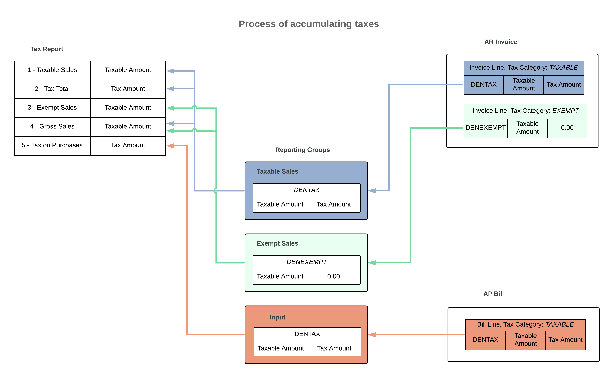

# Tax Report Configuration: To Create a Tax Report for Sales Taxes {#_ea46ee38-88f5-4353-a73b-53846a26c40e .task}

By performing this implementation activity, you will learn how to configure the content of a tax report for sales taxes, and to specify the rules of accumulating the data in the report lines.

## Story { .section}

Suppose that the Colorado State Department of Revenue agency, to which the Muffins &amp; Cakes company is going to report taxes, requires that the tax report includes the following lines:

1.  *Taxable Sales*: Accumulates the total amount of sales subjected to sales tax and processed in the tax period
2.  *Total Tax*: Accumulates the total sales tax amount of AR documents processed in the tax period
3.  *Exempt Sales*: Accumulates the total amount of tax-exempt sales processed in the tax period
4.  *Gross Sales*: Accumulates the total amount of sales \(excluding the tax amounts\) processed in the tax period \(that is, *Taxable Sales* + *Exempt Sales*\)
5.  *Tax on Purchases*: Accumulates the total amount of purchases subjected to sales tax and processed in the tax period

Acting as an implementation consultant, you need to configure the tax report to meet the requirements of the tax agency.

## Configuration Overview { .section}

For the purposes of this activity, in the *U100* dataset, on the [Vendors](../UserGuide/AP_30_30_00.md) \(AP303000\) form, the *COTAXDEP* vendor has been created.

## Process Overview { .section}

In this activity, you will prepare the tax report by doing the following:

1.  You will create a tax report for the needed tax agency and add lines to it on the [Reporting Settings](../UserGuide/TX_20_51_00.md) \(TX205100\) form.
2.  You will add reporting groups on the **Reporting Groups** tab of the [Reporting Settings](../UserGuide/TX_20_51_00.md) form.
3.  On the [Reporting Groups](../UserGuide/TX_20_52_00.md) \(TX205200\) form, you will specify the report lines that should be updated by the taxes associated with each reporting group.
4.  On the [Reporting Settings](../UserGuide/TX_20_51_00.md) form, you will review the calculation rule for one of the report lines added automatically by the system.

The following diagram illustrates how the taxes will be accumulated in the tax report that you will configure in this activity.

## System Preparation { .section}

Before you begin to configure the tax report, do the following:

1.  Launch the Acumatica ERP website with the *U100* dataset preloaded, and sign in as a system administrator Kimberly Gibbs by using the *gibbs* username and the *123* password.
2.  As a prerequisite activity, make sure the *COTAXDEP* tax agency has been configured as described in [Tax Agency: To Set Up a Tax Agency for Sales Taxes](TaxAgency_SalesTaxes_Implem_Activity.md).

## Step 1: Creating a Tax Report and Adding Report Lines { .section}

To create a tax report and add report lines to it, proceed as follows:

1.  Open the [Reporting Settings](../UserGuide/TX_20_51_00.md) \(TX205100\) form.
2.  In the **Tax Agency** box, select *COTAXDEP*.
3.  On the **Report Lines** tab, for each line of the tax report to be added, click **Add Row** on the table toolbar and specify the appropriate settings \(listed below\) in the row:

    |Report Line Order \(added by default\)|Description|Update With|Update Rule|Net Tax|Hide Report Line|
    |--------------------------------------|-----------|-----------|-----------|-------|----------------|
    |1|`Taxable Sales`|*Taxable Amount*|*+Output-Input*|Cleared|Cleared|
    |2|`Tax Total`|*Tax Amount*|*+Output-Input*|Selected|Cleared|
    |3|`Exempt Sales`|*Taxable Amount*|*+Output-Input*|Cleared|Cleared|
    |4|`Gross Sales`|*Taxable Amount*|*+Output-Input*|Cleared|Cleared|
    |5|`Tax on Purchases`|*Tax Amount*|*+Input-Output*|Cleared|Selected|

    Because you selected the **Net Tax** check box for the *Tax Total* report line, the amount accumulated in this line will be used as the document amount in the tax bill generated by the system for the tax agency.

4.  On the form toolbar, click **Save** to save the report.

## Step 2: Adding Reporting Groups to the Report { .section}

To add reporting groups to the newly created tax report, while you are still viewing the report on the [Reporting Settings](../UserGuide/TX_20_51_00.md) \(TX205100\) form, proceed as follows:

1.  On the **Reporting Groups** tab, for each line to be added, click **Add Row** on the table toolbar and specify the appropriate settings \(listed below\) in the row:
    -   **Name**: `Taxable`, **Group Type**: *Output*

        You will assign to this group the *DENTAX* tax with a 8.310% rate, which will apply to taxable items sold in Denver, Colorado.

        **Attention:** You use the *Output* type for output taxes that are collected from customers and paid to a tax agency.

    -   **Name**: `Exempt`, **Group Type**: *Output*

        You will assign to this group the *DENEXEMPT* tax with a 0% rate, which is needed to report tax-exempt sales.

    -   **Name**: `Input`, **Group Type**: *Input*

        You will assign to this group the *DENTAX* tax with a 8.310% rate, which will be applied to purchase of taxable items in Denver, Colorado.

2.  On the form toolbar, click **Save** to save your changes.

## Step 3: Specifying the Report Lines to be Updated { .section}

To specify which report lines will be updated with taxes, proceed as follows:

1.  While you are still viewing the report on the [Reporting Settings](../UserGuide/TX_20_51_00.md) \(TX205100\) form, in the table on the **Reporting Groups** tab, click the row for the *Taxable* group. On the table toolbar, click **Group Details**.
2.  On the [Reporting Groups](../UserGuide/TX_20_52_00.md) \(TX205200\) form, which opens, for each line to be added, click **Add Row** on the table toolbar, and specify the appropriate settings \(listed below\) in the row:
    -   **Report Line**: *1 - Taxable Sales*
    -   **Report Line**: *2 - Tax Total*
    -   **Report Line**: *4 - Gross Sales*
3.  On the form toolbar, click **Save** to save your changes.

    The taxes that you will assign to the *Taxable* reporting group will be included in report lines *1*, *2*, and *4*.

4.  In the **Reporting Group** box of the Summary area, select *2 - Exempt*.
5.  For each line to be added, on the table toolbar, click **Add Row**, and specify the appropriate settings in the added row:
    -   **Report Line**: *3 - Exempt Sales*
    -   **Report Line**: *4 - Gross Sales*
6.  On the form toolbar, click **Save** to save your changes.

    The taxes that you will assign to the *Exempt* reporting group will be included in report lines *3* and *4*.

7.  In the **Reporting Group** box, select *3 - Input*.
8.  On the table toolbar, click **Add Row**, and in the **Report Line** column of the row, select *5 - Tax on Purchases*.

    The tax that you will assign to this report line will not be included in the tax report, because this line is marked as hidden.

9.  On the form toolbar, click **Save** to save your changes.

## Step 4: Reviewing the Calculation Rule for a Report Line { .section}

To review the calculation rules for a report line, proceed as follows:

1.  Open the [Reporting Settings](../UserGuide/TX_20_51_00.md) \(TX205100\) form.
2.  In the **Tax Agency ID** box, select *COTAXDEP*.
3.  On the **Report Lines** tab, review the **Calc. Rule** column for report line *4*.

    The system has automatically updated the calculation rule for report line *4*, based on the reporting group settings that you have specified. You have configured the reporting groups so that the *1 - Taxable Sales* line is updated by the taxes included in the *Taxable Sales* group, the *3 - Exempt Sales* line is updated by the taxes included in the *Exempt Sales* group, and the *4 - Gross Sales* line is updated by the taxes that are included in the *Taxable Sales* or *Exempt Sales* group. As a result, the amount of the aggregate line *4* is calculated as the sum of the amounts in lines *1* and *3*.

**Parent topic:**[Tax Report](../ImplementationGuide/Taxes_TaxReport_Mapref.md)

