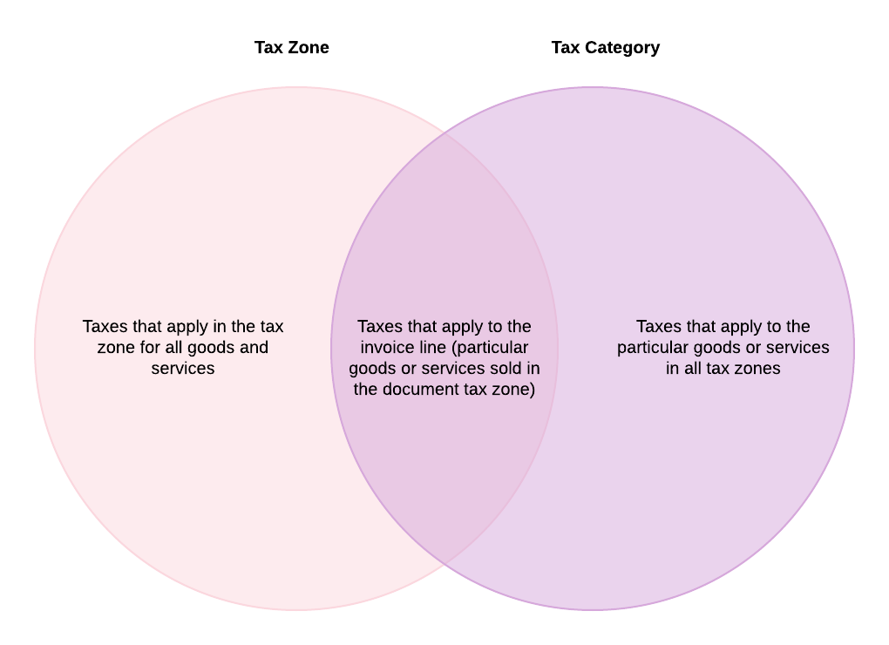

# Tax Zones and Categories: General Information {#_1271ca60-4b5d-41fe-ade3-bd05ded62026 .concept}

In some countries \(for example, most European countries\), taxes and their rates are defined at the federal level. In other countries, taxes are applied at multiple levels corresponding to geographical areas \(federal, state, county, and municipality\). So the taxes that a company pays or collects and their rates may differ from place to place, and may be common to the same geographical area. In Acumatica ERP, you can organize taxes by groups that are applicable in the same area by creating *tax zones*. When you create taxes in the system, you assign them to all applicable tax zones.

The taxes and their rates may also be different depending on the type of the goods or services you are selling or purchasing. For example, depending on whether the goods sold are electronic goods or food, the applied rate of the sales tax may be different even in the same geographical area. In Acumatica ERP, you can create tax categories to group the taxes that are applicable to particular services or goods. When you create taxes in the system, you specify the tax categories to which the tax belongs. You also select the tax category for non-stock and stock items defined in the system.

As a result of assigning taxes to the appropriate entities, you can ensure that the system will correctly apply taxes in various documents in the system.

## Learning Objectives { .section}

In this chapter, you will learn how to do the following:

-   Create a tax zone and a tax category
-   Review the tax categories existing in the system
-   Assign tax categories to non-stock items

## Applicable Scenarios { .section}

You create tax categories in Acumatica ERP early in the process of the implementation of taxes in the system. You then assign the appropriate categories to taxable or exempt items \(stock and non-stock\); you also assign a tax category to each tax. You create tax zones for all applicable geographical areas where your company does business so that you can assign taxes to the tax zones that correspond to these geographical locations.

## Tax Zones { .section}

In Acumatica ERP, a tax zone is a group of taxes levied on a particular geographical area for all goods and services that may be sold or purchased by your company. You create tax zones for all geographical areas of your customers and vendors and then assign appropriate taxes to these tax zones. After that, you specify the appropriate tax zone for each customer and vendor account.

You create a tax zone by using the [Tax Zones](../UserGuide/TX_20_60_00.md) \(TX206000\) form. You can create as many tax zones as you need. For each tax zone, you can specify the default tax category that will be used by default for this tax zone in document lines in which an item is not specified; if a stock or non-stock item is selected, the tax category of the item will be used to define the taxes that apply to the line. If needed, you can override the default tax category for any document line.

You can also assign a particular tax zone to each branch of your company on the **Delivery Settings** tab of the [Branches](../UserGuide/CS_10_20_00.md) \(CS102000\) form. If no tax zone is specified for a customer in the **Tax Zone** box in the **Tax Settings** section on the **Shipping** tab of the [Customers](../UserGuide/AR_30_30_00.md) \(AR303000\) form, the system applies the tax assigned to the tax zone of the branch specified in the **Branch** box on the **Financial** tab of the [Invoices and Memos](../UserGuide/AR_30_10_00.md) \(AR301000\) form.

## Tax Categories { .section}

A tax category is a group of taxes that are levied for selling or purchasing particular goods or services, regardless of the geographical location of the seller, the buyer, or the sale. You create a tax category and associate it with the appropriate goods and services, which are defined as stock and non-stock items in Acumatica ERP. The taxes of a particular tax category will be used for calculating the tax amounts in the documents that include the corresponding stock or non-stock items. Any number of taxes can be assigned to a tax category, and they can be any type.

However, not all taxes included in the tax category specified for an item will be applied to a particular bill or invoice that includes the item. The taxes that are not levied in the tax zone of the vendor or customer specified in the document will be excluded. Thus, only the taxes included both in the tax category of the stock or non-stock item and in the tax zone of the vendor or customer will be applied to the item and included in the tax amount.

For example, consider a company that sells books in Oregon and Delaware; the company defines a *Books* tax category that includes the sales taxes of both states. In reality, a customer from Delaware pays only the Delaware tax and a customer from Oregon pays only the Oregon tax, because the customers are located in different tax zones, each with a specific tax. To apply taxes appropriately, for each sale transaction, the system applies only taxes in both the tax zone and tax category lists. The Delaware tax zone, then, includes the tax that applies to book sales in this state, and the Oregon tax zone includes the state-specific tax applicable to books.

You can create a tax category that includes the taxes that should be excluded from the tax zone, so that the products or services of this tax category are subject to all taxes of the tax zone *except* the taxes included in this tax category. To do this, select the **Exclude Listed Taxes** check box on the [Tax Categories](../UserGuide/TX_20_55_00.md) \(TX205500\) form.

## Tax Application Diagram { .section}

The diagram below illustrates how taxes are applied in AR documents. For details, see [Invoices with Sales Taxes: General Information](../UserGuide/Taxes_Processing_Invoice_with_SalesTax_GeneralInfo.md) and [AR Documents with VAT: To Process an AR Invoice](../UserGuide/Taxes_Processing_ARDocs_with_VAT_Activity1.md).

**Parent topic:**[Tax Zones and Tax Categories](../ImplementationGuide/Taxes_TaxZones_and_Categories_Mapref.md)

