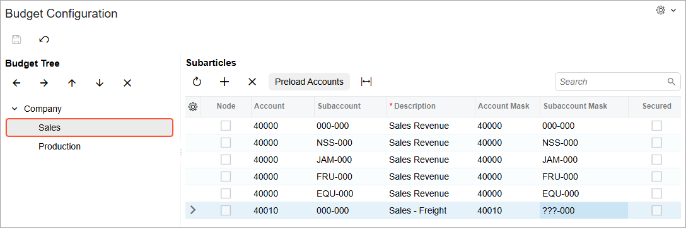
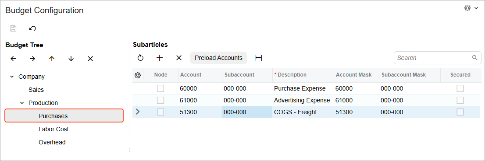
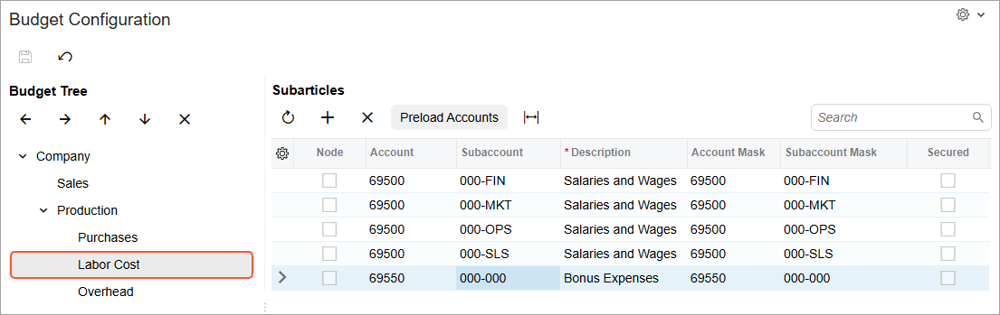
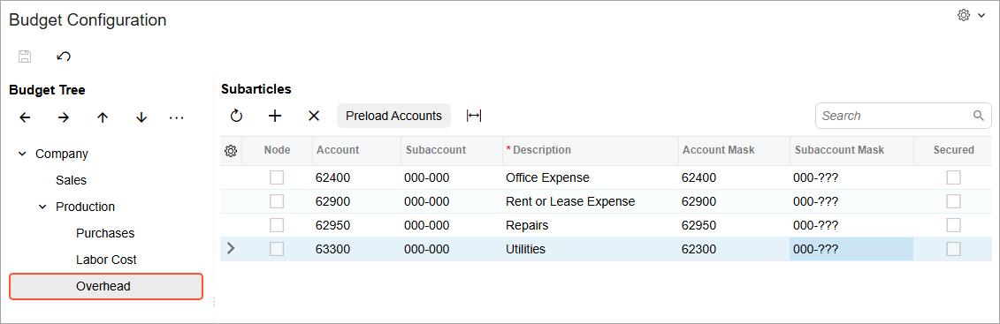

# Budget Tree: Implementation Activity {#_6c040be6-6d3d-4dd4-8644-dec62696ab3f .task}

In this activity, you will learn how to configure a budget tree in the system.

## Story { .section}

Suppose that the managers of SweetLife Fruits &amp; Jams have decided to use hierarchical budgets in the system. They want the budget to include the **Sales** node and the **Production** node; the latter node should have the **Purchases**, **Labor Cost**, and **Overhead** subnodes.

Acting as a system administrator, you need to create a budget tree with the **Sales** and **Production** nodes, which will contain the related budget articles.

## Configuration Overview { .section}

In the *U100* dataset, the following tasks have been performed for the purposes of this activity:

-   On the [Companies](../UserGuide/CS_10_15_00.md) \(CS101500\) form, the *SWEETLIFE* company has been defined.
-   On the [Branches](../UserGuide/CS_10_20_00.md) \(CS102000\) form, the *HEADOFFICE* branch of the *SWEETLIFE* company has been created.
-   On the [Chart of Accounts](../UserGuide/GL_20_25_00.md) \(GL202500\) form, the following accounts have been created:
    -   *40000 - Sales Revenue*
    -   *40010 - Sales Freight*
    -   *51300 - COGS - Freight*
    -   *60000 - Purchase Expense*
    -   *61000 - Advertising Expense*
    -   *62400 - Office Expense*
    -   *62900 - Rent or Lease Expense*
    -   *62950 - Repairs*
    -   *63300 - Supplies*
    -   *69500 - Salaries and Wages*
    -   *69550 - Bonus Expenses*
-   On the [Segmented Keys](../UserGuide/CS_20_20_00.md) \(CS202000\) form, the *SUBACCOUNT* segmented key has been defined.

## Process Overview { .section}

In this activity, on the [Subaccounts](../UserGuide/GL_20_30_00.md) \(GL203000\) form, you will upload the list of subaccounts from an Excel file. On the [Budget Configuration](../UserGuide/GL_20_50_00.md) \(GL205000\) form, you will create budget nodes and add leaves for each node.

## System Preparation {#section_hl3_tcd_bkb .section}

Before you begin configuring the budget tree, do the following:

1.  Launch the Acumatica ERP website with the *U100* dataset preloaded, and sign in as a system administrator Kimberly Gibbs by using the *gibbs* username and the *123* password.
2.  Make sure that you have completed the following prerequisite activity to perform the needed configuration of subaccounts: [Subaccounts: Implementation Activity](config_Subaccounts_Implem_Activity.md).
3.  Make sure that the 2027 financial year has been created on the [Master Financial Calendar](../UserGuide/GL_20_10_00.md) \(GL201000\) form.

## Step 1: Uploading a List of Subaccounts { .section}

To upload the list of subaccounts from a file, do the following:

1.  Open the [Subaccounts](../UserGuide/GL_20_30_00.md) \(GL203000\) form.
2.  On the form toolbar, click **Load Records from File**.
3.  In Step 1 of the **Import Data** wizard that opens, click **Upload File** and select the [Subaccounts.xlsx](Files/Subaccounts.xlsx) file.
4.  In Step 2 of the wizard, leave the default settings, and click **Next**.
5.  In Step 3 of the wizard, leave the default settings and click **Finish**.
6.  On the form toolbar, click **Save** to save your changes.

## Step 2: Defining Nodes { .section}

To define nodes in the budget structure, do the following:

1.  Open the [Budget Configuration](../UserGuide/GL_20_50_00.md) \(GL205000\) form.
2.  In the **Subarticles** pane, click **Add Row** on the table toolbar, and do the following in the added row:
    1.  Select the check box in the **Node** column.
    2.  In the **Description** column, type `Sales`.
    3.  Leave the other columns empty.

        You have not specified the account and subaccount masks for this node, because you will preload accounts and add one account manually to this node later.

3.  Click **Add Row**, and specify the following settings in the row to create a node:
    -   **Node**: Selected
    -   **Description**: `Production`
    -   Other columns: Empty

        You have not specified the account and subaccount masks for this node, because you will add subnodes to this node later.

4.  Click **Save** on the form toolbar to save your changes.

You have created nodes for your budget structure, which you can now see in the **Budget Tree** pane.

## Step 3: Adding Leaves to the Sales Node { .section}

To add leaves to the **Sales** node, do the following:

1.  While you are still viewing the budget tree on the [Budget Configuration](../UserGuide/GL_20_50_00.md) \(GL205000\) form, in the **Budget Tree** pane, click the **Sales** node.
2.  On the table toolbar of the **Subarticles** pane, click **Preload Accounts**.

    The **Preload Accounts** dialog box opens.

3.  In this dialog box, in the **Account From** and **Account To** boxes, select *40000 - Sales Revenue*.
4.  In the **Subaccount Mask** box, enter `???-000`.
5.  Click **OK** to preload the budget leaves. The system automatically populates the budget tree with all the possible combinations that match the specified mask.
6.  On the toolbar of the **Subarticles** pane, click **Add Row**, and specify the following settings in the added row:
    -   **Node**: Cleared
    -   **Account**: *40010*
    -   **Subaccount**: `000-000`
    -   **Account Mask**: *40010*
    -   **Subaccount Mask**: `???-000`
7.  On the form toolbar, click **Save** to save your changes. The following screenshot shows the **Sales** node with the added accounts.

    

## Step 4: Adding Subnodes to the Production Node { .section}

To add subnodes to the **Production** node, do the following:

1.  While you are still viewing the budget tree on the [Budget Configuration](../UserGuide/GL_20_50_00.md) \(GL205000\) form, in the **Budget Tree** pane, click the **Production** node.
2.  On the table toolbar of the **Subarticles** pane, click **Add Row**, and specify the following settings for the added row:
    -   **Node**: Selected
    -   **Description**: `Purchases`
3.  Click **Add Row**, and specify the following settings for the added row:
    -   **Node**: Selected
    -   **Description**: `Labor Cost`
4.  Click **Add Row**, and specify the following settings for the added row:
    -   **Node**: Selected
    -   **Description**: `Overhead`
5.  On the form toolbar, click **Save** to save your changes.

## Step 5: Adding Leaves to the Subnodes of the Production Node { .section}

To add leaves to the subnodes of the **Production** node, do the following:

1.  While you are still viewing the budget tree on the [Budget Configuration](../UserGuide/GL_20_50_00.md) \(GL205000\) form, in the **Budget Tree** pane, click the **Purchases** subnode of the **Production** node.
2.  On the table toolbar of the **Subarticles** pane, add each of the following leaves by clicking **Add Row** and entering the settings of the leaf.

    |Node|Account|Subaccount|Description|
    |----|-------|----------|-----------|
    |Cleared|*60000*|`000-000`|`Purchase Expense`|
    |Cleared|*61000*|`000-000`|`Advertising Expense`|
    |Cleared|*51300*|`000-000`|`COGS - Freight`|

3.  On the form toolbar, click **Save** to save the budget configuration, which is shown in the following screenshot.

    

4.  In the **Budget Tree** pane, click the **Labor Cost** subnode of the **Production** node.
5.  On the table toolbar of the **Subarticles** pane, click **Preload Accounts**.
6.  In the **Preload Accounts** dialog box, which opens, specify the following settings:
    -   **Account From**: *69500 - Salaries and Wages*
    -   **Account To**: *69500 - Salaries and Wages*
    -   **Subaccount Mask**: *000-???*
7.  Click **OK** in the dialog box.

    The system loads all the accounts that match the specified account and subaccount masks.

8.  In the **Subarticles** pane, remove the row with the *69500* account and *000-000* subaccount, and a row with the *69500* account and the *000-ENG* subaccount.
9.  On the table toolbar of the **Subarticles** pane, click **Add Row** and specify the following settings for the row:
    -   **Node**: Cleared
    -   **Account**: *69550 - Bonus Expenses*
    -   **Subaccount**: *000-000*
10. On the form toolbar, click **Save** to save the budget configuration, which is shown in the following screenshot.

    

11. In the **Budget Tree** pane, click the **Overhead** subnode of the **Production** node.
12. On the table toolbar of the **Subarticles** pane, add each of the following leaves by clicking **Add Row** and entering the settings of the leaf.

    |Node|Account|Subaccount|Description|Account Mask|Subaccount Mask|
    |----|-------|----------|-----------|------------|---------------|
    |Cleared|*62400*|`000-000`|`Office Expense`|*62400*|`000-???`|
    |Cleared|*62900*|`000-000`|`Rent or Lease Expense`|*62900*|`000-???`|
    |Cleared|*62950*|`000-000`|`Repairs`|*62950*|`000-???`|
    |Cleared|*63300*|`000-000`|`Utilities`|*63300*|`000-???`|

13. On the form toolbar, click **Save** to save the budget configuration, which is shown in the following screenshot.

    

**Parent topic:**[Budget Tree](../ImplementationGuide/config_Budget_Tree_Mapref.md)

