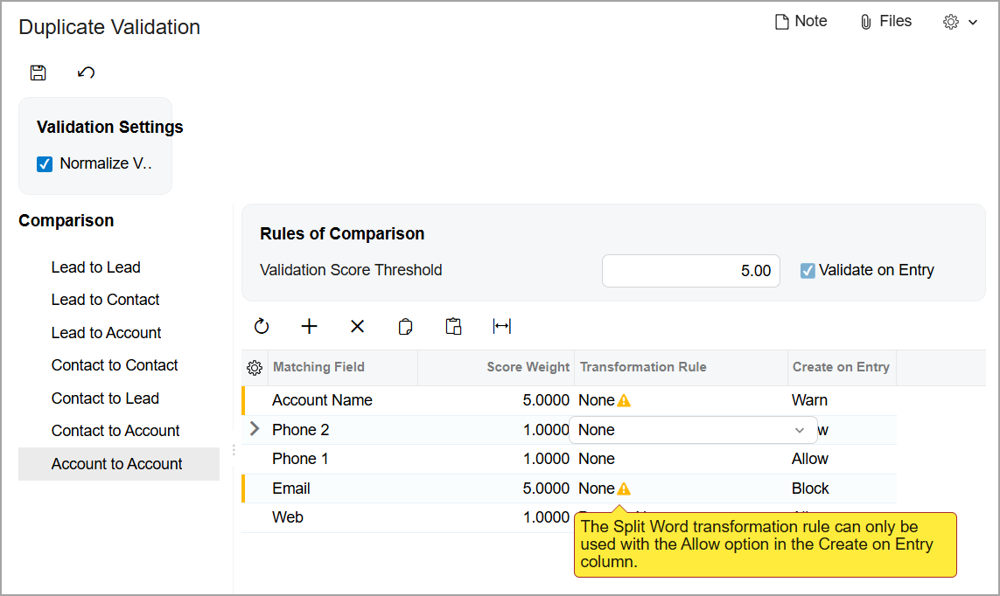

# Duplicate Validation: Implementation Activity {#_78e7ee6f-6947-4ac7-8147-50fd8ba1b632 .task}

The following implementation activity will show you how to configure duplicate validation in Acumatica ERP.

**Attention:** This activity is based on the *U100* dataset. If you are using another dataset or if any system settings have been changed in *U100*, these changes can affect the workflow of the activity and the results of the processing. To avoid issues, restore the *U100* dataset to its initial state.

## Story { .section}

Suppose that you, as an implementation consultant for the SweetLife Fruits &amp; Jams company.You need to review and modify the duplicate validation settings in Acumatica ERP in order to provide users with the following abilities:

-   To check leads for duplicates against existing leads on entry \(before a new record is saved for the first time\) and warn a user if a new lead has an email address that is identical to the email address of the existing lead
-   To check business accounts for duplicates against existing accounts on entry, prevent the creation of business accounts that have identical email addresses, and warn users about duplicate account names

## Process Overview { .section}

In this activity, you will do the following:

1.  Review the duplicate validation settings on the [Duplicate Validation](../UserGuide/CR_10_30_00.md) \(CR103000\) form
2.  Modify the validation rules on the [Duplicate Validation](../UserGuide/CR_10_30_00.md) form

## System Preparation {#section_udh_43p_btb .section}

Before you start configuring duplicate validation, you should do the following:

1.  Launch the Acumatica ERP website with the *U100* dataset preloaded.
2.  Sign in to the system as implementation consultant Kimberly Gibbs by using the following credentials:
    -   **Username**: *gibbs*
    -   **Password**: *123*
3.  Make sure that on the [Enable/Disable Features](../UserGuide/CS_10_00_00.md) \(CS100000\) form, the *Duplicate Validation* feature has been enabled.
4.  Make sure that on the Company and Branch Selection menu, in the top pane of the Acumatica ERP screen, the *SweetLife Head Office and Wholesale Center* branch is selected.

## Step 1: Reviewing Duplicate Validation Settings { .section}

To review the existing duplicate validation settings, do the following:

1.  Open the [Duplicate Validation](../UserGuide/CR_10_30_00.md) \(CR103000\) form. Notice that in the **Comparison** pane, the **Lead to Lead** node is selected by default; you will check its settings.
2.  In the right pane of the form, to review the settings used to specify the duplicate validation rules for leads, do the following:

    -   In the table, notice the following:
        -   The total sum of the values in the **Score Weight** column exceeds the value in the **Validation Score Threshold** box \(**Rules of Comparison** section\).
        -   In the row with the *Email* matching field, in the **Create on Entry** column, the *Warn* option is selected, and in the **Score Weight** column, the validation score is *5*, which is equal to the value in the **Validation Score Threshold** box.
    -   In the **Rules of Comparison** section, the **Validate on Entry** check box is selected and unavailable for changing.
    With these settings specified, if a user tries to create a lead that has a duplicate value in this field, the system inserts *Possible Duplicate* in the **Duplicate** box of the [Leads](../UserGuide/CR_30_10_00.md) \(CR301000\) form for the lead and displays a warning message. The user can save the lead or cancel record creation.

3.  In the **Comparison** pane, click the **Account to Account** node to view the duplicate validation rules for business accounts.
4.  In the right pane of the form, to review the settings used to specify the duplicate validation rules for business accounts, do the following:

    -   In the table, notice the following:
        -   The total sum of the values in the **Score Weight** column is 7.5 and exceeds the value in the **Validation Score Threshold** box, which is *5*.
        -   In each row with a matching field, in the **Create on Entry** column, the *Allow* option is selected, and the value in the **Score Weight** column is less than the value in the **Validation Score Threshold** box.
    -   In the **Rules of Comparison** section, the **Validate on Entry** check box is cleared and available for changing.
    With these settings specified, if a user tries to create a business account that has a duplicate field value, the system will not display a warning message when a user saves the newly created business account; it will insert *Possible Duplicate* in the **Duplicate** box of the [Business Accounts](../UserGuide/CR_30_30_00.md) \(CR303000\) form.

## Step 2: Modifying the Validation Rules for Business Accounts { .section}

Suppose that your marketing and sales teams need the system to validate business accounts against one another on entry by comparing email addresses. This prevents the creation of a business account if another account with an identical email address already exists in the system. Also, the system should validate account names for duplicates and warn a user if another account with an identical account name already exists.

To modify the validation rules for business accounts, do the following:

1.  While you are still viewing the [Duplicate Validation](../UserGuide/CR_10_30_00.md) \(CR103000\) form with the **Account to Account** node selected in the **Comparison** pane, in the table, do the following:

    1.  In the row with the *Email* matching field, notice *2* in the **Score Weight** column.
    2.  In the row with the *Email* matching field, select *Block* in the **Create on Entry** column.
    3.  In the row with the *Account Name* matching field, select *Warn* in the **Create on Entry** column.
    Notice that for the *Email* and *Account Name* matching fields, the system has changed \(see below\):

    -   The value in the **Score Weight** column to *5*, which is the same as the value in the **Validation Score Threshold** box \(**Rules of Comparison** section of the right pane\)
    -   The value in the **Transformation Rule** column to *None* and the warning message appears next to it
    -   The state of the **Validate on Entry** check box to selected and unavailable for editing
    

    With these settings, when a user saves a business account that has been created on the [Business Accounts](../UserGuide/CR_30_30_00.md) \(CR303000\) form, the system checks the validated fields, including email address and account name, to be sure that their values are not identical to the values of these fields in other business accounts in the system. If the email address of a new business account is identical to an email address existing in the system, when the user tries to save the account for the first time, the system will display an error message. If the account name of a new business account is identical to an account name existing in the system, when the user tries to save the account for the first time, the system will open the **Warning** dialog box asking whether the user wants to save the duplicate business account.

2.  On the form toolbar, click **Save**.
3.  In the **Warning** dialog box, which opens, click **Yes**.
4.  On the form toolbar of the [Calculate Grams](../UserGuide/CR_50_34_00.md) \(CR503400\) form, which opens, click **Process All**. The **Processing** dialog box opens, showing the progress of gram calculation.

    **Attention:** In a production environment, it may take time for the system to process all records.

5.  When the processing has been completed and the results of gram calculation are shown, click **Close**. The list of the records on the [Calculate Grams](../UserGuide/CR_50_34_00.md) form no longer contains any records.

You have modified the validation rules for business accounts. You have also calculated grams for all records. Now the system will validate business accounts according to the new rules that you have specified in this activity.

**Parent topic:**[Duplicate Validation](../ImplementationGuide/config_CRM_Duplicate_Validation_Mapref.md)

