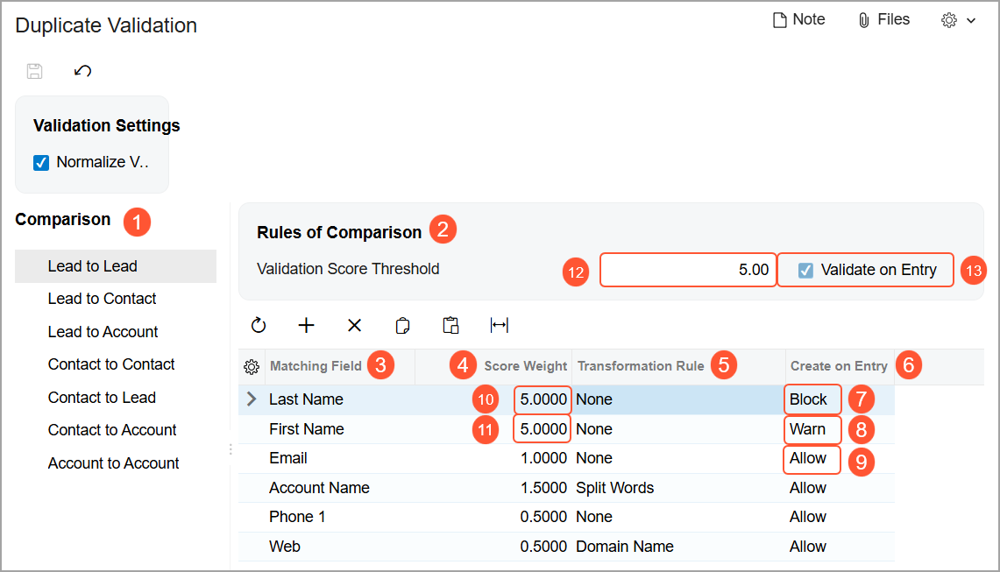

# Duplicate Validation: Rules {#_ba0bedca-f2a3-45e6-b183-af5a6403dafd .concept}

The forms for creating leads, contacts, business accounts, customers, and vendors use the same internal fields \(and corresponding UI elements\) to hold the contact settings of an individual or company. You can specify your organization’s rules for validating duplicate leads, contacts, business accounts, customers, and vendors. Also, you can specify the common fields to be used in this validation. For example, you can configure the system to compare only email addresses, or you can set it up to compare multiple settings, such as email addresses, last names, and company names.

## Specification of Rules for Duplicate Validation { .section}

In Acumatica ERP, you can specify how the duplicate validation process is performed for leads, contacts, business accounts, customers, and vendors by using the [Duplicate Validation](../UserGuide/CR_10_30_00.md) \(CR103000\) form. In the **Comparison** pane of the form \(see Item 1 in the following screenshot\), you select the pair of record types for which you want to specify the rules used for duplicate validation. In the selected pair of record types, the first type indicates the type of record that is compared with the record of the second type for duplication.

**Note:** To validate customers and vendors for duplicates, use the *Account to Account* pair of records.

In the right pane of the form \(Item 2\), you define the duplicate validation rules for the selected pair of record types. You can define the same set of rules for each pair of record types or specify different rules.

Consider the following example of the validation rules for the **Lead to Lead** pair of record types \(also shown in the following screenshot\). These rules will determine how validation is performed when a new lead is created and the system checks its field values against those of existing leads for duplicates.

For the selected pair of record types, you use the table in the right pane to list the fields whose values the system will compare during the validation process, and the validation settings. You specify values in the following columns:

-   **Matching Field** \(see Item 3 in the screenshot above\): A field to be used for duplicate validation.
-   **Score Weight** \(Item 4\): The share that the field contributes to the total validation score if the compared field values match. The total validation score of a pair of compared records is calculated as the sum of the score weights of the fields whose values match. With the rules specified in the example shown in the screenshot, if phone numbers match, the weight of 0.5 is computed, and if both last names and phone numbers match, the weight of 2.5 \(2.0 + 0.5\) is calculated. The score weight value is selected from a range of numbers where the maximum value is equal to the threshold value and the minimum value is greater than *0*. The more important the specified field, the higher its score weight.
-   **Transformation Rule** \(Item 5\): The rule the system will use to transform the values of this field before comparing them. You can specify one of the following options:
    -   *None* \(default\): The values in the fields are trimmed and transformed to lowercase before comparison. The values are compared.
    -   *Split Words*: This option can be used for any field except *Email*. The values in the fields are trimmed and transformed to lowercase, and all special characters are removed before comparison. The values are compared.

        **Tip:** By default, the system considers spaces as the applicable dividers. If you want to use other dividers, the set can be specified through a customization project.

    -   *Split Email Addresses*: This option is used only for the *Email* field. If the record that the system is validating has multiple email addresses specified and at least one email address from this list has a duplicate email address found in another record, the record is assigned the score specified in the **Score Weight** column for the *Email* field. This transformation rule treats only the semicolon symbol as a delimiter, because this symbol is typically used for separating one email address from another.
    -   *Domain Name*: This option is used for the *Web* and *Email* fields. The system compares the only applicable domain name, such as *domain.com* \(the value after *@* for an email address, or the value after *www.* for a URL\). For example, if the email address is *email@example.com*, then only *example.com* will be used for comparison.

        **Attention:** If the *Domain Name* transformation rule is used for the *Email* field, the results of elimination of duplicate records may be inaccurate if the most common email domains, such as *gmail.com* or *outlook.com*, are used in email addresses.

-   **Create on Entry** \(Item 6\): The rule the system will use to check duplicate settings for a matching field of records when a record is saved for the first time. For each field, you select one of the following options:

    -   *Block* \(Item 7\): If this option is selected, and a user tries to save a record that has the same value for this field as an existing record has, the system prevents the creation of the duplicate record and shows an error message.

        The system makes the value in the **Score Weight** column \(Item 10\) of the row equal to the value in the **Validation Score Threshold** box \(Item 12\) in the **Rules of Comparison** section. The **Validate on Entry** check box \(Item 13\) becomes selected and unavailable for editing.

        During the running of an import scenario, if the system creates a record that has a duplicate value in this field, the record is not saved and the system shows an error message on the [Import by Scenario](../UserGuide/SM_20_60_36.md) \(SM206036\) form.

        If the system finds a possible duplicate record in the system during the uploading of records from an Excel file, the system does not create a new record; instead, it displays an error in the **Processing** dialog box.

    -   *Warn* \(Item 8\): If this option is selected and a user tries to create a record that has a duplicate value in this field, the system inserts *Possible Duplicate* in the **Duplicate** box of the data entry form of the record and displays a warning message. The user can save the record or cancel record creation. During the running of an import scenario, if the system creates a record that has a duplicate value in this field, the record is saved without a warning message and the system inserts *Possible Duplicate* in the **Duplicate** box.

        The system inserts a value in the **Score Weight** column \(Item 11\) of the row that is equal to the value in the **Validation Score Threshold** box; it also makes the **Validate on Entry** check box selected and unavailable for editing.

    -   *Allow* \(default; see Item 9\): The system checks the value of this field for a newly created record to find duplicates if the **Validate on Entry** check box is manually selected. In this case, however, the system will not display a warning message when a user saves the newly created record; it will insert *Possible Duplicate* in the **Duplicate** box of the form used to create the record.
    Depending on the selected option for each of the listed fields, the system can allow or block the saving of a new record. If the user selects the *Allow* or *Warn* option for all fields in the selected pair of record types, the system will allow the new record to be saved. If the user selects the *Block* option for at least one of the fields, the system will block the saving of the new record.

**Tip:** For a pair of record types, if any set of options is selected and if in an existing record, the user changes the value of the validated field to a duplicate of the value in the other existing record, the system will save the record and insert *Possible Duplicate* in the **Duplicate** box of the saved record.

Also, in the **Validation Score Threshold** box in the **Rules of Comparison** section of the right pane, you specify the threshold value to be used to determine whether the compared records are possible duplicates.

**Tip:** For a particular pair of record types selected in the **Comparison** pane, the total score of the values listed in the **Score Weight** column should be greater than or the same as the value in the **Validation Score Threshold** box.

The interaction of the value in the **Validation Score Threshold** box with the validation settings in the table works as follows: During duplicate validation of a record, the system compares the values for all fields listed in the table, adds the **Score Weight** values for the field values that match, and then compares the total validation score to the value specified in the **Validation Score Threshold** box. If the total validation score equals or exceeds this threshold value, the compared records are considered possible duplicates.

With the settings shown in the screenshot above, if the last name of a new lead is the same as the last name of the existing lead, because the **Create on Entry** value of the *Last Name* field is *Block*, the system prevents the creation of a duplicate lead and shows an error message on the [Leads](../UserGuide/CR_30_10_00.md) \(CR301000\) form when a user tries to save the lead. If the first name of a new lead is the same as the first name of an existing lead, the system inserts *Possible Duplicate* in the **Duplicate** box of the [Leads](../UserGuide/CR_30_10_00.md) form and displays a warning message if a user tries to save the lead.

**Parent topic:**[Duplicate Validation](../ImplementationGuide/config_CRM_Duplicate_Validation_Mapref.md)

