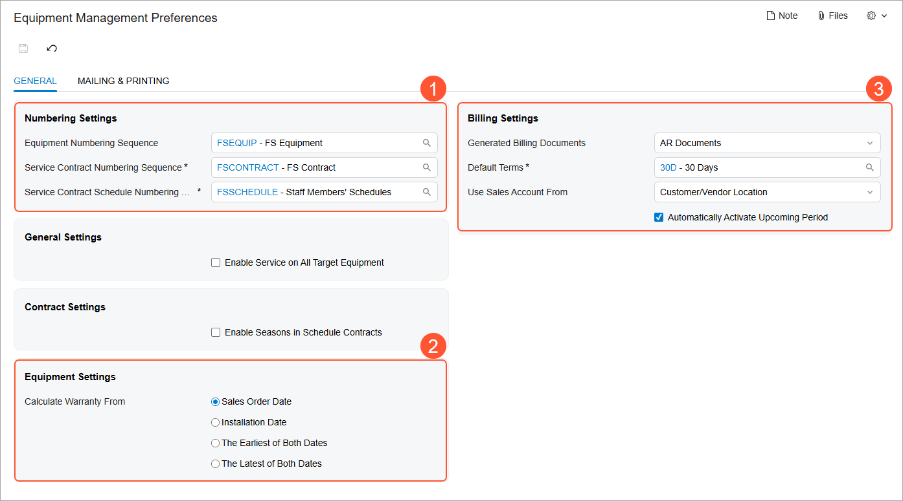

# Equipment Management: Implementation Activity {#_51c105f2-33db-406c-bc24-a15ff54d3e4e .task}

In this activity, you will enable the *Equipment Management* feature, which activates the equipment management functionality. You will also review the minimum required settings to use this functionality.

## Story {#section_n5z_cky_mdc .section}

Suppose that you are an administrative user of the SweetLife Service and Equipment Sales Center. You need to prepare the system for using the equipment management functionality.

## Process Overview {#section_lwj_x55_3dc .section}

On the [Enable/Disable Features](../UserGuide/CS_10_00_00.md) \(CS100000\) form, you will enable the *Equipment Management* feature. Then you will review the general equipment management settings on the [Equipment Management Preferences](../UserGuide/FS_10_03_00.md) \(FS100300\) form.

## System Preparation {#section_usm_gky_mdc .section}

Before you start performing the steps of this activity, do the following:

1.  On the Acumatica ERP website, sign in to a company with the *U100* dataset preloaded. You should sign in as a system administrator by using the *gibbs* username and the *123* password.
2.  On the Company and Branch Selection menu on the top pane of the Acumatica ERP screen, select the *SWEETEQUIP - Service and Equipment Sales Center* branch.

## Step 1: Enabling the Equipment Management Feature {#section_trv_kky_mdc .section}

To enable the *Equipment Management* feature, do the following:

1.  On the [Enable/Disable Features](../UserGuide/CS_10_00_00.md) \(CS100000\) form, on the form toolbar, click **Modify**.
2.  In the list of features, select the **Service Management** check box, and then select the **Equipment Management** check box, which becomes available.
3.  On the toolbar, click **Enable**. The *Equipment Management* feature is now enabled.

## Step 2: Reviewing the Equipment Management Settings {#section_ndn_lky_mdc .section}

To review the settings related to equipment management, do the following:

1.  Open the [Equipment Management Preferences](../UserGuide/FS_10_03_00.md) \(FS100300\) form.
2.  On the **General** tab, ensure that the following settings are specified:

    -   **Numbering Settings** section \(Item 1 in the screenshot below\):
        -   **Equipment Numbering Sequence**: *FSEQUIP - FS Equipment*
        -   **Service Contract Numbering Sequence**: *FSCONTRACT - FS Contract*
        -   **Service Contract Schedule Numbering Sequence**: *FSSCHEDULE - Staff Members' Schedules*
    -   **Equipment Settings** section \(Item 2\):
        -   **Calculate Warranty From**: **Sales Order Date**
    -   **Billing Settings** section \(Item 3\):
        -   **Generated Billing Documents**: *AR Documents*
        -   **Default Terms**: *30D - 30 days*
    

Now you can use the equipment management functionality.

**Parent topic:**[Configuring Equipment Management](../ImplementationGuide/config_EquipMgmt_Mapref.md)

