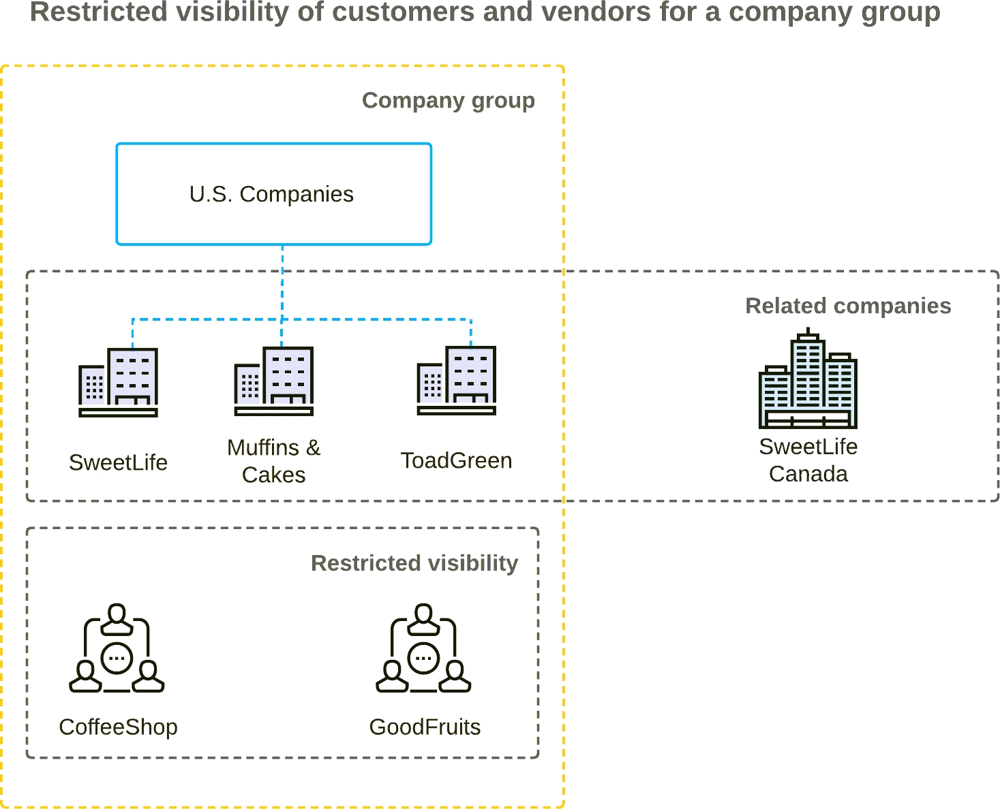

# Company Groups: General Information {#_5c402b6d-8af7-4143-8c68-2f40c2dff525 .concept}

In Acumatica ERP, a *company group* is an entity that includes two or more companies that can have access to the same set of customer and vendor records and have the same base currency. For reporting purposes, a company can be included in more than one group.

## Learning Objectives { .section}

In this chapter, you will learn how to do the following:

-   Create a company group and include companies in it
-   Restrict the visibility of a customer and vendor to this company group

## Applicable Scenarios { .section}

You may want to set up a company group in the following cases:

-   If multiple related companies need to have access to the same set of customer and vendor records
-   If you are using the *Multiple Base Currencies* feature and you need to limit the usage of customers and vendors to an entity \(a company, branch, or company group\)

## Creation of a Company Group { .section}

You perform the following configuration steps to create a company group:

1.  On the [Enable/Disable Features](../UserGuide/CS_10_00_00.md) \(CS100000\) form, you enable the *Multicompany Support*, *Multicurrency Accounting*, and *Customer and Vendor Visibility Restriction* features.
2.  On the [Company Groups](../UserGuide/CS_10_25_00.md) \(CS102500\) form, you create a company group and add companies to it.

    If the *Multiple Base Currencies* feature is enabled, when you are creating a new company group on the [Company Groups](../UserGuide/CS_10_25_00.md) form, the **Currency ID** setting is required. The box is empty by default, and you can select the currency from the list of active currencies. The currency can be changed for an empty company group \(a company group with no companies listed\) only if the company group is not associated with any customer or vendor. If the *Multiple Base Currencies* feature is disabled, the **Currency ID** box is unavailable and contains the base currency used for all companies in the tenant.

    You can add to the group only companies that have the same base currency as the currency of the group.

3.  Optional: On the [Companies](../UserGuide/CS_10_15_00.md) \(CS101500\) form, you can include any company in the group or in multiple groups.

    If any company is included in multiple groups, you specify the primary company group for the company. In the **Company/Branch** box in report forms and inquiry forms, the company will be highlighted under this group in the list, although it will be listed under all the groups where it is included.

4.  On the [Customers](../UserGuide/AR_30_30_00.md) \(AR303000\) and [Vendors](../UserGuide/AP_30_30_00.md) \(AP303000\) forms, you can restrict the visibility of a customer or vendor record to the company group you created by selecting this group in the **Restrict Visibility To** box on the **Financial** tab.

On the [Company Groups](../UserGuide/CS_10_25_00.md) form, if you delete a company group that restricts the visibility of customers or vendors, the system displays a warning message indicating that this visibility restriction will be deleted as well.

For details on managing visibility restrictions for customers, see [Visibility of Customer Records](Finance_Restricting_Customer_Visibility_Mapref.md). For details on managing visibility restrictions for vendors, see [Visibility of Vendor Records](Finance_Restricting_Vendor_Visibility_Mapref.md).

## Configuration Example { .section}

The following diagram illustrates an example of the configuration of a company group. This configuration is described in detail in [Company Groups: Implementation Activity](config_Finance_Company_Group_Implem_Activity.md).

In the diagram, three of the related companies are included in the same company group and the visibility of the CoffeeShop customer and the GoodFruits vendor has been restricted to this company group. Thus, the CoffeeShop and GoodFruits vendors can be used only in the documents having the SweetLife, Muffins &amp; Cakes, or ToadGreen branch as the original branch of the document. Only the users that are included in the access roles associated with the SweetLife, Muffins &amp; Cakes, or ToadGreen branch can view and edit the CoffeeShop record on the [Customers](../UserGuide/AR_30_30_00.md) \(AR303000\) form and the GoodFruits record on the [Vendors](../UserGuide/AP_30_30_00.md) \(AP303000\) form. That is, only the users belonging to the access roles specified for the SweetLife, Muffins &amp; Cakes, or ToadGreen branch can create documents for this customer and vendor and view and edit the customer or vendor's records \(if the users have the appropriate rights on the needed forms\).

**Parent topic:**[Company Groups](../ImplementationGuide/config_Finance_Company_Group_Mapref.md)

