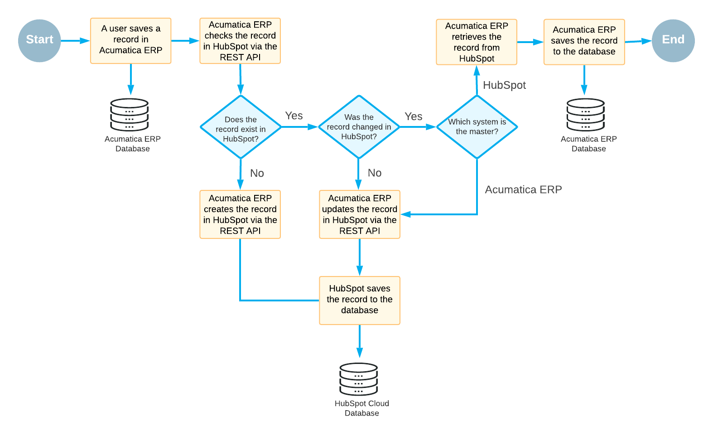
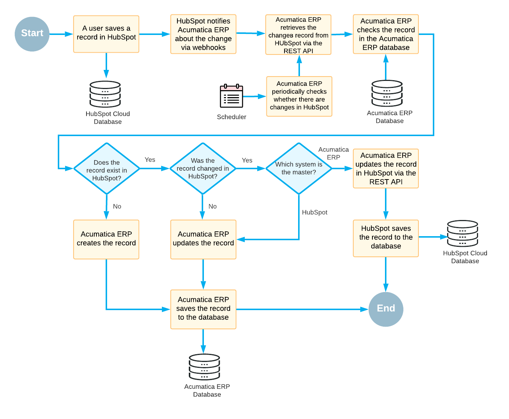

# Integration with HubSpot: Data Flow Between Systems {#_f0a7b81d-3874-432e-9c1c-dae03c60daf4 .concept}

The Acumatica ERP and HubSpot systems process data changes differently depending on in which system the changes have been made. In this topic, you will read about the data flow between Acumatica ERP and HubSpot.

## Data Changes Made in Acumatica ERP { .section}

After you make a change to a record in Acumatica ERP \(for example, deleting a contact\), Acumatica ERP queries HubSpot via the REST API and checks whether the matching entity in HubSpot has been modified. \(The import and export scenarios in Acumatica ERP define the matching rules for records.\)

If the matching record in HubSpot has not been modified or does not exist, Acumatica ERP updates it or creates a new record in HubSpot. If the matching record has been changed in HubSpot, Acumatica ERP checks which of the systems is the master system and uses the master system's data to update the corresponding record in the other system. The master system is defined on the [HubSpot Sync](../UserGuide/HS_20_50_20.md) \(HS205020\) form.

In the diagram below, you can see the process of synchronizing the data changes that were made in Acumatica ERP with the data in HubSpot.

## Data Changes Made in HubSpot { .section}

After you make a change to a record in HubSpot, the system triggers a webhook notification if the webhook notifications have been configured. \(A HubSpot administrator needs to configure webhook notifications for a HubSpot object event in advance.\) If the webhook notifications have not been configured, Acumatica ERP can get information on the changes in HubSpot by periodically polling it via REST API. \(The polling interval setting is located in the *HubSpot Enhanced Provider* data provider settings in Acumatica ERP.\)

When Acumatica ERP receives a notification about the change, the system checks if any change has been made to the matching record in Acumatica ERP. If no change has been made or no matching record exists, Acumatica ERP updates the record or creates a new one. If the record has been changed in both systems, Acumatica ERP checks which system is the master system and uses the master system data to update the corresponding record in the other system.

In the diagram below, you can see the process of synchronizing the data changes that were made in HubSpot with the data in Acumatica ERP.

**Parent topic:**[Integration with HubSpot](../ImplementationGuide/config_HubSpot_Mapref.md)

