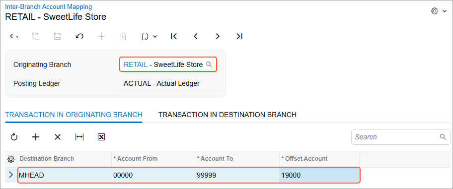

# Interbranch Account Mapping: Implementation Activity {#_62151c8a-f14d-49dd-a59b-ceff716aca56 .task}

In this activity, you will learn how to define account mapping rules for intercompany and interbranch transactions in the system.

**Attention:** This activity is based on the *U100* dataset. If you are using another dataset or if any system settings have been changed in *U100*, these changes can affect the workflow of the activity and the results of the processing. To avoid issues, restore the *U100* dataset to its initial state.

## Story { .section}

The Muffins &amp; Cakes company registers transactions between its branches in the system. Its branches use separate accounting, so they require balancing. The company also registers transactions with the SweetLife head office and retail shop. The account mapping rules between the Muffins &amp; Cakes head office branch \(*MHEAD* in the system\) and the Muffin &amp; Cakes retail store branch \(*MRETAIL*\) have already been defined in Acumatica ERP as well as mapping rules between the Muffins &amp; Cakes head office branch and the SweetLife head office branch \(*HEADOFFICE*\). You will review these rules. You need to define account mapping rules for transactions between Muffins &amp; Cakes head office branch and SweetLife retail shop \(*RETAIL*\).

## Configuration Overview {#section_ist_htv_3pb .section}

In the *U100* dataset, the following tasks have been performed to support this activity:

-   On the [Enable/Disable Features](../UserGuide/CS_10_00_00.md#) \(CS100000\) form, the following features have been enabled:
    -   *Multicompany Support*, which allows administrative users to create multiple companies within a tenant.
    -   *Multibranch Support*, which allows administrative users to create multiple branches for companies.
    -   *Inter-Branch Transactions*, which allows users to configure the automatic generation of balancing entries for transactions between different companies within one tenant, branches of different companies within one tenant, and branches that belong to one company and require balancing.
-   On the [Enable/Disable Features](../UserGuide/CS_10_00_00.md#) form, the *Multiple Base Currencies* feature has been disabled.
-   On the [Companies](../UserGuide/CS_10_15_00.md) \(CS101500\) form, the *SWEETLIFE* and *MUFFINS* companies have been defined.
-   On the [Branches](../UserGuide/CS_10_20_00.md) \(CS102000\) form, the *HEADOFFICE* and *RETAIL* branches of the *SWEETLIFE* company have been created; the *MHEAD* and *MRETAIL* branches of the *MUFFINS* company have been created.
-   On the [Chart of Accounts](../UserGuide/GL_20_25_00.md) \(GL202500\) form, the list of accounts including *19000 - Due from Related Entity* and *26000 - Due to Related Entity* have been created.
-   On the [Inter-Branch Account Mapping](../UserGuide/GL_10_10_10.md) \(GL101010\) form, the account mapping rules between the Muffins &amp; Cakes head office branch \(*MHEAD*\) and the Muffins &amp; Cakes retail store branch \(*MRETAIL*\) and between the Muffins &amp; Cakes head office branch \(*MHEAD*\) and SweetLife Head Office and Wholesale Center *HEADOFFICE* have been defined.

## Process Overview { .section}

In this activity, you will review the preconfigured account mapping on the [Inter-Branch Account Mapping](../UserGuide/GL_10_10_10.md) \(GL101010\) form. On the same form, you will configure the account mapping rules for transactions between two branches of separate companies.

## System Preparation { .section}

Launch the Acumatica ERP website with the *U100* dataset preloaded, and sign in as a system administrator Kimberly Gibbs by using the *gibbs* username and the *123* password.

## Step 1: Reviewing the Configuration of Mapping Rules Between Branches { .section}

To review the configuration of account mapping rules between the two branches of the *Muffins Head Office &amp; Wholesale Center* company, do the following:

1.  Open the [Inter-Branch Account Mapping](../UserGuide/GL_10_10_10.md) \(GL101010\) form.
2.  In the **Originating Branch** box of the Summary area, select *MHEAD*.

    The originating branch is the branch to which the rules defined on the tabs apply.

3.  On the **Transaction in Originating Branch** tab, review the settings that are used to generate balancing transactions in the originating branch.

    In the first row on this tab, notice that the *MRETAIL* branch is selected as the destination branch. This mapping rule applies to all the accounts within the specified account range. The *19000 - Due from Related Entity* account is specified as the offset account to which the system will post the balancing entry in the originating branch. The same settings apply to the *HEADOFFICE* branch in the second row of the tab.

4.  On the **Transaction in Destination Branch** tab, review the settings that are used to generate balancing transactions in the destination branch.

    In the rows on this tab, notice that *26000 - Due to Related Entity* is specified as the offset account to which the system will post the balancing entry in the destination branches.

5.  In the **Originating Branch** box in the Summary area, select *MRETAIL*, and review the mapping rules for transactions originating from the *MRETAIL* branch.

Now that you have reviewed the settings of existing interbranch account mapping rules, you will create your own account mapping rules.

## Step 2: Defining Interbranch Account Mapping for Intercompany Transactions { .section}

To configure the account mapping rules for transactions between the *Muffins Head Office &amp; Wholesale Center* branch and the *SweetLife Store* branch, which are in separate companies, do the following:

1.  While you are still on the [Inter-Branch Account Mapping](../UserGuide/GL_10_10_10.md) \(GL101010\) form, select *MHEAD* in the **Originating Branch** box of the Summary area.
2.  On the **Transaction in Originating Branch** tab, click **Add Row** on the table toolbar, and specify the following settings in the new row:

    -   **Destination Branch**: *RETAIL*
    -   **Account From**: `00000`
    -   **Account To**: `99999`
    -   **Offset Account**: *19000 - Due from Related Entity*
    This mapping rule applies to all the accounts within the specified account range. The *19000 - Due from Related Entity* account is specified as the offset account to which the system will post the balancing entry in the originating branch.

3.  On the **Transaction in Destination Branch** tab, click **Add Row** on the table toolbar, and specify the following settings in the new row:

    -   **Destination Branch**: *RETAIL*
    -   **Account From**: `00000`
    -   **Account To**: `99999`
    -   **Offset Account**: *26000 - Due to Related Entity*
    This mapping rule applies to all the accounts within the specified account range. The *26000 - Due to Related Entity* account is specified as the offset account to which the system will post the balancing entry in the destination branch.

4.  On the form toolbar, click **Save**.

    You have defined the account mapping rules to be used when *MHEAD* is the originating branch and *RETAIL* is the destination branch. Now you will specify the account mapping rules to be used when *RETAIL* is the originating branch and *MHEAD* is the destination branch.

5.  In the **Originating Branch** box of the Summary area, select *RETAIL*.
6.  On the **Transaction in Originating Branch** tab, click **Add Row** on the table toolbar, and specify the following settings in the new row:
    -   **Destination Branch**: *MHEAD*
    -   **Account From**: `00000`
    -   **Account To**: `99999`
    -   **Offset Account**: *19000 - Due from Related Entity*
7.  On the **Transaction in Destination Branch** tab, click **Add Row** on the table toolbar, and specify the following settings in the new row as shown in the screenshot below:
    -   **Destination Branch**: *MHEAD*
    -   **Account From**: `00000`
    -   **Account To**: `99999`
    -   **Offset Account**: *26000 - Due to Related Entity*
8.  On the form toolbar, click **Save**.

    Now you have configured balancing rules that will be used for transactions between the *Muffins Head Office &amp; Wholesale Center* branch and the *SweetLife Store* branch, as shown in the following screenshot.

**Parent topic:**[Interbranch Account Mapping](../ImplementationGuide/config_InterBranch_Mapping_Rules_Mapref.md)

