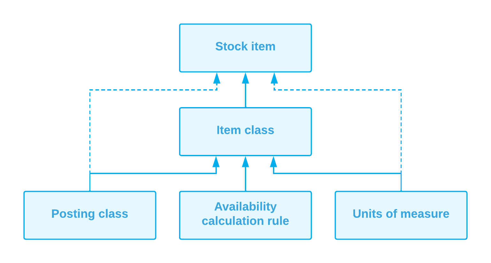

# Configuration of Order Management: General Information {#_0789cde5-b7dd-46cb-9118-b6f39c5e358d .concept}

This topic provides a general overview of the configuration steps that you have to perform before you can track inventory items and users can process sales and purchases of inventory items through orders.

## Learning Objectives { .section}

In this chapter, you will do the following:

-   Learn about the system features that are required for inventory and order management
-   Specify the minimum required configuration for the inventory, purchase order, and sales order management functionality
-   Become familiar with the recommended settings that you can specify to make the system fit your business requirements

## Applicable Scenarios { .section}

You perform configuration of inventory and order management in any of the following cases:

-   You are initially implementing Acumatica ERP and the *Inventory and Order Management* and *Inventory* features are included in your license.
-   Your new license includes the *Inventory and Order Management* and *Inventory* features, and you need to configure inventory and order management in the existing system.

## System Features to Be Enabled { .section}

To be able to configure and use the inventory and order management functionality in the system, you need to enable the following features on the [Enable/Disable Features](../UserGuide/CS_10_00_00.md) \(CS100000\) form:

-   *Inventory and Order Management*: Required for sales order management and purchase order management and allows you to configure purchase order processing for regular orders and configure sales order processing with the predefined order types.
-   *Inventory*: Required for inventory management.

A warehouse included in the basic functionality has one warehouse location, which is configured in the system automatically. This warehouse and location are used by default for receiving and issuing all inventory items and are not displayed on the forms.

**Attention:** Each particular feature may be subject to additional licensing; please consult the Acumatica ERP sales policy for details.

## Creation of Inventory Entities { .section}

The primary inventory entity defined in Acumatica ERP is *stock items*: the finished goods and raw materials that cost money, have value, and are stored. For each stock item, you create a record on the [Stock Items](../UserGuide/IN_20_25_00.md) \(IN202500\) form that holds the settings of the item, such as the GL accounts assigned to the item and the rules for the item's availability calculation.

Before you start creating stock items in the system, you need to create the following entities that are used in the item's settings:

-   Posting classes on the [Posting Classes](../UserGuide/IN_20_60_00.md) \(IN206000\) form: You must create posting classes before you start creating item classes. For details about these classes and their implementation, see [Creating Posting Classes](../UserGuide/Posting_Classes_Mapref.md).
-   Units of measure on the [Units of Measure](../UserGuide/CS_20_35_00.md) \(CS203500\) form \(optional\): If you need to create units of measure for item classes or stock items beyond those that are predefined in the system, this should be done before you start creating item classes. For details, see [Creating Units of Measure](../UserGuide/UOMs_Mapref.md).
-   Availability calculation rules on the [Availability Calculation Rules](../UserGuide/IN_20_15_00.md) \(IN201500\) form: You must create availability calculation rules before you start creating item classes. For details, see [Creating Availability Calculation Rules](../UserGuide/Availability_Calculation_Rules_Mapref.md).
-   Item classes on the [Item Classes](../UserGuide/IN_20_10_00.md) \(IN201000\) form: You must create item classes before you start creating stock items. For details, see [Creating Item Classes for Stock Items](../UserGuide/Item_Classes_Mapref.md).

**Attention:** The order in which you create entities is important, because some entities derive settings from other entities or use them in other ways. You first create posting classes, units of measure, and availability calculation rules in any order; you then create the item classes for which these entities will be used as settings. After item classes have been created, you create the stock items on the [Stock Items](../UserGuide/IN_20_25_00.md) \(IN202500\) form that will belong to these item classes and will derive settings from them. \(See the following diagram.\)

For details, see [Creating Stock Items](../UserGuide/Stock_Items_Mapref.md).

**Parent topic:**[Order Management with Inventory](../ImplementationGuide/config_InvMgmt_Basic_Mapref.md)

