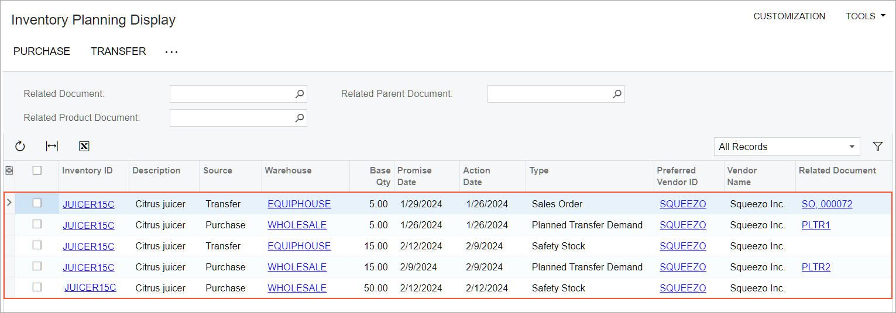

# Inventory Planning Configuration: To Implement DRP {#_91349161-e616-4a0e-8d59-585f7a4c72ae .task}

In the following implementation activity, you will configure distribution requirements planning \(DRP\)—that is, inventory planning that does not include production order planning—and review the planning recommendations for an item–warehouse pair.

**Attention:** This activity is based on the *U100* dataset. If you are using another dataset or if any system settings have been changed in *U100*, these changes can affect the workflow of the activity and the results of the processing. To avoid issues, restore the *U100* dataset to its initial state.

## Story { .section}

Suppose that you are an implementation manager at the SweetLife Fruits &amp; Jams company, and you need to prepare the system for the DRP type of inventory planning.

Your company sells juicers but does not manufacture them. SweetLife buys juicers to the wholesale warehouse and then transfers the needed quantities of juicers to the warehouse for equipment storage. You will use the *Safety Stock* stocking method for replenishing goods. You need to configure the warehouses involved in inventory planning, including the settings that cause the system to consider sales orders on hold during inventory planning.

## Configuration Overview {#_59ac3ed3-9150-44d0-a52d-ed0a06cc65bc .section}

In the *U100* dataset, the following tasks have been performed to support this activity:

-   The basic configuration of order management with inventory has been performed, as described in [Order Management with Inventory](config_InvMgmt_Basic_Mapref.md).
-   On the [Work Calendar](../UserGuide/CS_20_90_00.md) \(CS209000\) form, the *MAIN* calendar has been created.
-   On the [Warehouses](../UserGuide/IN_20_40_00.md) \(IN204000\) form, the *WHOLESALE* and *EQUIPHOUSE* warehouses have been created.
-   On the [Item Classes](../UserGuide/IN_20_10_00.md) \(IN201000\) form, the *CITRUSJCR* \(citrus juicers\) item class has been created for juicers, and the *DRP* planning method has been specified for this item class.
-   On the [Stock Items](../UserGuide/IN_20_25_00.md) \(IN202500\) form, the *JUICER15C* stock item has been created. On the **Vendors** tab, the default *SQUEEZO* vendor has been listed.
-   On the [Item Warehouse Details](../UserGuide/IN_20_45_00.md) \(IN204500\) form, inventory planning settings have been specified for the *JUICER15C* stock item at the *EQUIPHOUSE* warehouse.
-   On the [Sales Orders](../UserGuide/SO_30_10_00.md) \(SO301000\) form, a sales order for the *DELIENERGY* customer has been created and assigned the *On Hold* status. The order has 5 units of the *JUICER15C* stock item and is dated 1/29/2026.

## Process Overview { .section}

In this activity, you will do the following:

1.  On the [Enable/Disable Features](../UserGuide/CS_10_00_00.md) \(CS100000\) form, enable the *Distribution Requirements Planning* feature.
2.  On the [Inventory Planning Preferences](../UserGuide/AM_10_00_00.md) \(AM100000\) form, specify the required settings.
3.  On the [Warehouses](../UserGuide/IN_20_40_00.md) \(IN204000\) form, specify the inventory planning settings for the source warehouse.
4.  On the same form, specify the inventory planning settings for the destination warehouse.
5.  On the [Item Warehouse Details](../UserGuide/IN_20_45_00.md) \(IN204500\) form, review the inventory planning settings for the item–warehouse pair.
6.  On the [Regenerate Inventory Planning](../UserGuide/AM_50_50_00.md) \(AM505000\) form, perform inventory planning. On the [Inventory Planning Display](../UserGuide/AM_40_00_00.md) \(AM400000\) form, review the list of planning recommendations based on the last execution of inventory requirements planning.

## System Preparation { .section}

Before you start configuring inventory planning, launch the Acumatica ERP website, and sign in to a company with the *U100* dataset preloaded. You should sign in as a system administrator with the *gibbs* username and the *123* password.

## Step 1: Enabling the Needed Feature { .section}

To enable the *Distribution Requirements Planning* feature, do the following:

1.  Open the [Enable/Disable Features](../UserGuide/CS_10_00_00.md) \(CS100000\) form.
2.  On the form toolbar, click **Modify** to make it possible to change the set of selected features.
3.  In the **Inventory and Order Management** group, select the **Distribution Requirements Planning** check box.
4.  On the form toolbar, click **Enable**.

## Step 2: Specifying General Inventory Planning Settings { .section}

To specify the general system settings that affect inventory planning, do the following:

1.  Open the [Inventory Planning Preferences](../UserGuide/AM_10_00_00.md) \(AM100000\) form.
2.  In the **Exceptions** section, specify the following settings:
    -   **Days Before**: `7`
    -   **Days After**: `3`
3.  In the **General** section, specify the following settings:
    -   **Grace Period**: `30` \(selected by default\)
    -   **Stocking Method**: *Safety Stock* \(selected by default\)
    -   **Purchase Calendar ID**: *MAIN*
    -   **Include On-Hold Sales Orders**: Selected
    -   **Include On-Hold Purchase Orders**: Selected
    -   **Include Expired Blanket Sales Orders**: Cleared
4.  On the form toolbar, click **Save**.

## Step 3: Specifying the Inventory Planning Settings for a Source Warehouse { .section}

To specify the inventory planning settings for the *WHOLESALE* warehouse, to which juicers are bought, do the following:

1.  On the [Warehouses](../UserGuide/IN_20_40_00.md) \(IN204000\) form, open the *WHOLESALE* record.
2.  On the **Locations** tab, in the table row with the *MAIN* location’s settings, select the check box in the **Inventory Planning** column.
3.  In the **Inventory Planning Settings** section on the **Inventory Planning** tab, specify the following settings:
    -   **Forecasts**: Selected
    -   **Inventory On Hand**: Selected
    -   **Shipments**: Selected
    -   **Purchase Orders**: Selected
    -   **Sales Orders**: Selected
4.  On the form toolbar, click **Save**.

## Step 4: Specifying Inventory Planning Settings for a Destination Warehouse { .section}

To specify the inventory planning settings for the *EQUIPHOUSE* warehouse, to which juicers are transferred, do the following:

1.  On the [Warehouses](../UserGuide/IN_20_40_00.md) \(IN204000\) form, open the *EQUIPHOUSE* record.
2.  On the **Locations** tab, in the row with the *MAIN* location settings, select the check box in the **Inventory Planning** column.
3.  In the **Inventory Planning Settings** section on the **Inventory Planning** tab, specify the following settings:
    -   **Forecasts**: Selected
    -   **Inventory On Hand**: Selected
    -   **Shipments**: Selected
    -   **Purchase Orders**: Selected
    -   **Sales Orders**: Selected
4.  On the table toolbar of the **Transfer Lead Time** table, click **Add Row**.
5.  In the row, specify the following settings:
    -   **Replenishment Warehouse**: *WHOLESALE*
    -   **Transfer Lead Time \(Days\)**: `3`
6.  On the form toolbar, click **Save**.

## Step 5: Reviewing Inventory Planning Settings for an Item–Warehouse Pair { .section}

To review inventory planning settings for an item–warehouse pair, do the following:

1.  Open the [Item Warehouse Details](../UserGuide/IN_20_45_00.md) \(IN204500\) form.
2.  In the Summary area, specify the following settings:
    -   **Inventory ID**: *JUICER15C*
    -   **Warehouse**: *EQUIPHOUSE*
3.  On the **Inventory Planning** tab \(**Planning Method Settings** section\), make sure that *DRP* is selected in the **Planning Method** box.
4.  In the **Inventory Planning Settings** section, make sure that the following settings are specified:

    -   **Source**: *Transfer*
    -   **Source Warehouse**: *WHOLESALE*
    -   **Safety Stock**: *15*
    -   **Reorder Point**: *5*
    -   **Transfer Lead Time**: *3*
    With these settings, you replenish the *JUICER15C* stock item in the *EQUIPHOUSE* warehouse by transferring the needed quantities of the item from the *WHOLESALE* warehouse. When inventory planning has been performed, the item appears in the list of items on the [Inventory Planning Display](../UserGuide/AM_40_00_00.md) \(AM400000\) form when you have 15 pieces or fewer of the item in stock.

## Step 6: Performing Inventory Planning and Reviewing Planning Recommendations { .section}

To perform inventory planning and review planning recommendations for the *JUICER15C* stock item, do the following:

1.  Open the [Regenerate Inventory Planning](../UserGuide/AM_50_50_00.md) \(AM505000\) form.
2.  On the form toolbar, click **Process**. Wait for the system to complete the operation. Notice that the table becomes populated with records.
3.  Open the [Inventory Planning Display](../UserGuide/AM_40_00_00.md) \(AM400000\) form. You can see the following planning recommendations in the table, as shown in the screenshot below. Notice the following:

    -   Line 1: The line shows the recommendation of the *Transfer* source and *Sales Order* type for 5 units of *JUICER15C* because a sales order for the same item quantity has been created in the system. The **Action Date** is 1/26/2026 because the **Requested On** date in the sales order on the [Sales Orders](../UserGuide/SO_30_10_00.md) \(SO301000\) form is 1/29/2026 and it may take up to 3 days to transfer the juicers from the *WHOLESALE* to the *EQUIPHOUSE* warehouse. The status of the sales order is *On Hold*; in Step 2, you set up the system to include sales orders with this status in inventory planning.
    -   Line 2: The line shows the recommendation of the *Purchase* source and *Planned Transfer Demand* type for the 5 units of *JUICER15C* because the items should be sold from the *EQUIPHOUSE* warehouse and the on-hand quantity of the items in this warehouse is 0.
    -   Line 3: The line shows the recommendation of the *Transfer* source and *Safety Stock* type, meaning that 15 juicers should be transferred to the *EQUIPHOUSE* warehouse from the *WHOLESALE* warehouse when the juicers have been bought.
    -   Line 4: The line shows the recommendation of the *Purchase* source and *Planned Transfer Demand* type, meaning that 15 juicers should be purchased to the *WHOLESALE* warehouse and then transferred to the *EQUIPHOUSE*.
    -   Line 5: Because the **Safety Stock** in the *WHOLESALE* warehouse is *50* and the on-hand quantity is 0, the recommendation of the *Safety Stock* type is shown for this warehouse. The **Action Date** is the date when the inventory planning was performed, and the system suggests that the needed quantity is purchased on the same date.
    

**Parent topic:**[Configuring Inventory Planning](../ImplementationGuide/config_Inventory_Planning_Mapref.md)

