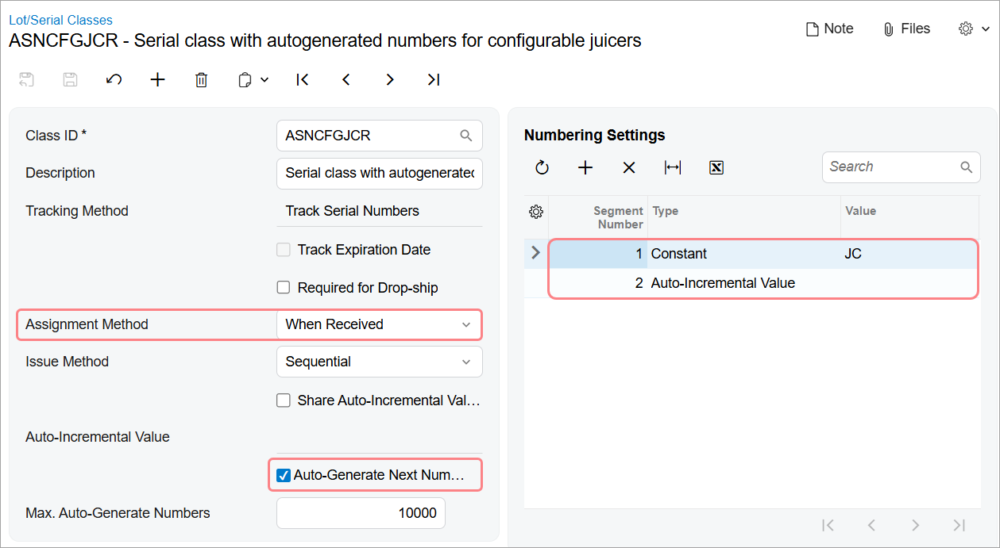

# Configuration for the Production of Lot- or Serial-Tracked Items: Implementation Activity {#_cf08d28d-c235-4a56-ae5e-6ce40ccc8617 .task}

In this implementation activity, you will prepare the system to process production orders that include lot- or serial-tracked items.

## Story { .section}

Suppose that SweetLife Fruits &amp; Jams has decided to extend its assortment of assembled juicers with a juicer for fruit. The company provides services for the replacement and repairing of the juicers. To make sure that juicers and parts were bought from SweetLife Fruits &amp; Jams, the customer service managers have asked the production department to assign a serial number to each juicer and to assign this serial number to the serial-tracked parts used in the juicer production. A production manager should assign serial numbers to juicers when creating production orders. The manager should also specify settings for the assignment of serial numbers of a produced item to serial-tracked materials when production orders are created. \(That is, the manager should specify the option indicating whether workers should assign the serial numbers when materials are issued or when recording the movement of the assembled juicers to stock\).

Assembly will take place in a specific work center of the Workhouse warehouse of the Service and Equipment Sales Center branch. The process of assembling a juicer consists of one assembly operation; it requires various juicer parts \(such as a motor base\) as materials, and a hammer and screwdriver as tools. Overhead costs have been specified at the work center level; you do not need to specify them on the bill of material. In the work center, two workers are involved in juicer assembly, each of whom produces three juicers per hour.

As an implementation manager, you will create the bill of material for the assembly process of the configurable juicer for fruits and vegetables, specify the default settings for assignment of serial numbers to production orders, and review the settings of serial-tracked stock items that are involved in production.

## Configuration Overview {#section_tz4_djx_cnb .section}

In the *U100* dataset, the following configuration tasks have been performed to prepare the system for this activity to be performed:

-   On the [Warehouses](../UserGuide/IN_20_40_00.md) \(IN204000\) form, the *WORKHOUSE* warehouse and the *MGI* and *MTL* locations have been defined.
-   On the [Stock Items](../UserGuide/IN_20_25_00.md) \(IN202500\) form, the *CFJFRUITSN*, *PULPCONT1L*, *JUICECUP05L*, *MRBASESN*, *FNSIEVE*, and *GRDISC01* stock items have been defined.
-   On the [Lot/Serial Classes](../UserGuide/IN_20_70_00.md) \(IN207000\) form, the *SNJCRPRT* and *ASNCFGJCR* serial classes have been created.

## Process Overview { .section}

In this activity, to prepare the system to manage the production of serial-tracked items with serial-tracked materials, you will do the following:

1.  On the [Bill of Material](../UserGuide/AM_20_80_00.md) \(AM208000\) form, create and configure the bill of material to be used for the fruit juicer production
2.  On the [Production Order Types](../UserGuide/AM_20_11_00.md) \(AM201100\) form, specify the default settings for the preassignment of serial numbers in regular production orders of this type
3.  On the [Stock Items](../UserGuide/IN_20_25_00.md) \(IN202500\) form, review the serial-tracking settings specified for the juicer item and for the motor base item, which is the serial-tracked material used in production of the juicers

## System Preparation { .section}

Before you start performing the activity, do the following:

1.  As prerequisites to the current activity, perform the following activities in the listed order:
    1.  [Configuring Production Cost Drivers: Implementation Activity](config_MFG_Production_Cost_Drivers_Implem_Activity.md) so that the needed tools have been created in a company with the *U100* dataset preloaded
    2.  [Configuring Work Centers: Implementation Activity](config_MFG_Work_Centers_Implem_Activity.md) so that the needed work center has been created in this company
    3.  [Production Order Types: To Create a Regular Production Order Type](config_MFG_Production_Order_Types_Implem_Activity_RO.md) to create a production order type for regular orders
2.  Sign in to this company \(in which the prerequisite activities have been performed\) as a system administrator with the *gibbs* username and *123* password.
3.  Make sure that the *Lot and Serial Tracking* feature \(under the *Inventory and Order Management* group of features\) has been enabled on the [Enable/Disable Features](../UserGuide/CS_10_00_00.md) \(CS100000\) form.

## Step 1: Creating a Bill of Material { .section}

To create a bill of material, do the following:

1.  On the [Bill of Material](../UserGuide/AM_20_80_00.md) \(AM208000\) form, add a new record.

    **Tip:** To open the form for creating a new record, type the form ID in the Search box, and on the Search form, point at the form title and click **New** right of the title.

2.  In the Summary area, specify the following settings:
    -   **Revision**: `A`
    -   **Hold**: Selected
    -   **Description**: `A bill of material for assembly of configurable juicers for fruits and vegetables`
    -   **Inventory ID**: *CFJFRUITSN*
    -   **Warehouse**: *WORKHOUSE*
    -   **Start Date**: 1/1/2025
    -   **End Date**: Empty
3.  On the form toolbar, click **Save**.

## Step 2: Adding an Operation { .section}

To add an assembly operation to the bill of material, while you are still viewing the bill of material on the [Bill of Material](../UserGuide/AM_20_80_00.md) \(AM208000\) form, do the following:

1.  On the toolbar of the Operations table, click **Add Row**.
2.  In the row, specify the following settings:
    -   **Operation ID**: `010`
    -   **Work Center**: *WCR10*

        You created this work center in [Configuring Work Centers: Implementation Activity](config_MFG_Work_Centers_Implem_Activity.md).

    -   **Setup Time**: `00:30`
    -   **Run Units**: `3`
    -   **Run Time**: `01:00`
3.  On the form toolbar, click **Save**.

## Step 3: Adding Materials { .section}

To add the materials required for the operation, while you are still viewing the bill of material on the [Bill of Material](../UserGuide/AM_20_80_00.md) \(AM208000\) form, do the following:

1.  In the Operations table, click the row with the *010* operation.
2.  On the **Materials** tab in the lower part of the form, add rows for the stock items listed in the following table, specifying the listed settings for each.

    |Inventory ID|Qty. Required|
    |------------|-------------|
    |*MRBASESN*|`1`|
    |*JUICECUP05L*|`1`|
    |*PULPCONT1L*|`1`|
    |*FNSIEVE*|`1`|
    |*GRDISC01*|`1`|

3.  On the form toolbar, click **Save**.

## Step 4: Adding the Steps { .section}

To add the steps required to perform the operation, while you are still viewing the bill of material on the [Bill of Material](../UserGuide/AM_20_80_00.md) \(AM208000\) form, do the following:

1.  With the 010 operation still selected, on the **Steps** tab in the lower part of the form, add four rows for the steps, entering the information from the following table.

    |Description|Line Order|
    |-----------|----------|
    |`Attach the grating disc to the motor base.`|*10*|
    |`Attach the fine sieve to the grating disc.`|*20*|
    |`Attach the pulp container to the motor base.`|*30*|
    |`Attach the juice cup to the motor base.`|*40*|

2.  On the form toolbar, click **Save**.

## Step 5: Adding the Tools { .section}

To add the tools involved in the assembly process \(you created these tools in [Configuring Production Cost Drivers: Implementation Activity](config_MFG_Production_Cost_Drivers_Implem_Activity.md)\) to the operation settings, while you are still viewing the bill of material on the [Bill of Material](../UserGuide/AM_20_80_00.md) \(AM208000\) form, do the following:

1.  On the **Tools** tab, add rows for the tools listed in the following table, specifying the listed settings for each.

    |Tool ID|Qty. Required|Unit Cost|
    |-------|-------------|---------|
    |*HAMMER*|`1`|0.02|
    |*SCREWDRIVER*|`1`|0.20|

2.  On the form toolbar, click **Save**.

## Step 6: Activating the Bill of Material { .section}

To make the created bill of material active and specify it as the default bill of material for the *CFJFRUITSN* item, while you are still viewing the bill of material on the [Bill of Material](../UserGuide/AM_20_80_00.md) \(AM208000\) form, do the following:

1.  In the Summary area, clear the **Hold** check box. The status of the bill of material changes to *Active*.
2.  On the form toolbar, click **Save**.
3.  On the More menu \(under **Other**\), click **Set as Default BOM**.

    **Tip:** You open the More menu by clicking the More button \(…\) on the form toolbar.

4.  In the **Default BOM Levels** dialog box, which opens, do the following:

    1.  Make sure that the **Item** and **Warehouse** check boxes are selected.
    2.  Click **Update**.
    The system inserts the identifier of the bill of material in the **Default BOM ID** box of the **Manufacturing** tab of the following forms:

    -   The [Stock Items](../UserGuide/IN_20_25_00.md) \(IN202500\) form for the *CFJFRUITSN* item
    -   The [Item Warehouse Details](../UserGuide/IN_20_45_00.md) \(IN204500\) form for the *CFJFRUITSN* item and *WORKHOUSE* warehouse

## Step 7: Specifying the Default Settings for the Assignment of Lot or Serial Numbers to Production Orders { .section}

To allow users to preassign lot or serial numbers to regular production orders by default, do the following:

1.  On the [Production Order Types](../UserGuide/AM_20_11_00.md) \(AM201100\) form, open the *RO* production order type.
2.  In the **Data Entry Settings** section of the **General** tab, select the **Allow Preassigning Lot/Serial Numbers** check box.
3.  Make sure that *Never* is selected in the **Require Parent Lot/Serial Number** box, which becomes available. Production managers will select the needed option \(*On Issue* or *On Completion*\) when they create production orders of this type.
4.  On the form toolbar, click **Save**.

## Step 8: Reviewing the Settings of Serialized Stock Items Involved in Production { .section}

You will review the settings of the *CFJFRUITSN* stock item, which is used for tracking production of serialized juicers, and the *MRBASESN* item, which is used as a material for *CFJFRUITSN* production. Do the following:

1.  On the [Stock Items](../UserGuide/IN_20_25_00.md) \(IN202500\) form, open the *CFJFRUITSN* item.
2.  Notice that *ASNCFGJCR* is specified in the **Lot/Serial Class** box of the **General** tab \(**Item Defaults** section\).
3.  In the **Lot/Serial Class** box, click the identifier \(*ASNCFGJCR*\), which is a link that opens the [Lot/Serial Classes](../UserGuide/IN_20_70_00.md) \(IN207000\) form for the serial class in a separate window.
4.  Review the settings of the serial class as follows:

    1.  Notice that *When Received* is selected in the **Assignment Method** box.
    2.  Notice that the **Auto-Generate Next Number** check box is selected.
    3.  In the table, review the settings that determine the structure of the serial numbers of items of the class, with each row representing a segment of the serial number. These serial numbers consist of the *JC* prefix \(with the *Constant* type\) and the auto-incrementing value.
    These settings are shown in the following screenshot.

    

5.  Close the window with the [Lot/Serial Classes](../UserGuide/IN_20_70_00.md) form.
6.  In the **Inventory ID** box of the [Stock Items](../UserGuide/IN_20_25_00.md) form, select *MRBASESN*.
7.  Notice that *SNJCRPRT* is specified in the **Lot/Serial Class** box of the **Item Defaults** section on the **General** tab, which means that this item, which is used as material for *CFJFRUITSN*, is serial-tracked.

You have configured the bill of material for the serialized juicer, specified default settings for the preassignment of serial numbers for regular production orders, and reviewed the serial-tracking settings of stock items involved in production.

**Parent topic:**[Implementing Production of Lot- or Serial-Tracked Items](../ImplementationGuide/config_MFG_Lot_Serial_Tracked_Items_Mapref.md)

