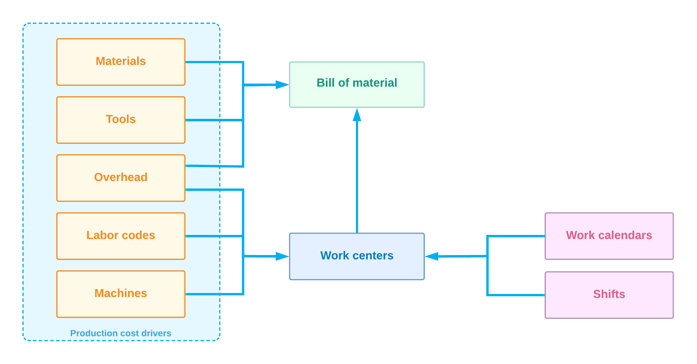

# Implementing Bills of Material: General Process {#_e11a085c-1a86-499f-9f33-f6b4d312476b .concept}

The primary entity defined in Acumatica ERP Manufacturing Edition is a *bill of material* that contains the details of the process of producing a particular stock item. The bill of material includes the operations involved in production, the materials used in the operations, the more detailed steps of the operations, and the factors that must be included in the cost of the finished goods.

In this topic, you will find information about the general process of implementing bills of material in Acumatica ERP Manufacturing Edition. You can also find the implementation checklist for bills of material in [Bills of Material: Implementation Checklist](../UserGuide/BOM_Implem_Checklist.md).

## Manufacturing Entities to Be Created { .section}

You need to create the following entities before users can start processing production transactions in Acumatica ERP Manufacturing Edition:

1.  Production cost drivers \(for more information, see [Configuring Production Cost Drivers: General Information](config_MFG_Production_Cost_Drivers_GeneralInfo.md)\): You create any of the following entities whose costs will be included in the cost of the final product:
    -   Labor codes on the [Labor Codes](../UserGuide/AM_20_65_00.md) \(AM206500\) form, which provide information about direct and indirect labor costs; you specify labor codes when you create a work center.
    -   Overhead rates on the [Overhead](../UserGuide/AM_20_25_00.md) \(AM202500\) form; you specify overhead entities when you create a work center, a bill of material, or both of these.
    -   Cost rates for tools involved in production, on the [Tools](../UserGuide/AM_20_55_00.md) \(AM205500\) form; you specify tool entities when you create a bill of material.
    -   Cost rates for machines used in production, on the [Machines](../UserGuide/AM_20_45_00.md) \(AM204500\) form; you specify machine entities when you create a work center.
    -   Material costs on the [Stock Items](../UserGuide/IN_20_25_00.md) \(IN202500\) form \(if the material is a stock item\) or [Non-Stock Items](../UserGuide/IN_20_20_00.md) \(IN202000\) form \(if the material is a non-stock item\); these costs are calculated automatically when production transactions are processed in the system.
2.  Work centers \(described in detail in [Configuring Work Centers: General Information](config_MFG_Work_Centers_GeneralInfo.md)\): In addition to the production cost drivers mentioned above as being specified for a work center, you need to create the following entities before you create any work centers on the [Work Centers](../UserGuide/AM_20_70_00.md) \(AM207000\) form:
    -   Work calendars on the [Work Calendar](../UserGuide/CS_20_90_00.md) \(CS209000\) form
    -   Shifts on the [Shifts](../UserGuide/AM_20_50_00.md) \(AM205000\) form
3.  Bills of material \(described further in [Bills of Material: General Information](../UserGuide/BOM_GeneralInfo.md)\): You create bills of material on the [Bill of Material](../UserGuide/AM_20_80_00.md) \(AM208000\) form.

Thus, the order in which you create entities is important, because some entities derive settings from other entities or use them in other ways. You first create the entities that provide cost rates \(materials, tools, overhead, labor codes, and machines\) in any order; you then create shifts and work calendars. After that, you create work centers, and finally, you create a bill of material. \(See the following diagram.\)

**Parent topic:**[Implementing Manufacturing](../ImplementationGuide/config_Mapref_Manufacturing.md)

