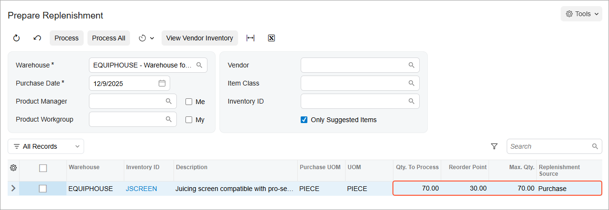

# Configuration of Replenishment: To Configure Replenishment for an Item–Warehouse Pair {#_d62835f0-9485-49e5-bd48-1b8b338e8d9a .task}

In the following implementation activity, you will configure replenishment for an item–warehouse pair in Acumatica ERP.

**Attention:** This activity is based on the *U100* dataset. If you are using another dataset or if any system settings have been changed in *U100*, these changes can affect the workflow of the activity and the results of the processing. To avoid issues, restore the *U100* dataset to its initial state.

## Story { .section}

Suppose that the SweetLife Service and Equipment Sales Center branch of SweetLife Fruits &amp; Jams company provides repair services and stores the required spare parts for juicers. The branch orders these spare parts directly from vendors and stores them in the *EQUIPHOUSE* warehouse.

Acting as purchasing manager Matt Parker, you need to configure the replenishment functionality to regularly restock the spare parts that the company uses for juicer maintenance and repair. The branch should have no more than 70 juicing screens in the *EQUIPHOUSE* warehouse, and purchasing managers should order juicing screens when 30 items or fewer are left in stock. You also need to review the settings that the system will use to calculate the replenishment of the juicing screens in the *EQUIPHOUSE* warehouse.

## Configuration Overview { .section}

In the *U100* dataset, the following tasks have been performed to support this activity:

-   The following features have been enabled on the [Enable/Disable Features](../UserGuide/CS_10_00_00.md) \(CS100000\) form in the *Inventory and Order Management* group of features:
    -   *Inventory Replenishment*
    -   *Multiple Warehouse Locations*
-   The basic configuration of order management with inventory has been performed, as described in [Order Management with Inventory](config_InvMgmt_Basic_Mapref.md).
-   On the [Warehouses](../UserGuide/IN_20_40_00.md) \(IN204000\) form, the *EQUIPHOUSE* warehouse in the SweetLife Service and Equipment Sales Center branch has been created.
-   On the [Item Classes](../UserGuide/IN_20_10_00.md) \(IN201000\) form, the *JCRSPRPRT* \(juicer spare parts\) item class has been created for juicer spare parts.

## Process Overview { .section}

In this activity, you will do the following:

1.  On the [Replenishment Classes](../UserGuide/IN_20_88_00.md) \(IN208800\) form, create the *SPAREPART* replenishment class, which is used to optimize the purchasing of juicer spare parts.
2.  On the [Warehouses](../UserGuide/IN_20_40_00.md) \(IN204000\) form, specify the replenishment class for the *EQUIPHOUSE* warehouse.
3.  On the [Item Classes](../UserGuide/IN_20_10_00.md) \(IN201000\) form, specify the replenishment settings for the *JCRSPRPRT* item class.
4.  On the [Stock Items](../UserGuide/IN_20_25_00.md) \(IN202500\) form, create the *JSCREEN* stock item of the *JCRSPRPRT* item class.
5.  On the [Prepare Replenishment](../UserGuide/IN_50_80_00.md) \(IN508000\) form, process the *JSCREEN* stock item.

## System Preparation { .section}

Before you start configuring replenishment through purchases for an item‒warehouse pair, you should launch the Acumatica ERP website and sign in to a company with the *U100* dataset preloaded. You should sign in as purchasing manager Matt Parker by using the *parker* username and the *123* password.

## Step 1: Creating the Replenishment Class { .section}

To create the *SPAREPART* replenishment class, do the following:

1.  On the [Replenishment Classes](../UserGuide/IN_20_88_00.md) \(IN208800\) form, add a new row.
2.  In the **Class ID** column, type `SPAREPART`.
3.  In the **Description** column, type `Replenishment class for the purchase of juicer spare parts`.
4.  In the **Replenishment Source** column, select *Purchase*.

    With this setting, the demand for creation of purchase orders that include the items may be calculated on the [Prepare Replenishment](../UserGuide/IN_50_80_00.md) \(IN508000\) form in the quantities that are calculated based on the replenishment settings.

5.  On the form toolbar, click **Save**.

## Step 2: Specifying the Replenishment Class for the Warehouse { .section}

To specify the replenishment class for the *EQUIPHOUSE* warehouse, where spare parts for juicers are stocked, do the following:

1.  On the [Warehouses](../UserGuide/IN_20_40_00.md) \(IN204000\) form, open the *EQUIPHOUSE* record.
2.  In the **Replenishment Class** box of the Summary area, select *SPAREPART*.

    **Tip:** The system uses the replenishment class specified for a warehouse to replenish a stock item at a warehouse where the item is stocked. It also shows this class in the **Replenishment Class** box on the [Item Warehouse Details](../UserGuide/IN_20_45_00.md) \(IN204500\) form.

3.  On the form toolbar, click **Save**.

## Step 3: Specifying Replenishment Settings for the Item Class { .section}

Suppose that you need to add some new spare parts of the *JCRSPRPRT* \(juicer spare parts\) item class for juicers to your inventory stock. You plan to replenish these stock items. Thus, you need to specify replenishment settings for the item class so that the system copies these settings to each newly created stock item of the class.

To specify replenishment settings for the *JCRSPRPRT* item class, do the following:

1.  On the [Item Classes](../UserGuide/IN_20_10_00.md) \(IN201000\) form, open the *JCRSPRPRT* item class.
2.  On the **Inventory Planning** tab, in the **Demand Calculation** box, make sure that *Item Class Settings* is specified.

    With this setting, the demand for juicer spare parts will be calculated based on the availability calculation rule specified for this item class on the **General** tab of this form.

3.  On the table toolbar, click **Add Row**.
4.  In the row, specify the following settings:
    -   **Replenishment Class ID**: *SPAREPART*
    -   **Seasonality**: *NONE*
    -   **Source**: *Purchase*
    -   **Method**: *Min./Max.*

        With this method, the stock level of inventory items of the class at the warehouse where the items are stocked will be maintained between the minimum and maximum quantities specified on the **Inventory Planning** tab of the [Stock Items](../UserGuide/IN_20_25_00.md) \(IN202500\) form.

5.  On the form toolbar, click **Save**.

## Step 4: Creating a Stock Item of the Class { .section}

To create a stock item to represent the juicing screen, do the following:

1.  On the [Stock Items](../UserGuide/IN_20_25_00.md) \(IN202500\) form, add a new record.
2.  In the Summary area, specify the following settings:
    -   **Inventory ID**: `JSCREEN`
    -   **Description**: `Juicing screen compatible with pro-series and commercial citrus juicers`
3.  On the **General** tab, in the **Item Class** box, specify *JCRSPRPRT*.

    Notice that the system has inserted the default settings of the stock item based on the item class settings that you specified in the previous step on the [Item Classes](../UserGuide/IN_20_10_00.md) \(IN201000\) form. In the **Warehouse Defaults** section of this tab, notice that *EQUIPHOUSE* has been inserted as the default warehouse.

4.  On the **Price/Cost** tab, in the **Default Price** box, specify `80`.
5.  On the **Vendors** tab, do the following:
    1.  On the table toolbar, click **Add Row**.
    2.  In the **Vendor ID** column, select the *SQUEEZO* vendor.
6.  On the form toolbar, click **Save**.
7.  On the **Inventory Planning** tab, do the following:
    1.  Notice that the system has copied the row with the replenishment settings from the *JCRSPRPRT* item class specified on the [Item Classes](../UserGuide/IN_20_10_00.md) form. It has inserted the following settings:
        -   **Repl. Class**: *SPAREPART*
        -   **Seasonality**: *NONE*
        -   **Source**: *Purchase*
        -   **Method**: *Min./Max.*
    2.  In the row, specify the following settings:

        -   **Reorder Point**: `30.00`

            With this setting, when the stock of the *JSCREEN* item is less than 30, the item will be listed on the [Prepare Replenishment](../UserGuide/IN_50_80_00.md) \(IN508000\) form.

        -   **Max Qty.**: `70.00`

            This is the maximum stock quantity of the *JSCREEN* item. This quantity will be used for the calculation of replenishment parameters of the stock item in the *EQUIPHOUSE* warehouse.

        **Tip:** The system copies the **Source**, **Reorder Point**, and **Max Qty.** settings to the **Inventory Planning** tab of the [Item Warehouse Details](../UserGuide/IN_20_45_00.md) \(IN204500\) form, where they are inserted in the **Replenishment Source**, **Reorder Point**, and **Max Qty.** boxes and then uses these settings for the calculation of the *JSCREEN* item's replenishment quantity in the *EQUIPHOUSE* warehouse.

8.  On the form toolbar, click **Save**.

## Step 5: Reviewing Stock Items Requiring Replenishment { .section}

To make sure that the *JSCREEN* stock item requires replenishment in the *EQUIPHOUSE* warehouse and review the item's settings, do the following:

1.  Open the [Prepare Replenishment](../UserGuide/IN_50_80_00.md) \(IN508000\) form.
2.  In the Selection area, specify the following settings:
    -   **Warehouse**: *EQUIPHOUSE*
    -   **Purchase Date**: Current date
    -   **Me**: Cleared
    -   **Only Suggested Items**: Selected

        With this setting, only items that require replenishment are displayed in the table.

3.  In the row for the *JSCREEN* stock item, make sure that the following settings are specified \(see the screenshot below\):

    -   **Reorder Point**: *30*
    -   **Max Qty.**: *70*
    -   **Replenishment Source**: *Purchase*
    -   **Qty. To Process**: *70*

        This is the quantity to be replenished in the destination warehouse.

    

    **Tip:** If you need to change the order of columns in any table, you can drag a column by its header to the new place in the table.

You have reviewed the replenishment settings of the juicing screen stock item in the *EQUIPHOUSE* warehouse. In a production situation, you would then select the needed items and prepare replenishment requests for the selected stock items.

**Parent topic:**[Replenishment for Stock Items](../ImplementationGuide/config_OrderMgmt_Replenishment_Mapref.md)

