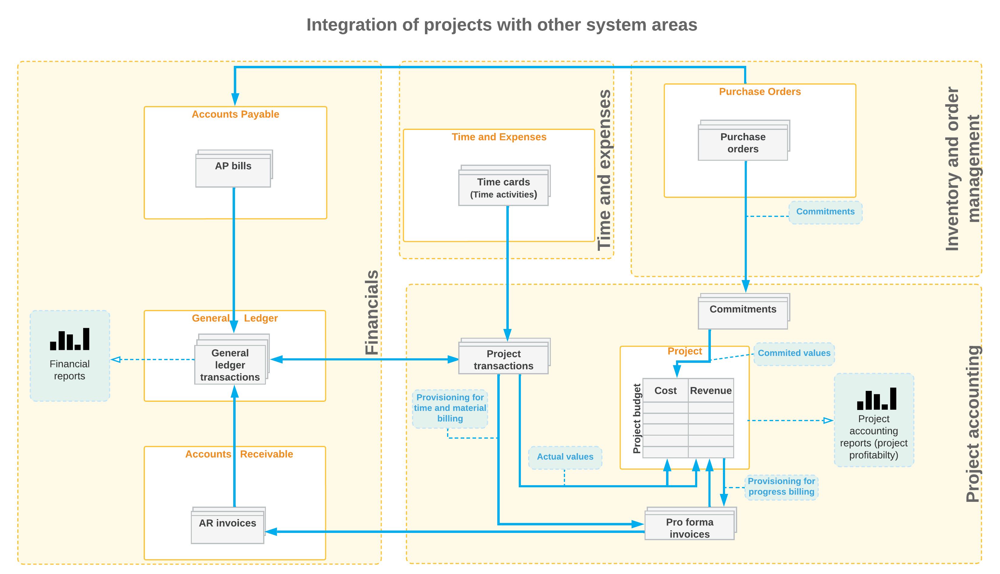

# Basic Project Configuration: General Information {#_c1b33990-3af1-4712-862e-07d8f188f80b .concept}

The project accounting functionality in Acumatica ERP offers a new way of handling financial and management accounting in the company. By using projects, you can break corporate activity into separate units, each of which denotes a set of services provided to a particular customer. You can also track the progress of work being performed for each individual project, and estimate the profitability of the project.

This topic provides a general overview of the configuration steps that you have to perform before you can start using project accounting functionality in Acumatica ERP.

## Learning Objectives { .section}

In this chapter, you will learn how to perform the initial configuration for the project accounting functionality. In particular, you will do the following:

-   Enable the needed system features
-   Perform the minimum required configuration
-   Learn the recommended settings that you can specify to make the system fit your business requirements

## Applicable Scenarios { .section}

You perform the basic configuration of the project accounting functionality in either of the following cases:

-   When you initially implement Acumatica ERP and the *Projects* feature is included in your license
-   When you have purchased the *Projects* feature, and you need to configure project accounting in the already-implemented system

## Integration of Projects with Other System Areas { .section}

To track budgets, costs, and future revenues for projects, the project accounting functionality can be tightly integrated with other system areas: general ledger, accounts payable, accounts receivable, cash management, inventory and order management, customer management, and time and expenses. By using this integration, you can collect comprehensive information about transactions related to projects. The following diagram illustrates the integration of project accounting with other functional areas of Acumatica ERP.

You specify the system areas in which you want the ability to process documents or transactions related to particular projects by selecting the corresponding check boxes in the **Visibility Settings** section of the [Projects Preferences](../UserGuide/PM_10_10_00.md) \(PM101000\) form. The active projects become visible in all the system areas for which you have selected check boxes on this form; the system adds two additional elements—**Project** and **Task**—to the data entry forms of these areas. Each time you enter a document or transaction, or a document or transaction line, that relates to a specific active project, you select the appropriate project and task to associate this document or transaction \(or this document or transaction line\) with the project. As a result, the information from these documents and transactions is represented in the project and affects the project budget.

## Tracking of Non-Project Transactions { .section}

When you are initially configuring the project accounting functionality, you define the non-project code on the [Projects Preferences](../UserGuide/PM_10_10_00.md) \(PM101000\) form. You specify this code for specific documents or transactions \(or their lines\) to indicate that they are not associated with any project. By default, this code is *X*, but you can specify a different non-project code. If a particular transaction is not related to any project, you specify the non-project code in the document or transaction, or the document or transaction line. The information from the documents or document lines with the non-project code specified is not used in project accounting and does not update project balances.

## Workflow of the Project Accounting Implementation { .section}

**Attention:** Each particular feature may be subject to additional licensing; please consult the Acumatica ERP licensing policy for details.

Before you start to configure project accounting, you perform initial system implementation, which may include \(but is not limited to\) the following configuration steps:

1.  You configure basic company settings and implement the minimum general ledger, cash management, accounts payable, and accounts receivable functionality. For details, see [Acumatica ERP Implementation Guide](Implementation_Guide.md).
2.  You perform basic configuration of customer management if the *Customer Management* feature is included in your license. For details, see the [Basic Customer Relationship Management](config_CRM_Basic_Mapref.md) chapter.
3.  If you plan to include non-stock items in the budget structure, you create non-stock items, as described in the [Creating a Non-Stock Item](../UserGuide/Non_Stock_Item_Fin_Mapref.md) chapter.
4.  You perform basic configuration of order management if the *Inventory and Order Management* feature is included in your license. For details, see the [Order Management with Inventory](config_InvMgmt_Basic_Mapref.md) chapter.
5.  You perform basic configuration of inventory if the *Inventory* feature is included in your license. For details, see the [Order Management with Inventory](config_InvMgmt_Basic_Mapref.md) chapter.
6.  If you plan to include stock items in the budget structure, you configure stock items, as described in the [Creating Stock Items](../UserGuide/Stock_Items_Mapref.md) chapter.
7.  If time tracking in projects is planned, you perform basic configuration of time reporting functionality. For an example of configuration, see [Time Tracking Configuration: General Information](config_Project_Time_Tracking_GeneralInfo.md).

To configure project accounting, you perform the following general steps:

1.  You enable the *Projects* feature on the [Enable/Disable Features](../UserGuide/CS_10_00_00.md) \(CS100000\) form. On the [Projects Preferences](../UserGuide/PM_10_10_00.md) \(PO101000\) form, you specify the necessary settings \(and any optional settings\) to be used in project accounting, including the non-project code, which you use to indicate that specific documents or transactions \(or their lines\) are not associated with any project. For an example of configuration, see [Basic Project Configuration: Implementation Activity](config_Project_Basic_Implem_Activity.md).
2.  On the [Account Groups](../UserGuide/PM_20_10_00.md) \(PM201000\) form, you define the account groups that will aggregate information about the GL transactions related to the projects. For an example of defining account groups, see [Account Groups: To Create an Expense Account Group](../UserGuide/Account_Groups_Implem_Activity.md).
3.  On the [Billing Rules](../UserGuide/PM_20_70_00.md) \(PM207000\) form, you create the billing rules to be used for billing projects. For details, see the topics of the [Creating Billing Rules](../UserGuide/Billing_Rules_Mapref.md) chapter.
4.  On the [Projects](../UserGuide/PM_30_10_00.md) \(PM301000\) form, you configure a project. For details on the project lifecycle and project configuration, see the topics of the [Creating and Processing Projects](../UserGuide/Projects_Process_Mapref.md) chapter.

**Parent topic:**[Basic Project Accounting](../ImplementationGuide/config_Project_Basic_Config_Mapref.md)

