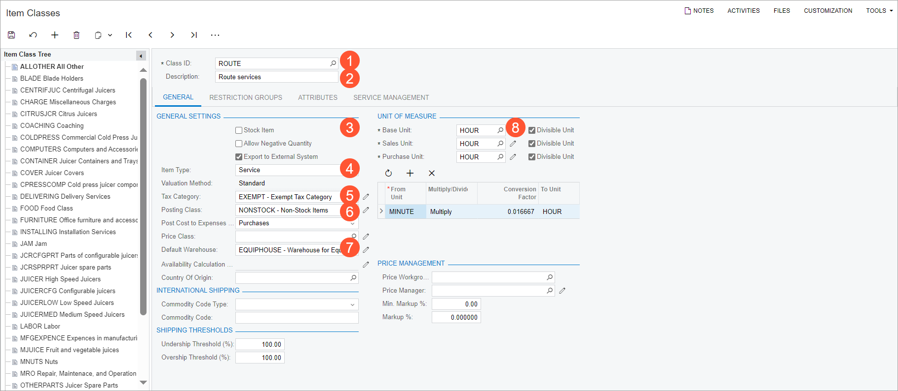
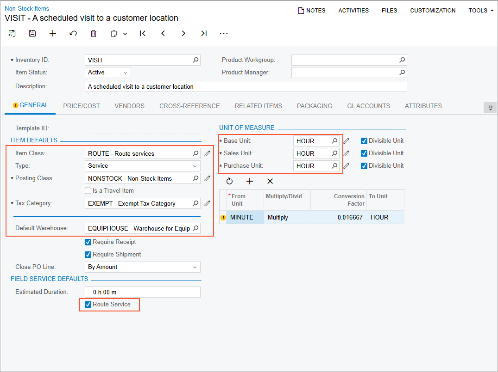
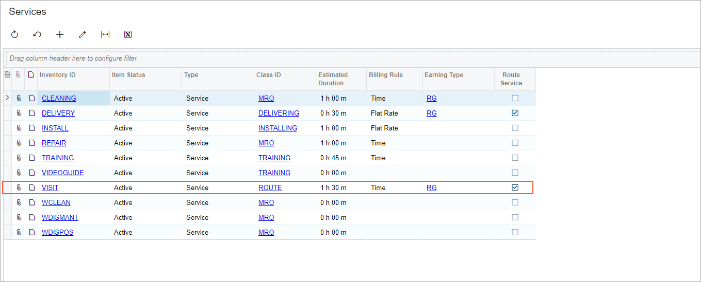

# Route Management: To Create a Route Service {#_fe0f67aa-e9b1-434b-ad66-f2a6bae59294 .task}

This activity will walk you through the processes of creating an item class to group route services and creating a route service. Route services are services that are performed during a route, which could include just the pickup and delivery services and could include other services.

You will create a route service that has no related items—that is, either no items are picked up or delivered while the service is performed, or if items are picked up or delivered, they are not tracked in Acumatica ERP.

## Story {#section_mwy_mx1_ldc .section}

Suppose that the SweetLife Service and Equipment Sales Center is going to provide route services. Acting as an administrative user, you will create the *ROUTE* item class for routes and the *VISIT* service of this class.

## Process Overview { .section}

On the [Item Classes](../UserGuide/IN_20_10_00.md) \(IN201000\) form, you will create an item class for route services. Then on the [Services](../UserGuide/FS_40_08_00.md) \(FS400800\) form, you will initiate the creation of a route service and complete it on the [Non-Stock Items](../UserGuide/IN_20_20_00.md) \(IN202000\) form by using the newly created route item class.

## System Preparation {#section_xyr_cbv_3dc .section}

Before you start creating an item class and a service, do the following:

1.  On the Acumatica ERP website, sign in to a company with the *U100* dataset preloaded as a system administrator by using the *gibbs* username and the *123* password.
2.  On the Company and Branch Selection menu on the top pane of the Acumatica ERP screen, select the *SWEETEQUIP - Service and Equipment Sales Center* branch.

## Step 1: Creating a Route Item Class {#section_ojn_nx1_ldc .section}

You need to create at least one route item class for the items that represent route services. To create an item class for route services, perform the following instructions:

1.  On the [Item Classes](../UserGuide/IN_20_10_00.md) \(IN201000\) form, click **Add New Record** on the form toolbar.
2.  In the Summary area, specify the following settings:
    -   **Class ID**: `ROUTE` \(see Item 1 in the following screenshot\)
    -   **Description**: `Route services` \(Item 2\)
3.  On the **General** tab \(**General Settings** section\), specify the following settings:

    -   **Stock Item**: Cleared \(Item 3\)
    -   **Item Type**: *Service* \(Item 4\)
    -   **Tax Category**: *EXEMPT* \(Item 5\)
    -   **Posting Class**: *NONSTOCK* \(Item 6\)
    -   **Default Warehouse**: *EQUIPHOUSE* \(Item 7\)
    Clearing the **Stock Item** box and specifying the *Service* item type defines this item class as being for services.

4.  In the **Unit of Measure** section, specify the following settings \(Item 8\):

    -   **Base Unit**: *HOUR*
    -   **Sales Unit**: *HOUR*
    -   **Purchase Unit**: *HOUR*
    

5.  On the **Service Management** tab, select the **Route Service Class** check box.
6.  On the form toolbar, click **Save**.

Now you can proceed to creating route services—that is, items in the item class that you have created.

## Step 2: Creating a Route Service {#section_ahc_4x1_ldc .section}

Perform the following instructions:

1.  On the [Services](../UserGuide/FS_40_08_00.md) \(FS400800\) form, click **New Record**.

    The [Non-Stock Items](../UserGuide/IN_20_20_00.md) \(IN202000\) form opens so that you can define the route service.

2.  In the **Inventory ID** box, type `VISIT`.
3.  In the **Description** box, type `A scheduled visit to a customer location`.
4.  On the **General** tab, in the **Item Class** box, select *ROUTE*.

    The **Type**, **Posting Class**, **Tax Category**, and **Default Warehouse** boxes have been populated with the values from the selected item class, which you defined specifically for route services in the previous step. Also, the settings in the **Unit of Measure** section and the **Route Service** check box have been populated with the class settings. \(See the populated settings in the following screenshot.\)

    

5.  In the **Field Service Defaults** section, in the **Estimated Duration** box, type `1h 30 min`.
6.  On the **Price/Cost** tab, set the **Default Price** to `100`.
7.  On the **Pickup/Delivery Item** tab, in the **Pickup/Delivery Action** box, leave *N/A*.
8.  Save your changes and close the window.
9.  On the [Services](../UserGuide/FS_40_08_00.md) form, verify that the new service has appeared on the list, as shown in the following screenshot. Notice that this service has the **Route Service** check box selected.

    

**Parent topic:**[Configuring Route Management](../ImplementationGuide/config_RouteMgmt_Mapref.md)

