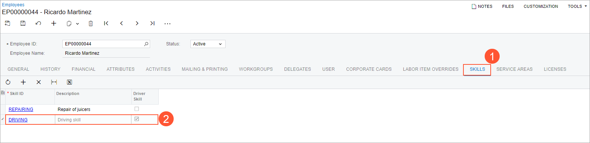

# Drivers: To Review and Assign a Driver Skill {#_2e099148-e844-44eb-8fa4-0dd5deee4e60 .task}

In Acumatica ERP, a skill is a personal characteristic or capability that can be assigned to an employee and then used as an employee requirement to perform a service. A *driver skill* is a skill associated with driving a vehicle. Only employees who have driving skills can use vehicles while providing a company's route services.

## Story {#section_dhb_5v1_ldc .section}

Suppose that the SweetLife Service and Equipment Sales Center provides route services. The route services require the staff members to have driver skills, which should be assigned to employees in Acumatica ERP.

Acting as an administrative user of the company, you will review a driver skill that another administrator has created and then assign it to an employee. As a result, the scheduler will be able to assign route appointments to this staff member.

## Process Overview { .section}

On the [Skills](../UserGuide/FS_20_06_00.md) \(FS200600\) form, you will review a driver skill \(it has been preconfigured in the *U100* dataset\). Then on the [Staff](../UserGuide/FS_20_55_00.md) \(FS205500\) form, you will assign this skill to an employee.

## System Preparation {#section_xyr_cbv_3dc .section}

Before you start performing the instructions in this activity, do the following:

1.  On the Acumatica ERP website, sign in to a company with the *U100* dataset preloaded as a system administrator by using the *gibbs* username and the *123* password.
2.  On the Company and Branch Selection menu on the top pane of the Acumatica ERP screen, select the *SWEETEQUIP - Service and Equipment Sales Center* branch.

## Step 1: Reviewing a Driver Skill {#section_sl4_5v1_ldc .section}

Perform the following instructions:

1.  Open the [Skills](../UserGuide/FS_20_06_00.md) \(FS200600\) form.
2.  In the list of skills, in the **Skill ID** column, find the *DRIVING* skill.
3.  Notice that the **Driver Skill** check box is selected for this skill.

Now this skill can be assigned to employees and to services. This will give you the ability to filter staff members for appointments requiring the skill.

## Step 2: Assigning a Skill to a Staff Member {#section_u5c_vv1_ldc .section}

Perform the following instructions:

1.  Open the [Staff](../UserGuide/FS_20_55_00.md) \(FS205500\) form.
2.  In the list of staff members, click *EP00000044 \(Ricardo Martinez\)*.
3.  On the [Employees](../UserGuide/EP_20_30_00.md) \(EP203000\) form, which the system opens in a pop-up window, go to the **Skills** tab \(see Item 1 in the following screenshot\).
4.  On the table toolbar, click **Add Row**, and in the new row, select *DRIVING* in the **Skill ID** column \(Item 2\).

    

5.  Save your changes and close the window.

**Parent topic:**[Drivers](../ImplementationGuide/config_RouteMgmt_Drivers_Mapref.md)

